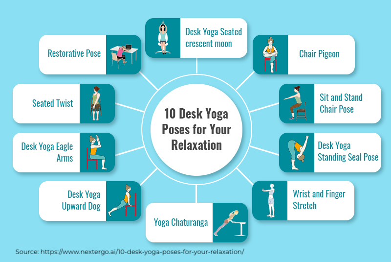

At Bright Inventions we really understand the importance of employee health and wellness. We believe that a healthy workplace directly translates to improved mental and physical health, increased energy and better productivity. Some time ago we also incorporated yoga in our bright routine. Every Friday we have classes with great instructors from [Fizjolab](https://fizjolab.com/?gclid=Cj0KCQjwlMaGBhD3ARIsAPvWd6gWjfYO9cr0ueeNAAZtjKuvyFSsUEWUhVxHwhb1pua8xTNHLOLDcKEaAtc4EALw_wcB) who teach us how to keep our mind and body still and focused. Yoga helps us to reduce physical pain, decrease stress level and also to limit some potential irritability.  And how about you? Do you like yoga? Have you practised some poses yet? If not, let me take you on some short trip about how it may help you live your professional and private life fuller. 

## \#1 Pain Alleviation


One of the most common complaints connected with desk jobs is back pain. [According to Occupation Medicine, British journal, stress together with the back pain are two main factors leading to sickness absence at work.](https://academic.oup.com/occmed/article/62/8/606/1441276) The research done on governmental offices workers has shown that yoga can be effective for reducing both and improving psychological well-being. The yoga group reported significantly less back pain and lower stress, as well as greater self-assurance and serenity. Another journal, [
 Annals of Internal Medicine](https://www.acpjournals.org/doi/10.7326/P17-9039), indicates that people who attended weekly yoga sessions experienced improvements in pain, which was nearly identical to those who attended physical therapy.  Yoga can decrease pain perception, which means that people after yoga practise feel the pain less strong than before. Yoga dissociates negative emotions from pain and improves our mood. 

## \#2  Improved Stress Resilience

Chronic stress can take a toll not only on your physical and mental health but your relationships as well, both in private life and at work. Fortunately, yoga is great for building stress resilience. The challenge and unpredictability in yoga can teach your brain how to flexibly adapt to changes, the changes that are nowadays a common part of our daily  life. And how does it happen? Trying a new pose requires our brain to get out of the comfort zone and to solve a kind of “problem”. This activity creates some new connections in the brain that make it more adaptable to change in general. Ta da! We have novelty here and repetition (we practise the same pose), which makes those new connections stronger.  The better your brain is at adapting to change, the easier it becomes to deal with stress. Each time we are on the mat it is good to examine how we respond to frustration and uncertainty. It may be a reflection of the reactions to some similar unpredictable and stressful situations at our work. [Check a few yoga poses to calm down anxiety and reduce stress. ](https://www.yogajournal.com/poses/yoga-by-benefit/anxiety/)

## \#3  Increased Energy

Have you ever come to work, collapsed at your desk and complained how exhausted your were? Your back was killing you and you were afraid that you were going to die. Sounds scary, but the point is that [there seems to be a growing trend of adults who are tired all the time, and struggle with fatigue and exhaustion at work](https://www.sciencedirect.com/science/article/pii/S0149763418305220).  We experience somehow “the exhaustion epidemic”. The weekly yoga lesson is the time we can have a chance to reconnect with ourselves and to fully relax. Our body’s natural energy source is oxygen. During yoga practise you learn how to breathe correctly, how to find your breath in every day situations and take better care of yourself. Yoga is an excellent natural energy booster.  Active poses that stimulate the blood flow through the body can help fight fatigue and boost our vitality. Instead of reaching for a cup of coffee, [let us try some yoga moves.](https://www.nytimes.com/guides/well/beginner-yoga)

## \#4 Better Focus, Memory and Concentration

Strict deadlines, heavy workload and endless meetings may prevent us from concentrating on tasks and making clever decisions. Yoga, meditation and breathing exercises are an effective ways to free our mind of clutter that is destroying productivity. Researchers have shown that yoga can greatly affect neural patterns in the brain, which can improve our ability to concentrate. The benefits of yoga for concentration can potentially apply to just about any task that comes our way. It appears [that people who practise yoga are able to focus better, learn more effectively and  process information quickly and more accurately.](https://universityhealthnews.com/daily/mobility-fitness/yoga-for-concentration-cognition-and-memory/) Yoga benefits the blood circulatory system. The stretching during yoga poses (e.g. headstand and shoulder stand) helps to rejuvenate and oxygenate the blood. The improved blood circulation means the brain receives more oxygen, thus increasing alertness, awareness and memory.

## Let’s practise some Uttana shishosana

By understanding the mind-body connection and treating your physical and emotional health well we can increase productivity and improve significantly the quality of our life. You don’t have to be a big company like [Nike, Google or Facebook ](https://journey.live/6-companies-using-meditation-for-a-productive-and-happier-workplace) to start yoga classes in your team. If your budget is low to cooperate with a professional instructor, you can begin with some in-house online lunchtime stretching/yoga classes. There are many videos and  [apps](https://www.statista.com/chart/22059/most-popular-yoga-and-meditation-apps/) on the market that can help you start. You can also try [some basic desk yoga poses](https://www.workandmoney.com/s/11-yoga-poses-you-can-do-at-your-desk-817027439e104424) if you are not sure if it is something you may like. And remember - yoga is not about being good at something, it is about being good to yourself. ❤️

