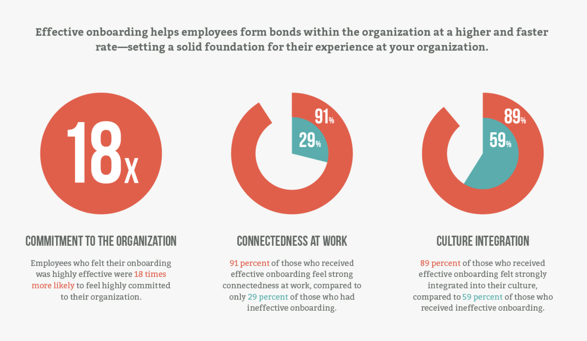
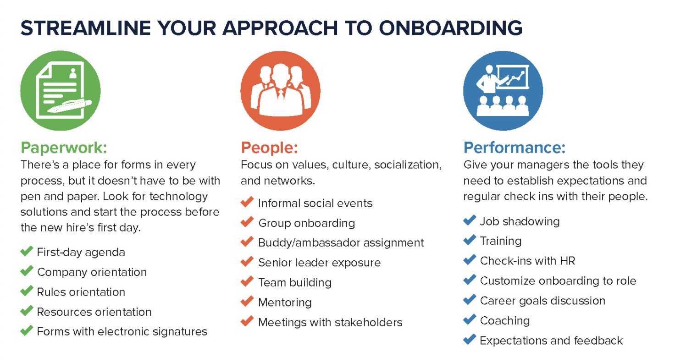
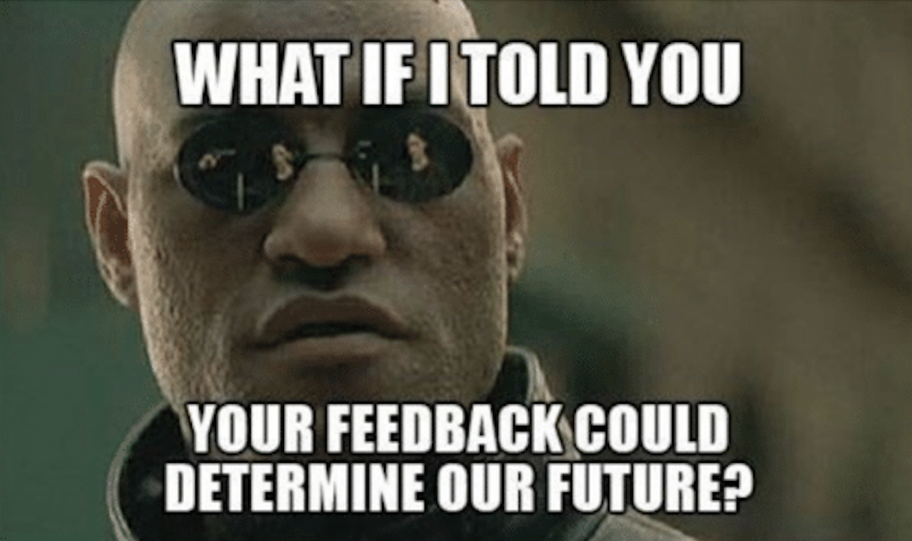

There are many onboarding strategies. **Ours is transparency, [regular feedback](https://brightinventions.pl/blog/no-time-for-bullshit-feedback-culture/) and support.** 

First days at new work are hard, even if the new hire is competent, friendly and super positive, these are still the first days. To me, we are all a bit nervous and fumble each time we start a new chapter of our professional career. But effective onboarding can make many things much easier and it might be the cornerstone of a new employee’s experience. 

###### Source: https://www.bamboohr.com/blog/effective-onboarding-infographic

At Bright Inventions an onboarding journey lasts almost three months and it begins before the first day. **The good onboarding process, as the word “process” suggests, takes time.** It is not a one-time meeting. It involves the engagement of a team, great time management skills and a bit of supervision. Nothing happens automagically. 

## **BEFORE IT EVEN STARTS** 

I always inform my [Bright Team](https://brightinventions.pl/about-us/team/) in advance about new colleagues - their names, roles and start date. It is important that no one feels surprised to see a new co-worker in the office or at some online company meeting. It is also crucial to map out everything and plan all the key appointments with people new hires will interact with on a regular basis.

You may also assign a buddy i.e. a member of your team to mentor the newcomer on the ins and outs of the project, people and organisation. We do that. This introductory mentoring should include everything from certain company-wide procedures down to how to perform daily tasks. **I am quite certain that if we did not plan each step beforehand, the whole process would be chaotic and stressful for both sides.**

Last but not least, our memory is like a sieve so it might be advisable to send a friendly reminder to your team a few days ahead of the newcomer’s arrival.

## **HELLO MY DEAR FRIEND** 

If the first day is in person, you may take your new colleagues on a short office tour. And then:

 ✔️ Discuss the first days schedule. Tell your new hires about what the days are going to be like, so that they know what to expect. **Open up the floor for questions**. **Don’t leave new-comers twiddling their thumbs because they are not sure what they will be doing.**

✔️ Make sure you give the new hire all the documents like NDAs, GDPR and other privacy forms they need to sign. Ensure you do this while explaining the purpose behind each one.

✔️ Remember about giving an access to your company Wiki/culture book/other materials that involve the key information everyone in the team should be introduced with. Not mentioning the tools they will need in their job. 

✔️ First day is also a good time for some ice-breakers. At Bright Inventions we use Slack for daily communication and it is quite useful for this occasion. But it can be done via any platform you use. 

✔️ I really recommend organising some lunch for new teammates on their first day. It is a great chance for them to get to know and meet other people in your team. Apart from that at Bright Inventions we also arrange an additional meeting in person with our co-founders so that new-comers can really make a bond and see that there is no need to be afraid of talking to them about literally anything. **[Michał](https://brightinventions.pl/about-us/michal/) and [Daniel](https://brightinventions.pl/about-us/daniel/) are talking about the idea behind starting the company, [the values we believe in](https://brightinventions.pl/about-us/values/), and the direction we want to go in.** 

✔️ Plan it ahead. I cannot imagine onboarding without scheduling everything ahead. Always inform all the people engaged in the onboarding process about what you might expect them to do. Invite them to all the necessary meetings. 

✔️ **Tell about company culture, work ethics and core values.** It is crucial that new employees understand the expectations held within the company. It is not only about what we want them to do, but how and why it is important to the organization’s success.  

✔️ Establish lines of open communication. **Encourage new-comers to ask questions and make them involved.** I believe we should foster engagement from the moment new employees walk in our office door for the first time. 

###### Source: https://hrdailyadvisor.blr.com/infographic/infographic-tips-ending-burden-onboarding

## **WHAT IS NEXT** 

The first week on a new job is a bit like orientation on a school campus. It is important not to overwhelm a new employees during this stage. But for sure we should walk them through important procedures and standards which help them feel comfortable getting started on the real work.

**Follow up and check ins - do not forget about them.** After giving the new hires time to get used to the office, workspace and their trainer, it is good to follow up with them to make sure they are feeling comfortable and picking things up at an appropriate pace. As far as I can tell, the end of the first week is a good time to discuss how the next weeks or so should progress, what you expect and where they should be once they reach that time. 

Make also some time for feedback. As you probably already know at Bright Inventions we value and practise transparent feedback culture. **If you are a manager, make sure to get updates from those who work closely with the new-hires and make an effort to point your new-comers in the right direction if they seem to be faltering or struggling with certain tasks.** Also do ask for feedback as they should be able to express freely their feelings and impressions since day one.

**Next weeks and next months is also a perfect time for reviewing.** Do not leave it for the end of a trial period or a performance test. Review past assignments and check if the new hire is on schedule with the tasks. It can be quite informal, but still it is the best time to evaluate their strengths and weaknesses. Review past and future assignments. After 90 days, the new hire should be at a healthy proficiency in their role. 

## **AND THEY LIVE HAPPILY EVER AFTER** 

We should try to create for new joiners a space to learn and explore the company, its culture, and its people. At the same time we have to keep in mind that every person has different standards, develop at a different pace and may need different scope of support. **Onboarding doesn’t need to be a one size fits all process. We may have specific trainings and use different methods each time a new co-worker appears. It just has to be effective.** And if it is like that, it will also have an incredibly positive impact not only on the new joiners but also on the whole team. 

What I especially love while running onboarding process is **encouraging independence and openness in people.** With trainings, introductions and communication all covered, it is always the best time to start letting your new employee show engagement and practice what you hired them for. And I believe we are hired at Bright Inventions to create a great team, a healthy workplace and software solutions that can change the world.
