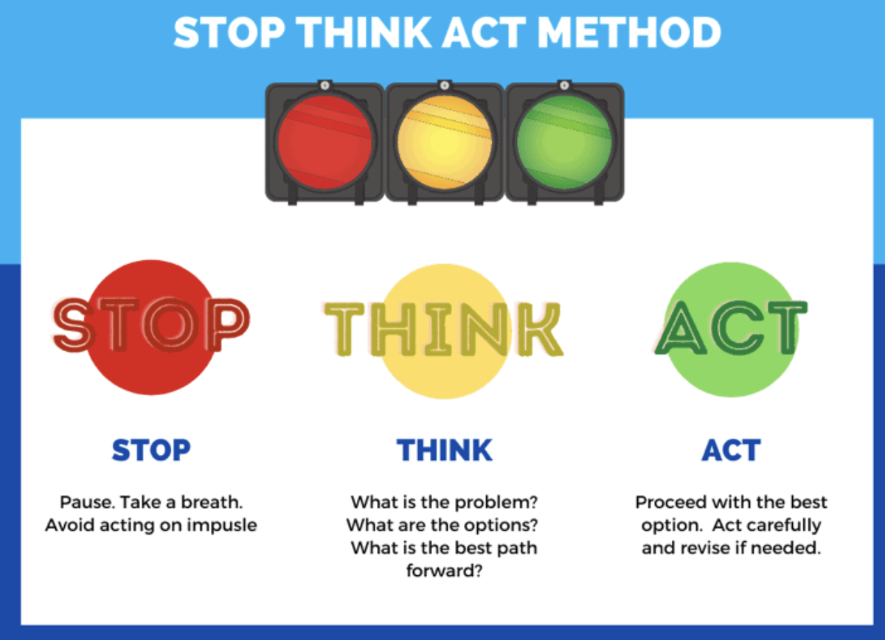

You are receiving negative feedback or just someone is disagreeing with you, and your first reaction is self-defence mechanism? Remember that it is a very short way to burst into anger or carry some emotional burden. Feedback is a gift and you should learn how to proceed it effectively without unnecessary stress or negative feelings. Be grateful that someone has enough courage to share it with you. Thanks to that you can work on important changes that need to be made to avoid the same mistakes in the future.

## **Don’t take it personally**

Our ego doesn’t want to be criticised. It wants to be acknowledged and praised. When someone gives us negative/corrective feedback, we feel offended. We just always want to be right and to prove someone they are wrong.

When we see the bigger picture, it helps us put feedback in its proper perspective. Then and only then should we decide how to respond. **Remember you are not the idea or behaviour the other person is referring to. This feedback is not about you.** Don’t overanalyse and see some meaning where there isn’t any. Look at the the other person’s intention and try to see positive motives of the person who is giving you feedback. **Don’t waste your energy on taking things personally.** 



If you decide to watch the movie below, please do that with deep understanding. This TEDTalk is not about becoming ignorant to other people’s negative feedback and taking the approach “I shouldn’t care”. It is about comprehending why this negative/corrective feedback touches us so much and what we can do with it.

<YouTubeEmbed url='https://www.youtube.com/watch?v=LnJwH_PZXnM' />

## **When emotions walk in through the door, logic flies out** 


You have to learn how to manage your emotions to avoid saying things that may do harm to yourself or people around you. **Don’t act impulsively just because someone said something you don’t like. Don’t rush to react.** 

The so called S.T.A.R method can help you react in a calm and peaceful way to the negative feedback you receive and can show you a different perspective to the problem you focus on. It is a very simple method you can use in any situations of potential conflict or disagreement. 

**STOP** - after receiving the feedback take a moment to reflect on the actions described by the feedback giver 

**THINK** - think about next steps you can choose and solutions you can take 

**ACT** - decide on the best option you can take to improve a situation/your behaviour 

**REVIEW** - check the consequences of the chosen option. Has it changed anything?

## **Don’t become an offended recluse**

[The research](https://hbr.org/2016/09/research-we-drop-people-who-give-us-critical-feedback) by Francesca Gino, Paul Green, and Brad Staats shows that we tend to avoid people after they give us negative feedback. And while it can certainly feel easier to see ourselves as a martyr - **avoiding people who tell us (usually) the truth is a big mistake. In fact, we should see it as opportunity to reset one’s relationships. With the proper approach, our biggest “critics” can become our greatest supporters.** Remember that it is really simple to say you like someone’s idea, take a high five and live happily ever after. Much harder it is to find the courage to tell someone you see some things to improve in their behaviour. Appreciate the fact that you have among your colleagues or friends people who would tell you bluntly when you fuc* something up. 😉

**The critical feedback can be an excellent moment to make new friends. Really.** 

## **Take it on the chin**

Believe me or not, **the best response to some critical feedback is to admit our flaws — first to ourselves, and then to others.** We should understand and set the expectations for how we are likely to behave. Focus on changing the things you can change. Remember that people around you can very often see much more about your behaviour than you see yourself (if you haven’t heard about[ the Johari Window matrix](https://brightinventions.pl/blog/the-johari-window-as-a-tool-in-feedback-processing/), it is high time to take a look). 

<GiphyEmbed url='https://giphy.com/gifs/heyarnold-hey-arnold-nick-splat-xUNda7NlTLmCGj6bU4' />

Give yourself time, space and empathy to work on the area that is unknown to you. Accept the fact that you are not always right. Or even accept the fact that you are barely ever right. **The corrective feedback is not about aiming at perfection,** it is about asking questions and looking for the answers.As Alexander Pope wrote in his poem *An Essay on Criticism* "To err is human, to forgive is divine.” We err all the time. We learn best from the mistakes we make. **We learn most while confronted with the views completely different to ours.** 

Remember that negative feedback might be much more valuable to your self-development than the positive one. 

## **And what are your techniques**

And how about you? How do you react when you get corrective feedback from someone? Is it easy for you to accept you might be wrong? Do you take things personally? Do you feel offended? Do you overreact? Do you see only negative intentions behind? 

If you have never asked yourself these questions, I really encourage you to do so. **Check if you have enough courage inside yourself to admit you might be wrong.**

And coming back to our original questions - how to react to corrective feedback? With a smile, gratitude, empathy and openness. 🧡
