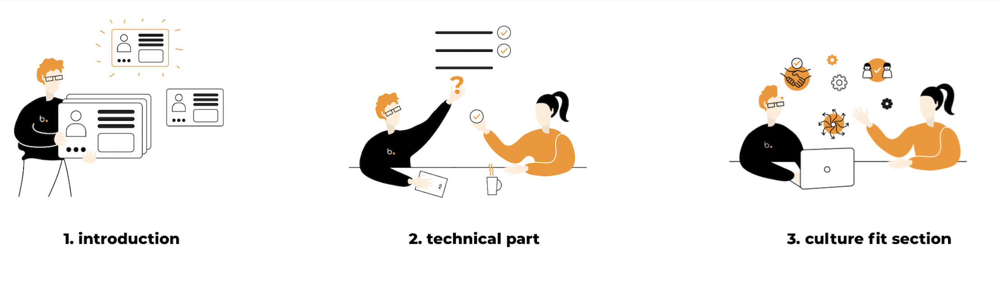
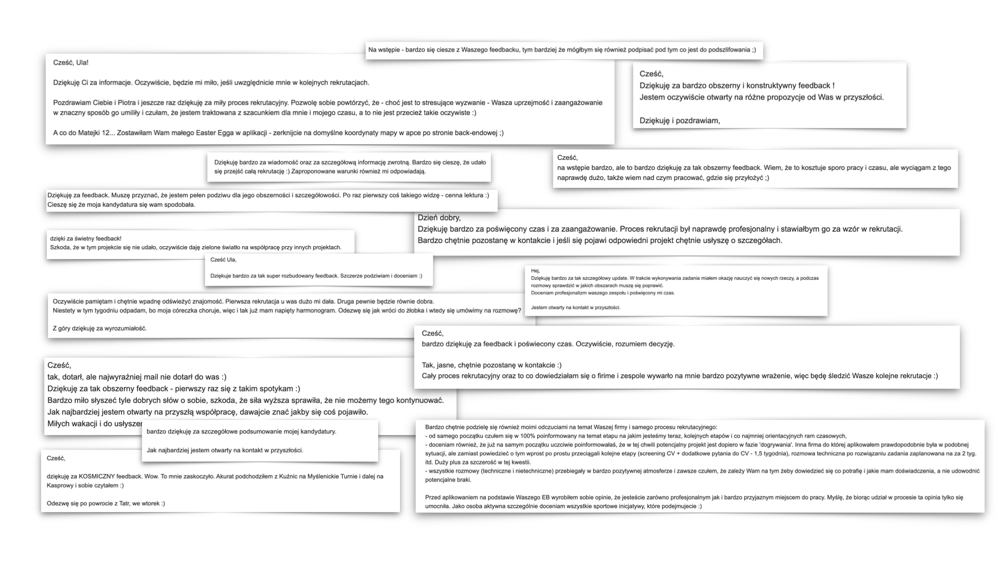

Our recruitment process is not a secret and we are always trying to be as transparent as we can. **The hiring process at Bright Inventions consists of three steps: phone screening, an interview and a programming assignment.** The successful completion depends on the correctness of each stage. Below we are describing each step with more details. We hope these insights will be useful and helpful to you if you are currently considering applying for a role in our organisation.

## **PHONE SCREENING** 

The phone screening is conducted after evaluating skills and data contained in the candidate’s application documents. The purpose of screening is to clarify the details about the job position as well as the hiring process itself. **Our goal is to ensure the candidate understands fully the role he/she is applying for.** 

The screening stage should provide both sides with all the basic information crucial to move on to the next stage. **We ask you about:** 

* your plan for next career steps,  
* issues connected with your professional experience (e.g. projects, clients cooperation, tech stack, motivation for changing current position), 
* your availability (possible cooperation starting date),
* salary expectations and preferred work model.

We also ask a few questions in English as we use this language in daily communication with our clients.

## **ONLINE INTERVIEW** 

The interview lasts 2,5 hour and it usually takes the full length of the allocated time. It is divided into three sections with open, in-depth or problem solving questions:

1. introduction,
2. technical part,
3. culture fit section.  

**1️⃣ Introduction is just a short 10-15 minutes section to get you current professional status and check if anything changes since our last phone conversation. W**e will ask you a few question about the present project, methodologies you use and recent tasks. \
\
**2️⃣ Next will be technical part which is not to get the perfect answers (remember that!)**. The goal of technical interview is to explore various approaches and discuss workable solutions. It is ok to make mistakes and have different ideas to share. Your answers to our questions give us some idea of your coding skills, problem-solving attitude or even teamwork abilities. After the technical part you will get some first-impression feedback on the spot. 

**3️⃣ The culture fit section’s purpose is to make sure your values blend well with our current team members.** We ask you about work preferences, values you follow at work or what motivates you.

We encourage you to ask any questions or doubts you may have. 🧡 We are trying to organise an interview in a discussion friendly mode. It is also an opportunity for you to meet some team members you may work alongside in the future.

## **REMOTE CODING ASSIGNMENT** 

A selected group of candidates who deal really well during the interview phase are provided with a remote programming assignment. **The goal is to further verify their technical skills and check their depth as we know that the interview itself is just a short episode of someone’s experience.**

We send the task via email and **you determine the deadline till which you complete it.** If you need some guidance you can always ask just as if we were working together on some task in the project. You usually have freedom to choose techniques, but we recommend using the solutions presented in the job opening for a particular role. 

**There is always a timeframe limit which cannot exceed 8 hours. If you haven’t finished the task by that time, you submit it as-is and let us know what is missing.** You can publish your solution on your private GitHub/BitBucket/GitLab repository and share access with us.

While examining the completed assignment we consider if you complete the task accurately, efficiently and in timely manner. 

## **FEEDBACK TIME** 

This is the moment when we ask for your patience. It is time for us to review once again all the candidates’ profiles and reach a final decision. It takes usually 10 working days because we want to make sure that both you and our current team will feel comfortable together. Sometimes we may inquire about some extra insights. In case of any delays we send up a follow-up note.

**As a final element of the recruitment process we will provide you with feedback regarding the entire process - it includes our impression after the interview and coding assignment.** Apart from the general assessment we will also include some advice what you can work on and which skills you should improve. In the end we may also like to have a quick feedback call with you. 

## **TAKE A LOOK WHAT CANDIDATES SAY ABOUT OUR HIRING PROCESS** 

**We believe that the hiring process is an investment for both sides - ours and candidates’.** We never leave you without some feedback why we can or can’t provide you with a job opportunity. The goal is to provide you with great recruitment experience and a good ROI. 😎

**If you want to give us a try and check whether we can offer you some space for development right now, check our [career page](https://brightinventions.pl/career/).** Maybe you will find your dream job there. 

## **BEFORE YOU SEND YOUR APPLICATION**

Before you decide to apply and send your resume, make sure you meet our bright universal criteria described below. **Bright Inventions might be a great place for you to push your career to the next level, but make sure we are the place you are looking for.** 

* You take responsibility for the products you work on. 
* You have a strong business focus and you are not afraid of contact with clients. 
* You actively take care of your self-development and learning process. 
* You value teamwork and regular feedback culture. 
* You are fluent in both Polish and English (min.B2). 

**We recommend sending the application in English. If you don’t have a CV, you can share with us your LinkedIn profile.**

In case you have any questions or doubts, you can drop us a line at [jobs@brightinventions.pl](mailto:jobs@brightinventions.pl) or contact directly[ Ula](https://www.linkedin.com/in/urszula-stankiewicz-rusek/), [Agata](https://www.linkedin.com/in/agatamietlinska/) or[ Sara](https://www.linkedin.com/in/saralecka81680085/) via LinkedIn. 

Hope to see you soon on our bright board!
