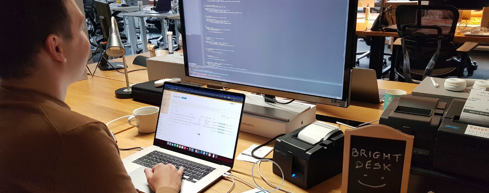
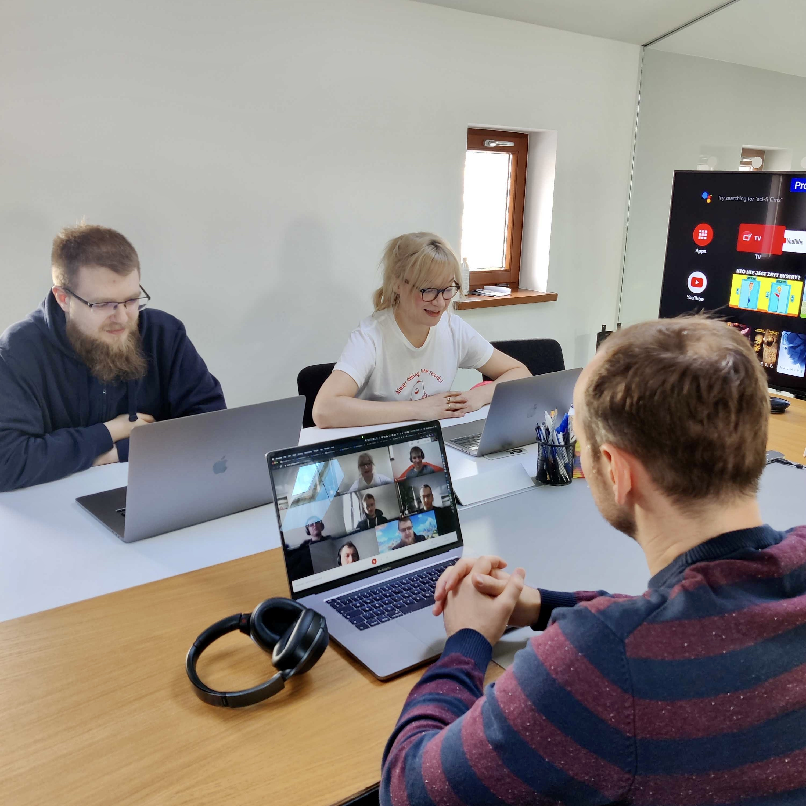

**Since the beginning of the pandemic we have established a unique hybrid work model at Bright Inventions. What does it mean? Basically, we are free to choose if we work from home, from the office or combine both. After over a year of hybrid work we want to share with you some tips on how to make it work and maintain consistency in delivering valuable software solutions to our clients.**

## Hot desks are always ready

We organised a couple of hot desks for team members that do not visit the office regularly. Desks have a plate that indicates it is in fact a bright hot desk. 🙂  So everyone knows immediately where to sit. Of course, when someone goes to an office at least a couple of days in the week they have their own desks which are not occupied by others. 

Our hot desks are organised in a way that you are able to quickly sit down, turn on the laptop and start your day. Simply because all desks have a power strip, monitor and HDMI cable so one can quickly connect a laptop and do not worry about anything. If somebody forgets a laptop charger, one can easily use another stored in the office exclusively for that situation.

## Designated space for calls

Calls, whether we like them or not – are a part of our work life. That is why, we have a few rooms dedicated to online and offline meetings. We can easily book a room with Google calendar. The meeting space is equipped with Jabra speakerphones, laptop chargers and in some cases – a TV screen for presentations.

## Let’s dine together

Friday is a huge day for bright people. Not only because of the upcoming weekend and our Friday yoga classes or board game meetups. On Friday Ula (our HR & Marketing Manager) presents lunch roulette results. Every Friday there is a draw and lucky ones go to lunch next week accompanied by other 2 team members. Lunches are on the house and thanks to the great location of our office in Gdańsk we have plenty of nearby food options to choose from. “Bright Lunches” are an awesome way to get to know each other especially when good luck brings together people who do not work in the same team.

<InstagramEmbed url='https://www.instagram.com/p/CUpCyvigmIr' />

## Sharing the same passions after work

Working together is one thing but when you have a chance to share the same passions with your colleagues – that brings your work experience to the next level. At Bright Inventions, we cooperate with a professional triathlete – [Bartosz Banach](https://www.facebook.com/bartoszbanachpl) who conducts workouts for our team. People are free to choose if they want to join running, swimming or MTB workouts that Bartosz organises for us. Our workouts are a great opportunity to stay healthy & active plus obviously to meet each other. What is more, Bartosz helps to reach our private training goals. Recently a few members of our team ran in the marathons! But do not worry, we also have some after-work activities that do not require physical work. 😉  For example, bright board game lovers meet regularly at the office to roll some dice.

## Integration meetings

We do not want people to feel that all they do is to interact with avatars. Once a quarter we organise team retreats parties that enable us to meet offline and face to face. So, if you feel that you want to finally see your coworkers, our team building events are perfect for that.

<InstagramEmbed url='https://www.instagram.com/p/CUFvOhfAg-M' />

## Agile state of mind

Dailies, backlogs, Jira or reviews are not just some buzzwords but actually tools that make it possible to cooperate and build the best possible software solutions for our clients from around the world. Even though team members do not see each other face to face, everyone can stay on top of things if agile methods are implemented properly. This methodology has proved to be efficient even at these very hectic and globally difficult times. If someone in the software development community has not relied on Agile yet, now it is probably high time to do so.

## The key is freedom

At Bright, we are free to choose whether we want to work from the office or home. As well as if we want to attend sports workouts or team building events. That is the power of hybrid work – flexibility and independence. But at the same time teamwork and responsibility. 

What are your experiences with the hybrid work model? Let us know in the comment section!
