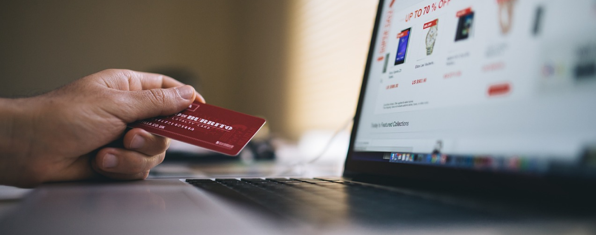
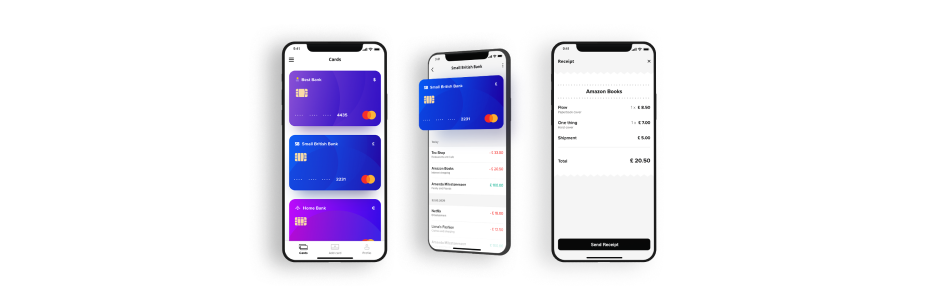

**Payment is one of the most important features of digital products. In case any problems arise, both you and your users could potentially experience financial losses. So based on our over 10 years of experience in building digital products, we gathered some recommendations for payment implementation for startup founders, CTOs, and tech leaders.**

Payment can enable you to monetize your solution. Or it can be an important feature for your users. For example, if you offer a retail [POS solution](/projects/pos-legacy/), payment is the heart of it. If there are any issues with it, your clients will lose money. **The success of payments doesn't solely depend on your development team's code but rather on the business decisions you make** before any programming lines are written.

**Things to consider before you add a payment feature to the software development team’s backlog:**

## 1. Do you need the payment for international markets or locally?

If you need to implement payments for a specific country, it might be wise to seek a local provider that is well-versed in the market's nuances and regulations. However, if you need to facilitate international payments, your payment provider probably should be one of the top players, such as Stripe, PayPal, and Zettle by PayPal.

<h2>turning smartphones into terminals with card payment app</h2>
Learn more about the fintech iOS and Android application that allows businesses to charge credit cards without a payment terminal.
<a href="/projects/credit-card-reader/"><button>dive into case study</button></a>

## 2. Do you need a small provider or a top player on the market?

There is no ideal option for everyone, so you need to analyze the pros and cons from your business perspective. The final decision often relies on the size of your organization. Startups and SMEs will likely have different needs compared to large enterprises.

### Advantages of large payment providers:

* Stable and mature payment solution.
* Technical support.
* Lots of helpful resources and docs for software engineers.

### Disadvantages of large payment providers:

* Possible slow response time from support (if you're small, you’re not a key client).
* Less attractive price models (the smallest volume, the bigger price).

### Advantages of smaller payment providers:

* Chance for lower prices.
* A possible better response time from support (they often try to offer better customer support to stand out from bigger providers).
* Flexibility and startup culture (it might be a plus for small companies).

### Disadvantages of smaller payment providers:

* Less stability: their product is often in the early stages of development and updates might affect your payments.
* Less amount of resources and docs for software engineers.

## 3. Who is responsible for any technical issues with payments? You or your payment provider?

You need to determine who will be responsible for any payment malfunctions – you or your payment provider. For example, if you offer a mentioned POS system, your client will contact you about unavailable payment features even if you aren't directly responsible for them. You need to ensure that your payment provider will take responsibility for issues with payments.

## 4. Will your provider offer you an account manager?

It's smart to choose a provider that will offer an account manager. This is a person who will not only be a first responder to your problems or needs. **The account manager should also inform you about any payment anomalies and give you a heads-up when security certificates are about to expire**. It's good to have that support from your payment provider's side.

## 5. What is the payment culture of your target group?

Choosing the payment method is a decision that should depend on your users' habits. These might vary [depending on the country](https://pay-lobby.com/en/country). For example, in the USA and the UK, online payment with debit/credit cards and e-wallets are the most popular. On the contrary, there are countries where bank transfers are one of the most common payment methods (e.g. Netherlands, Poland).

[Over 40% of eCommerce users](https://www.ppro.com/news/retailers-risk-losing-customers/) in the USA stop a purchase if their favorite payment method isn’t available. So **don’t try to change your users' habits, embrace them**.

## 6. What information should be included in the payment statement?

In some cases, users are extremely protective of their anonymity. For example, if you build a web therapy platform, your users may not be willing to share the information that they struggle with some mental issues. So they don't want the payment to visibly state that they use a web therapy platform. Especially when another family member has access to, for example, the credit card statement. That's why you need to decide what's the proper name for the payment statement for your solution.

<h2>do you struggle with payment implementation?</h2>
 Contact us and book a free consultation in 48 hours with our software development team.
<a href="/start-project/"><button>let's talk about your solution</button></a>
