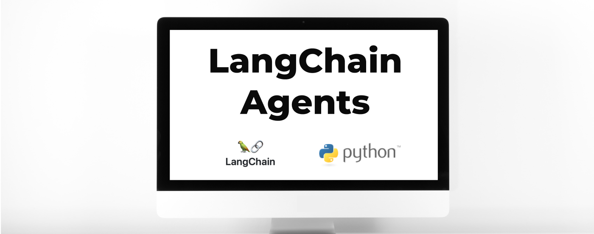
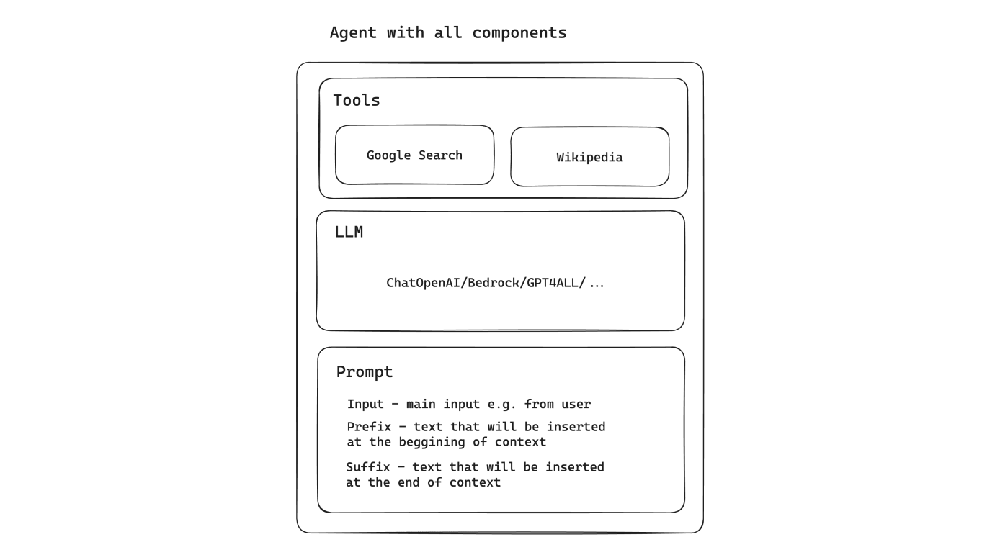
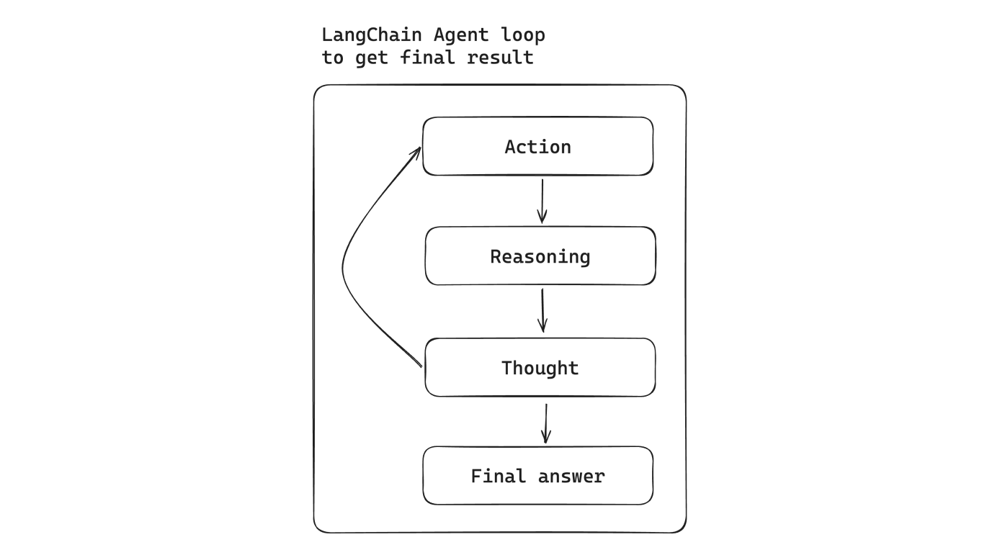

**Discover the ultimate guide to LangChain agents. This tutorial, published following the release of LangChain 0.1.0 in January 2024, is your key to creating your first agent with Python. Stay ahead with this up-to-the-minute resource and start your LLM development journey now.**

<div className="image"></div>

## What is LangChain agent?

The idea behind the agent in LangChain is to utilize a language model along with a sequence of actions to take. The agent is using a reasoning engine to determine which actions to take to get a result.

Agents are crucial for handling tasks ranging from simple automated responses to complex, context-aware interactions.

For example, you may have an agent integrated with Google Search, Wikipedia and OpenAI LLM. With given agent tools, they can search for results in Google, then use retrieved context in Wikipedia tool to find detailed information and expand the context.

Bear in mind that you have to put clearly defined instructions to make sure that the agent will invoke tools in a proper order.

The illustration presents the agent and his components:

<div className="image"></div>

## Boosting your agent

You may be wondering, ‘Why I cannot use simple LLM to get my questions answered?’ There might be situations, where used LLM model has old data or you have to provide some internal data (and use embedding to find similarity). 

Explore these examples of features that can boost your agent:

1. Web search tool 

You can easily add different types of web search as an available action to your agent. It might be Google Search, Tavily Search, DuckDuckGo and many others.

2. Embedding search in vector database 

You can create a tool from retriever and describe it as you need, so the agent will use this tool to get some kind of data doing e.g. similarity check and embedding model.

3. Doing some actions

Your agent can be multipurpose one. For example, it might be searching for some kind of information on the internet, doing the reasoning step, and after all invoking action to create a Jira issue.

4. API integration tool

There are many API integration done for the LangChain framework, all you need to do is take the API key, install the package and attach the tool to the agent.

5. Custom tool 

You can write your own tool, refer to the documentation to see how to do it. It might be integration with your internal API, your document system, and many others!

## LangChain Agent vs. Chain

Besides having agents, LangChain also supports the idea of a Chain.

Chain is a subsequence of actions to take, always in a hardcoded manner. This is the crucial difference between an agent and a chain. While in the agent, the reasoning model may choose other actions (from given tools) to fetch specific data, the chain will always take the same path that we have chosen.

Advantages of agents compared to chains:

1. Based on the description of tools, the agent decides which tool should be used to get relevant information.
2. Agent takes actions and takes the context of the given result to e.g. search for other information in other resources (like for example Google Search and Wikipedia).
3. The agent checks the results and repeats the process to get the desired data.

## The main goal of using agents

When you’re building your own AI LangChain solution, you need to be aware if using an agent is the way you want to go. 

If your use case is always based on the same flow and strategy, for example:

1. First step: web search.
2. Second step: internal vector database text embedding.
3. Reasoning.

Then you might consider using chains instead of agents. Agent cost is unpredictable because some questions might be answered directly after e.g. call to one tool, while others might use a comprehensive set of tools to do proper reasoning. If your use case is based on determining things from different sources (called tools), then an agent seems to be a great solution. On the other hand, one agent type uses a single tool to divide a complex query into simpler ones, so that might also be another criterion for deciding whether to use chain or agent.

<div className="image"></div>

## LangChain Agent types

LangChain categorizes agents based on several dimensions:

\- model type;

\- support for chat history;

\- multi-input tools;

\- parallel function calling;

\- required model parameters.

It is important to choose the option that fits to your use case:

1. **OpenAI functions** 

There are certain models fine-tuned where input is a bit different than usual. There are special functions that can be called and the role of this agent is to determine when it should be invoked. This agent is designed to work with this kind of OpenAI model. It supports chat history.

2. **OpenAI tools** 

This agent is designed to work with OpenAI tools, so its role is to interact and determine whether to use e.g. image generation tool or another built-in one. The main difference between OpenAI function is the fact that the function is trying to find the best fitting algorithm/part of an algorithm to do better reasoning, while OpenAI tool is about built-in tools like image generation, and executing code. It supports chat history.

3. **XML Agent** 

There are models, where reasoning/writing XML is on a very advanced level (a good example is Anthropic Claude's model). If you're operating on XML files, that might be the right one to be considered. It supports chat history.

4. **JSON Chat Agent**

Several LLMs available in the market are particularly handy when it comes to reading JSON. JSON is also a very common standard of some e.g. entity representation. If you're building some kind of integration that operates on JSON files and the model is supporting it, you can try to use this agent. It supports chat history.

5. **Structured chat** 

Intended for multi-input tools. It supports chat history.

6. **ReAct agent**

Made for simple models (LLM - not conversational). It supports chat history.

7. **Self-ask with search**

This kind of agent supports only one tool as an input. The main goal is to divide your query into smaller ones, use tools to get the answer, and then combine it into a full answer to your question. This kind of agent doesn’t support chat history.

## Tools

Tools are the main components of agents that perform individual tasks. It may be web search, vector database search, or any other action. You can choose from many complete tools done by the community or write your own.

LangChain also features a highly useful capability to create tools from retrievers: 

```python
tool = create_retriever_tool(
   retriever,
   name="companies_database",
   description="Useful when you need to find information about company."
)
```

Where retriever might be created from Chroma in-memory database:

```python
retriever = Chroma.from_documents(documents_list, embedding_function).as_retriever()
```

It is very important to create a good description of retriever tool like in this example because agent step decision mechanism is based on that. If your description is missing or incomplete, it might result in skipping the action taken by the agent.

It’s worth mentioning that the tool name should be also unique.

## Toolkits

Toolkits are the combination of tools with predefined actions that can be used in our agent. Usually, they're assembled to the specific domain. There are different examples:

\- **CSV** agent toolkit to operate on \`CSV\` files (read, write),

\- **Github** agent toolkit that has implemented different operations on Github, e.g. creating new issues, creating new pull requests, and so on.

Compared to the tools, toolkits have an implementation of several actions.

## Creating your first LangChain agent

```
Prerequisites: 
- Tavily API token
- OpenAI API token
- Python v3.11 and 
- Pip packages: langchain (at least v0.1.0), openai, wikipedia, 
langchain-community, tavily-python, langchainhub, 
langchain-openai, python-dotenv
```

First, install pip packages:

```shell
! pip install langchain==0.1.0 wikipedia==1.4.0 langchain-community=0.0.10 tavily-python==0.3.0 langchainhub==0.1.14 langchain-openai==0.0.2 openai==1.7.0 python-dotenv==1.0.0
```

At this point you have to choose:

* LLM that you wanted to use (e.g. ChatOpenAI);
* agent type (more on that is covered in agent types section);
* tools.

Now you can combine everything:

```python
from dotenv import load_dotenv
from langchain import hub
from langchain.agents import AgentExecutor, create_openai_functions_agent, load_tools
from langchain.tools.tavily_search import TavilySearchResults
from langchain.utilities.tavily_search import TavilySearchAPIWrapper
from langchain_openai import ChatOpenAI

load_dotenv()

def get_function_tools():
  search = TavilySearchAPIWrapper()
  tavily_tool = TavilySearchResults(api_wrapper=search)

  tools = [
      tavily_tool
  ]

  tools.extend(load_tools(['wikipedia']))

  return tools


def init_action():
  llm = ChatOpenAI(model="gpt-4", temperature=0.1)
  prompt = hub.pull("hwchase17/openai-functions-agent")
  tools = get_function_tools()
  agent = create_openai_functions_agent(llm, tools, prompt)
  agent_executor = AgentExecutor(agent=agent, tools=tools, verbose=True)
  agent_executor.invoke({"input": "Who is the owner of Tesla company? Let me know details about owner."})


init_action()
```

Dotenv file should have following envs:

```dotenv
TAVILY_API_KEY=
OPENAI_API_KEY=
```

Example answer using above agent configuration:

> Elon Musk is the owner of Tesla, Inc. He is a businessman and investor who is also the founder, chairman, CEO, and chief technology officer of SpaceX. He is also an angel investor, CEO, product architect, and former chairman of Tesla, Inc. He is also the owner, chairman, and CTO of X Corp., founder of the Boring Company and xAI, co-founder of Neuralink and OpenAI, and president of the Musk Foundation. 
>
> Elon Musk was born on June 28, 1971, in Pretoria, South Africa. He immigrated to Canada at age 18, acquiring citizenship through his Canadian-born mother. He later attended Queen's University at Kingston in Canada and the University of Pennsylvania, where he received bachelor's degrees in economics and physics. He moved to California in 1995 to attend Stanford University but dropped out after two days to co-found the online city guide software company Zip2 with his brother Kimbal.
>
> Musk became an early investor in electric vehicle manufacturer Tesla Motors, Inc. (now Tesla, Inc.) in 2004. He became its chairman and product architect, assuming the position of CEO in 2008. In 2006, Musk helped create SolarCity, a solar-energy company that was acquired by Tesla in 2016 and became Tesla Energy.
>
> Musk is known for his polarizing views and has been criticized for making unscientific and misleading statements. In 2018, the U.S. Securities and Exchange Commission (SEC) sued him for falsely tweeting that he had secured funding for a private takeover of Tesla. To settle the case, Musk stepped down as the chairman of Tesla and paid a $20 million fine.
>
> As of December 2023, he is the wealthiest person in the world, with an estimated net worth of US$232 billion according to the Bloomberg Billionaires Index, and $254 billion according to Forbes, primarily from his ownership stakes in Tesla and SpaceX.

## Agent Executor

From LangChain **v0.1.0** version, the recommended way of creating new agents is to use AgentExecutor. You can easily define your executor by passing agents and tools.

The old way of using **initialize_agent** is marked as deprecated from **v0.1.0** version.

```python
agent_executor = AgentExecutor(agent=agent, tools=tools, verbose=True)
```

## Defining prompt

LangChain **v0.1.0** version provided a new approach of initializing agents. Instead of using **initialize_agent**, we have to use a clearly defined method for every type. There is an additional parameter called `prompt`. We can use the default prompt (you can refer to the [documentation](https://python.langchain.com/docs/modules/agents/agent_types/openai_functions_agent#create-agent) to see a prompt for every agent).

Example of default prompt for OpenAI functions agent:

```python
prompt = hub.pull("hwchase17/openai-functions-agent")
```

If you’re not planning to override the default prompt - provide a default one accordingly.

## Ready to build your custom agent in LangChain?

I believe you are! In case you have any questions, just let me know in the comments.

