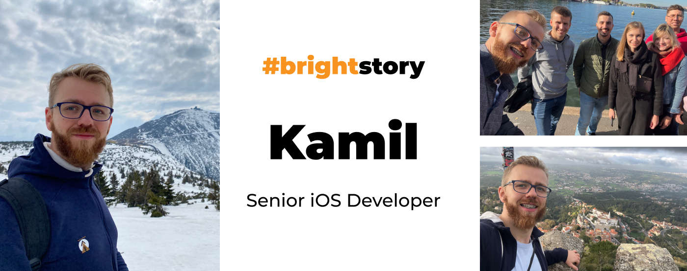
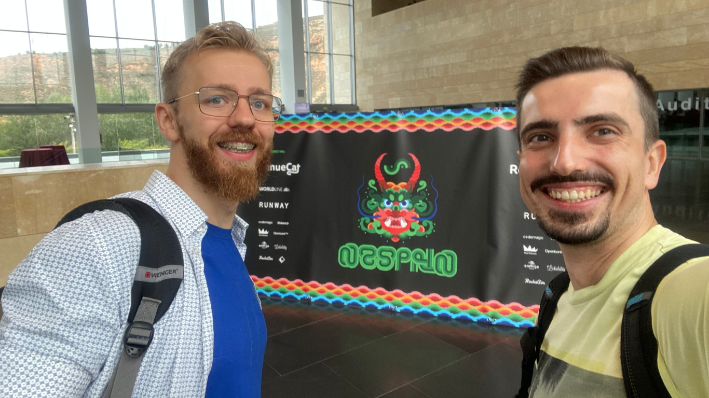
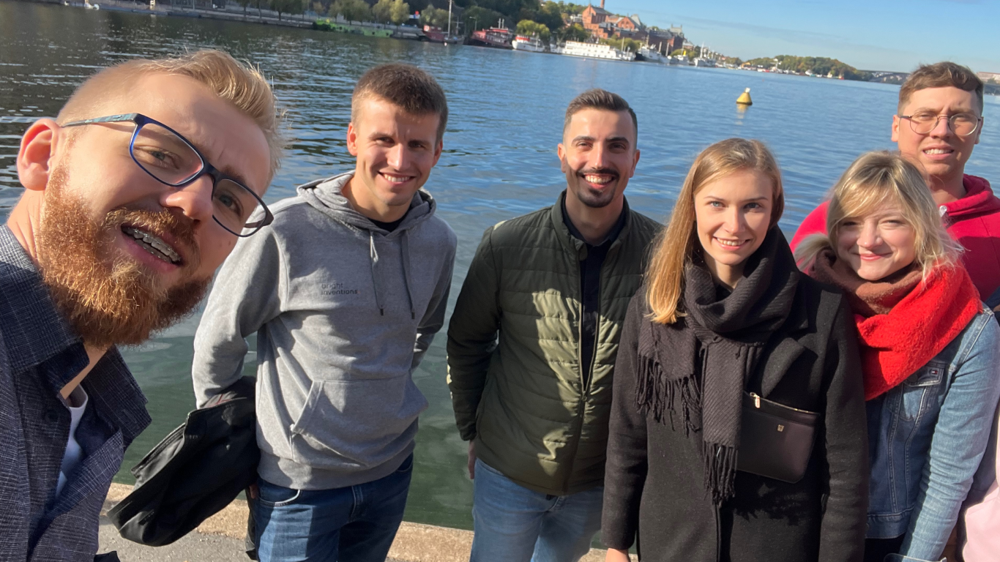
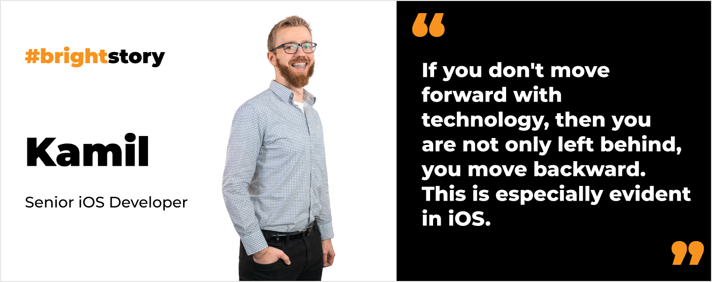
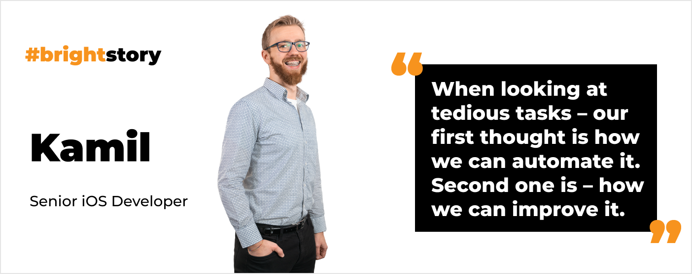

**Although he was programming from the age of 11, he wanted to become a lawyer. Eventually, he listened to his true calling and followed a software engineering path. Check Kamil’s iOS development career story with some unusual Android stops on the way. Also, find out what he is seeking from candidates during interviews.**

## You recently came back from the iOS event NSSpain. How was it?

Wine, Spain and iOS? Couldn't be better! I went there with Filip from the team, we had the opportunity to share a 4 hour drive from Barcelona to Logrono. The best part of it is that **it was a networking-first event**. There were multiple occasions to meet other iOS developers. **We were fortunate to bump into many speakers**, but when we did, honestly saying, we didn't yet know who they were! For example, we had a great conversation with a guy on the registration line about why the queue worked  the way it was and if it was optimal. Yeah we are nerds. What a shocker it was when later that day he stepped on a scene and we finally recognized it was [Swift Lee](https://www.avanderlee.com/). 

Kamil and FIlip at NSSpain

## Have you already bought a new iPhone? 😉

Not yet, but I have to admit **I am tempted**. I still have an iPhone 13. I was considering a pro model and looking for any great app that would "sell" LIDAR to me – but such an app still needs to be created I suppose. Maybe I will buy a new one this year, as dynamic island and USB-C (Finally, thanks EU!) makes my pocket shiver. 

In general I think I agree with what [MKBHD](https://www.youtube.com/user/marquesbrownlee) recently said in one of his videos. **New iPhones are like porsche, each generation is an improvement, but not a revolution**. Over longer periods of time – you can really appreciate what changed. Are two years sufficient? I think that's a question that everyone needs to answer themselves.

## Is it true that you have been programming for half of your life?

It certainly feels like it. 😀 Honestly, **I think it’s even longer than that**. I have a brother who is 9 years older than me. He was always interested in IT and was studying Computer Science. I followed his steps. Every pocket money we had we invested in hardware and we split expenses. For example, my brother bought a processor, and I bought RAM. Obviously when we were fighting, I was taking my RAM away. Sometimes we disassembled the computer a few times a week. 😀

I think **the first code I wrote was when I was around 11-12 years old**. I was playing one of the first MMORPGs back then – Eternal Lands. I joined one of the in-game guilds and decided that I would try to create a website for our team.

The way I learned was by copying other websites' code and deleting some parts to see what would be missing from the page. By playing online I already knew a bit of English – so I had this advantage. That's how I understood the concept of head, body, etc. I didn't know PHP (oh what a lucky and unaware sunshine I was), so my learning process was limited. 

## I assume you wanted to be a programmer when you grew up?

Not really. 😀 I wanted to be a lawyer. My plan was to finish the most promising technical school in the area, leave my home town, get a good paying job and be able to finance my part-time studies. So I went to mechatronics technical school.

## So how did you end up as a programmer? 😀

In the second grade of the technical school we started to program PLC. I found out that I was pretty good at it!. I even won some contests. So I went full Leeroy Jenkins and decided to study Automation and Robotics. 

However, during student internships, I could see that **it might be tricky for me to freely develop advanced skills in that area.** From my observations during that time **it was very rare to be an “author” of automations systems and software**. In Poland most people work as a person who just assembles ready-made projects or services them. To be something more you are fully dependent on the company you land in. Whether it supports your growth, paying for your courses and very expensive certifications. 

**In programming, you don’t need pricey courses. The only true limitation is You**. If you are determined, consistent, curious and open minded – you can excel in your area (no pun intended). Also, **who am I kidding – I love programming**, so eventually I chose Computer Studies as my Master’s.

When the storm comes – there are no crowds in Rome!

## Finally! And how did you become an iOS developer?

**I enjoy seeing the effects of my work. It's what I loved about automation**. Pumps, valves, actuators, motors – everything moves and is physically present, not virtual. You see the whole organism working. **The closest thing in IT I could think of that you can “touch” and interact with are mobile phones**. So I decided that mobile development is the way to go.

I actually started with Android and entered the null-pointer exception Java world. I think KitKat 4.0 was my first operating system. Back then, I worked at a software company in Wrocław, and they asked me if I wanted to try to migrate one of their in-house products to iOS. I was happy to learn something new. Fortunately, it was the end of Objective-C, and I was already learning to code in Swift 2.0.

That was also the time when Kotlin started to be in the spotlight. I remember attending a local Android meetup and seeing a presentation where **Kotlin was described as “the next big thing”. At the same time, I was looking at Swift – it was not “the next thing”. It was already there**. Production ready, fully supported, people jumping to it from Obj-c like crazy. So I decided to stick with it.

## Tell us more about your actual project at Bright Inventions

We work on a **food delivery app for the Israeli market** that focuses on both private and enterprise clients. The best thing about this project is the trust we have managed to build in the client-Bright Inventions relationship. 

**We have proved our expertise more than once, so they really listen to our recommendations**. It enables us to implement new solutions from Apple naturally while business knows it will be beneficial to them. It also allows us to be truly part of the process, aligning it to people, and not squeeze people inside some narrow box straight from the Scrum guide.

 Bright Inventions’ team retreat in Stockholm. 

## You are a tech recruiter at Bright Inventions. What is a perfect match in your opinion?

For me the **perfect Bright Inventions & candidate match is someone who sees the problem and first asks "why"**. A person **who tries to understand the context of the issue**. Look at it in a holistic way. Not just someone who wants to fix it without understanding what is really broken. 

What if a solution that everyone agreed upon only tackled symptoms not cause? Or some questions were never asked, because it was assumed that they were already answered? **During the interview, we try to determine if someone truly wants to grasp the root causes of the problem**.

Another important thing is **whether you keep on growing as an iOS developer**. It might sound harsh – but if you don't move forward with technology, then you are not only left behind, you move backward. This is especially evident in iOS. You can be an iOS developer who never wrote a single code in SwiftUI. Who doesn't know about Combine and is oblivious to Tasks, and Actors. Maybe never heard of Macros and SwiftData. You can continue doing your work like that for years, and suddenly your client asks you if they should switch to SwiftUI, and you have no idea what to say. 

**It’s really hard to argue over the benefits of new technologies if one doesn't know them**. And then it's almost impossible to push the product forward. Also without knowledge it’s tricky to distinguish good ideas from miss-used ones. When someone finds a hammer – suddenly everything around looks like a nail. You can end up in RxSwift hell where no one knows what’s going on, or with legacy code that no one wants to work with.

## What about people who can't use SwiftUI at work? If they catch up after hours but don't work with it commercially, would you welcome them to our team?

Yes, **I would admire them even more. I mean people who want to catch up in their free time because they are genuinely passionate about it**. You have to love iOS development, stay up-to-date, test new features and versions, etc., regardless of what you do at work. **When someone does it only because they’re forced by their job, that’s not our perfect match**. 

**iOS developers at Bright Inventions are passionate about their work. I know it sounds super cliche, but it’s true**. When looking at tedious tasks – our first thought is how we can automate it. Second one is – how we can improve it. We follow every news, update, attend iOS conferences etc. 

Steve Jobs once said:

<blockquote>
Stay hungry. Stay foolish. Never let go of your appetite to go after new ideas, new experiences, and new adventures.
<footer>Steve Jobs</footer></blockquote>

I would only add to that – stay curious.

## I know you like making homemade pasta. Do you still do it?

Yes, of course! **I recently made my own prawn tagliatelle**. It takes some time to do it properly. Recently I started thinking if it's worth it. I even bought the same type of durum pasta from the store to make sure there was a difference. There was. A LOT. 

My passion for homemade pasta started from the cooking classes I took with my girlfriend. We were looking for new hobbies and we decided to try it. It inspired us to try to prepare some food from around the world. We enjoy not only the better taste but the whole experience. It's a great way to spend time preparing meals together. 
