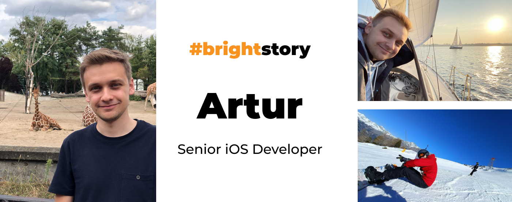
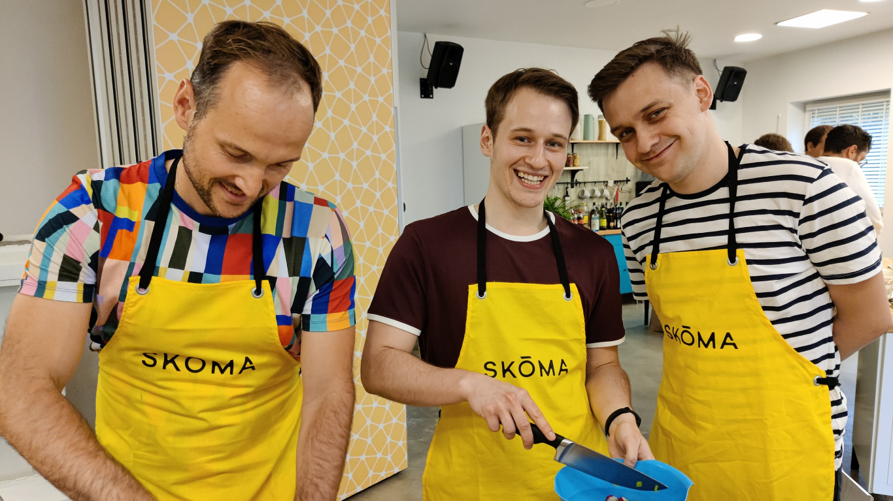
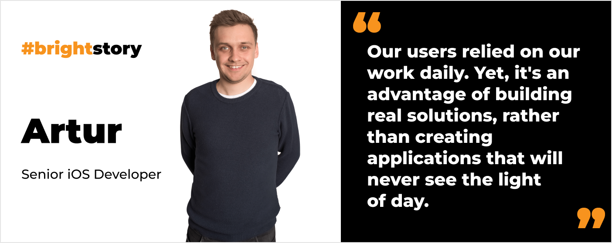
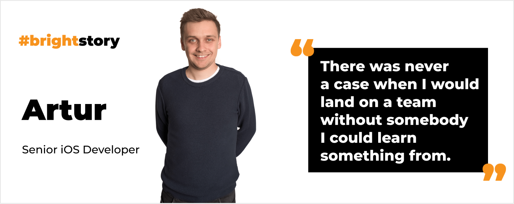

**He became an iOS developer by chance, but couldn’t love it more. Find out how Artur’s career has evolved over 5 years from a junior to a senior iOS developer. Check out the apps he has worked on. Discover his favorite travel destinations too. Let’s dive in!**

## You joined Bright Inventions 5 years ago while you were still at college. How did you start your job here?

I saw a job listing for a blockchain developer position and applied. However, before I had my interview, the position got filled. Yet, **[Michał](/about-us/michal/) decided to still interview me and eventually offered me the position of iOS developer**.

I didn't have any experience with iOS back then. I had maybe 2 classes about it in college. However, I always liked Apple products, so I thought I could go for it. That’s how I became an iOS developer. **Maybe it was a coincidence rather than a conscious decision, but I really enjoy [iOS development](/our-areas/mobile-app-development/)**.

## How would you compare your challenges at the beginning of your career to now?

Back then, the team was much smaller. There were only 2 other iOS developers at Bright Inventions. Although they were very supportive, I needed to quickly learn a lot on my own. It required a lot of self-organization to find the answers online. **Then, my challenges were related to the learning process, using the programming languages, and how to structure my code**.

Now, I work in a bigger team, and the daily challenges are different. Currently, **we focus on enhancing our communication and creating processes that will help us cooperate effectively**. I work in a team that consists of 6 people. Some would say it’s still a small group, but we really need to communicate well to move the development process forward

So, my first challenge was to effectively manage work on my own. Nowadays, it is all about working effectively as a team.

<h2>Join Artur's team</h2>
We are looking for an experienced iOS Developer whose main goal will be supporting us in building the powerful high profile iOS application that will impact how Just Eat shapes the retail world.
<a href="/jobs/senior-ios-developer/"><button>apply now</button></a>

## And how do you enjoy working with your current team?

I am a part of an experienced and very competent team. It consists of only senior iOS developers who are highly engaged in what they do. We work on a food delivery app available on the Israeli market. I enjoy the fact that our client trusts us; therefore, we can choose the tech stack we use. 

Our team also includes skilled software testers. Although we, as developers, do some tests on our own during the code review, it’s great to share the responsibility. I still feel responsible for my code, but it’s great to feel the reassurance that there are people who will test it as well.

Artur during a team retreat.

## What projects, that you worked on, are particularly memorable to you?

[Finebite](/projects/everytap/) for sure. **That’s a very popular app in Poland, and it was great to be a part of its development process from the beginning to the launch**. When people find out I am a mobile developer, they often ask me if I've worked on any apps they know. I always mention Finebite, and people recognize it. That’s cool. :)

[Just Eat POS](/projects/system-for-restaurants-mobile/) (prev. Practi) was one of the projects close to my heart as well. It was **a retail platform, very popular, especially in the Israeli market**. We delivered solutions for restaurant owners and their employees. Our users and their businesses relied on our work daily. So, it was a huge responsibility. Yet, it's an advantage of building real solutions, rather than creating applications that will never see the light of day.

## What’s your recipe for spending over 5 years at one company? It’s rather unique nowadays. 😀

The key ingredient is changing the projects you work on. I've worked for various clients, with different people. Sometimes it almost felt like changing a company. **It’s great to change teams to share knowledge with others. There was never a case when I would land on a team without somebody I could learn something from**. 

Although **I have been in one company for over 5 years, Bright Inventions gave me an opportunity to work on many different solutions and touch on various technologies**. What's also important **I have built products that are really used and appreciated by users**.

I even traveled to London to see with my own eyes how the end users used the application I had built. It’s such a great feeling to see that your work gives value to someone.

## How do you catch up with news and trends in the iOS world?

As probably every iOS developer, I always check all the news announced during The Apple Worldwide Developers Conference. Besides that, **I have OKRs dedicated to my personal growth, monitored by my mentor – [Kamil](/about-us/kamil-b/)**. We both choose topics that I can improve on or decide on what new solutions and tools I should test. 

Thanks to the fact that our client lets us choose the tech stack we work on, we can quickly implement new technologies in our project. **So we get to work with SwiftUI, async/await to utilize those for the benefit of our client staying up-to-date with Apple products**.

## I know you love to travel. Some of your favorite travel destinations are Scandinavia and Iceland. Why?

I visit these places regularly to hike in nature. I had a chance to experience polar day and to see the Northern lights too. I don’t know which one is better. I recommend everyone to see both.

.")

Hiking in Northern Norway (nearby Tromso).

I would actually love to try living on a polar day. I'd like to experience living in a place where you can organize your life cycle whenever you want, and you are not dependent on the time of day or night.

It’s not that easy to experience the northern lights, though. You have to be lucky. The sky has to be clear. It’s worth noting that the temperature was really low. When I was there, it was -27 degrees Celsius.

## I know you are going to the Manchester United vs. Liverpool game in April 2024. What is the score going to be? 😉

I’d say it is going to be 3-1 for Manchester United. At least I hope so. 😀 We’re about to find out. 😉

Artur during Manchester United stadium tour.

