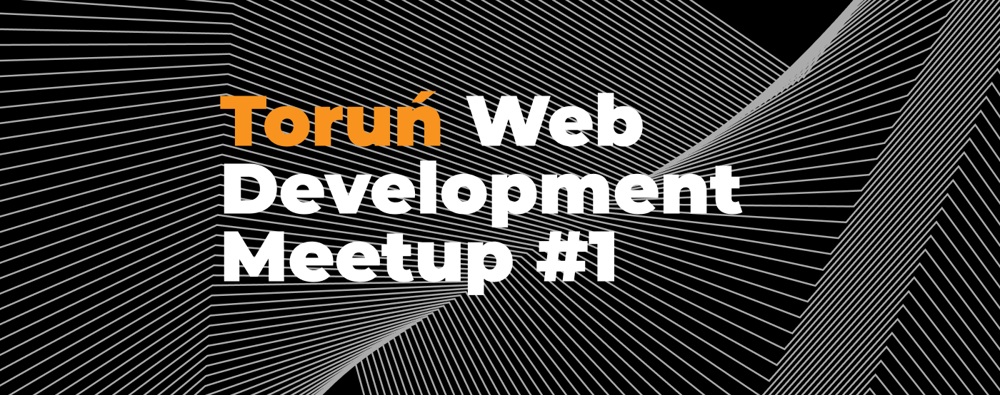
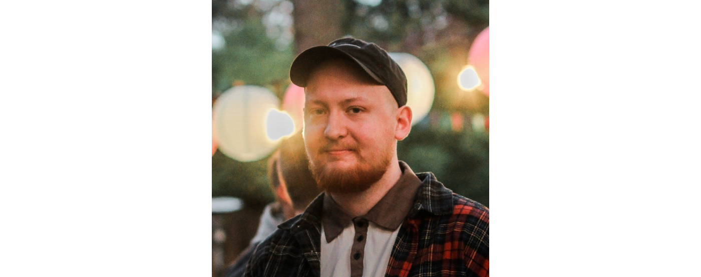

**We are calling web developers from Toruń and nearby! Whether you're a seasoned web developer or just starting your journey, let’s meet at Toruń Technological Incubator. We have an event coming on October 18! Toruń, here we come!**

## What to Expect at Torun Web Development Meetup #1 \[Agenda]

### 📌 Registration and Networking | October 19, 6.00 PM – 6.15 PM

We'll start with some casual networking, giving you the opportunity to meet other web enthusiasts and share your experiences.

### 🚀 Web Components – The Illusion of Encapsulation | Wojciech Trawiński | 6.15 PM – 6.50 PM

Encapsulation, independence, and reusability are the buzzwords that technology Web Components are described, much like a Hollywood story. But is it really justified?

During my presentation, you will get to know the darker side of Web Components and learn how the context of your element's use affects its functionality.

### ☕️ Short Regenerative Break | 6.50 PM – 7.00 PM

Grab that coffee and get ready for what’s next.

### 🚀 Frontend in Production | Olaf Sulich | 7.00 PM – 7.35 PM

Frontend beyond the realm of Udemy courses. Discover how to create modern and secure user interfaces for millions of users.

### 🌐 Q&A and Discussion | 7.35 PM – 8.00 PM

After the presentations, we will have time for questions and discussions.

### 🍕 Snacks and Networking | 8.00 PM – 8.30 PM

Following the official part of the meeting, we invite you for snacks and further networking. It's a great opportunity to continue conversations and establish new connections.

## Meet our speakers

**[Wojciech Trawiński](http://www.linkedin.com/in/wojciech-trawi%C5%84ski)**

A Senior Software Engineer who specializes in creating web applications. He is an enthusiast of the Angular framework and reactive programming, always seeking challenges both in and outside of work. He is also the author of the blog "[JavaScript Everyday](https://medium.com/javascript-everyday)". In his free time, he enjoys watching Formula 1 and... building Lego. He is addicted to coffee, chocolate, and cycling.

**[Olaf Sulich](https://www.linkedin.com/in/olaf-sulich/)**

A Senior Frontend Developer who isn't afraid of any challenges. The creator of the [Frontlive.pl](https://frontlive.pl/) blog and a community for ambitious programmers on Discord. Currently, he is working on developing one of the largest and most dynamic marketplaces in Poland – Allegro Lokalnie.

## Let’s meet in Toruń

Are you ready to join us? [Get your free ticket now](https://www.meetup.com/toru%C5%84-web-development/events/295971160/)!

## Event Details

Date: October 19, 2023

Time: 6:00-8.30 PM

Location: Business Link Toruń Toruński Inkubator Technologiczny

Hosted by: Bright Inventions

Event Link: [meetup.com](https://www.meetup.com/toru%C5%84-web-development/events/295971160/)
