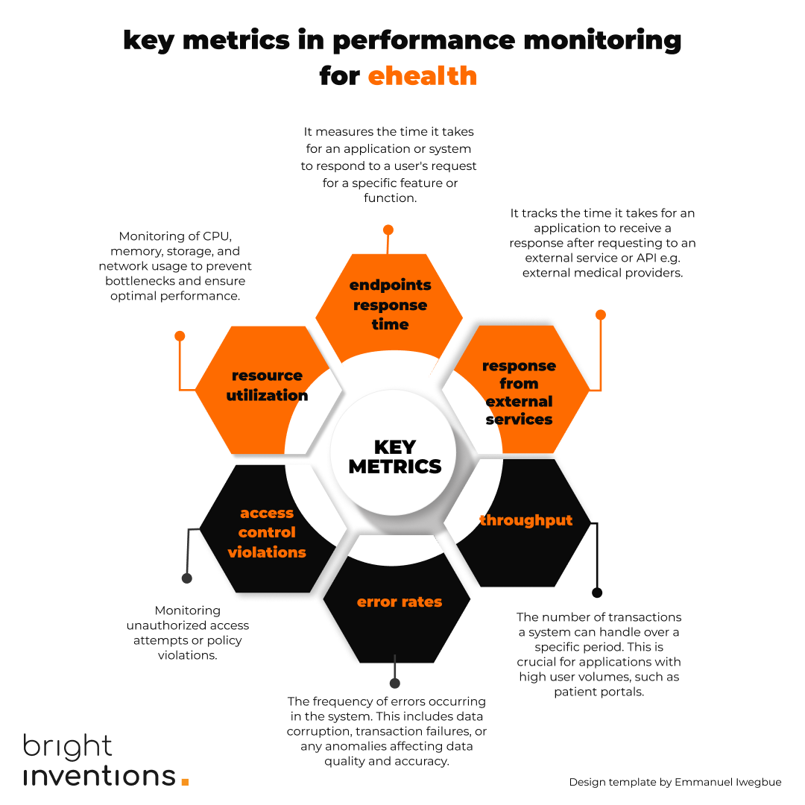
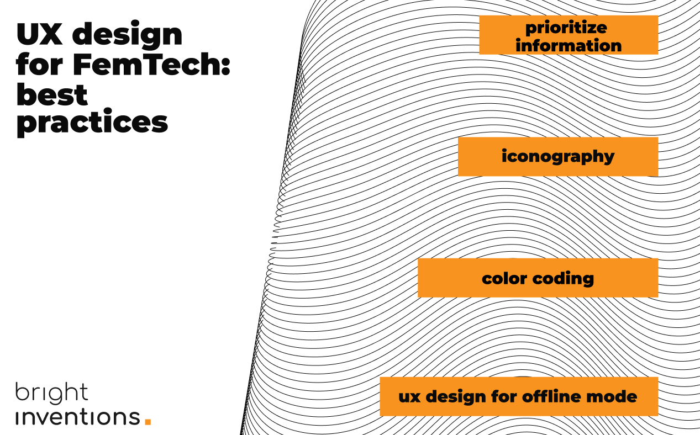

**FemTech means technology for women. It is as simple as that, yet it embraces so many layers, and responsibilities. As a healthcare software development company, we may not have all the answers to your business challenges, but we're here to guide you on how to smartly leverage technology. Let us show you how tech can help you enhance your solution and – more importantly – relations with your female users.**

## Empathy and data-driven development \[use case: onboarding for an app for pregnant women]

What’s best for FemTech users? Short, easy-to-complete onboarding, or perhaps a long but very personalized one? The answer might surprise you. Short onboarding is often a key to success, especially in lifestyle applications, but this might not be the case in applications related to health.

From the first interactions with your FemTech app, it's crucial to demonstrate the willingness to understand their perspective without making assumptions. Well-designed onboarding will convey this approach to your female users right from their very first interactions.

No matter what onboarding strategy you will choose you should always analyze its performance by measuring the competition rate as a part of data-driven development.

Read more about [how data-driven development saved the onboarding of FemTech app for moms-to-be](/blog/data-driven-development-femtech-app-onboarding/).

## Building trust with security \[guide to internal security audit included]

Patients don't want to share their health data with health tech companies. It's hard to blame them. Day by day, we hear about cyber attacks targeted at healthcare companies. At the same time, security practices aren't some mystery knowledge. You can quickly conduct even an internal security audit with the tools that we list in our [security guide for healthcare](/blog/cyber-security-in-healthcare/).

## Ensuring credibility with app performance monitoring \[tutorial and metrics cheat sheet included]

User frustrations related to your solution may be painful for you in the future. Yet, there is quite an easy way to prevent it. Implement app monitoring from the very beginning (or as soon as possible) to monitor any app performance issues before your female users even experience them. There are many crucial metrics you should measure:

A basic app performance monitoring can be set up even within a day. For more information on this go to our another blog post deeply covering [eHealth app performance monitoring](/blog/healthcare-app-performance-monitoring/).

## Inclusive product design

UX/UI design must tame any complexities and immediately show the value of your solution, otherwise patients and physicians won’t be keen to use it. Your design should offer a personal approach and enhance smooth navigation for women of different age groups and levels of tech-savviness.

[Check how we approached a product design for a complex healthcare solution](/blog/ux-design-healthcare-medical-apps-case-study/).

