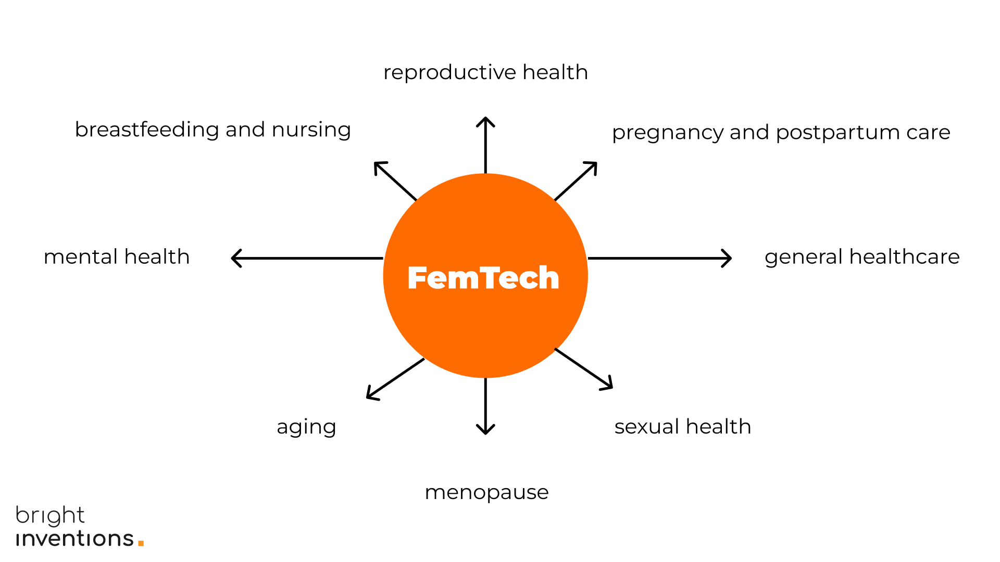

**FemTech means technology for women. It is as simple as that, yet it embraces so many layers, and responsibilities. As a healthcare software development company, we may not have all the answers to your business challenges, but we're here to guide you on how to smartly leverage technology. Let us show you how tech can help you enhance your solution and – more importantly – relations with your female users.**

## Empathy and data-driven development \[use case: onboarding for an app for pregnant women]

What’s best for FemTech users? Short, easy-to-complete onboarding, or perhaps a long but very personalized one? The answer might surprise you. Short onboarding is often a key to success, especially in lifestyle applications, but this might not be the case in applications related to health.

From the first interactions with your FemTech app, it's crucial to demonstrate the willingness to understand their perspective without making assumptions. Well-designed onboarding will convey this approach to your female users right from their very first interactions.

No matter what onboarding strategy you will choose you should always analyze its performance by measuring the competition rate as a part of data-driven development.

Read more about [how data-driven development saved the onboarding of FemTech app for moms-to-be](/blog/data-driven-development-femtech-app-onboarding/).

## Building trust with security \[guide to internal security audit included]

Patients don't want to share their health data with health tech companies. It's hard to blame them. Day by day, we hear about cyber attacks targeted at healthcare companies. At the same time, security practices aren't some mystery knowledge. You can quickly conduct even an internal security audit with the tools that we list in our [security guide for healthcare](/blog/cyber-security-in-healthcare/).

## Ensuring credibility with app performance monitoring \[tutorial and metrics cheat sheet included]

User frustrations related to your solution may be painful for you in the future. Yet, there is quite an easy way to prevent it. Implement app monitoring from the very beginning (or as soon as possible) to monitor any app performance issues before your female users even experience them. There are many crucial metrics you should measure:

A basic app performance monitoring can be set up even within a day. For more information on this go to our another blog post deeply covering [eHealth app performance monitoring](/blog/healthcare-app-performance-monitoring/).

## Inclusive product design

UX/UI design must tame any complexities and immediately show the value of your solution, otherwise patients and physicians won’t be keen to use it. Your design should offer a personal approach and enhance smooth navigation for women of different age groups and levels of tech-savviness.

[Check how we approached a product design for a complex healthcare solution](/blog/ux-design-healthcare-medical-apps-case-study/).

## Offline-first application

Depending on your FemTech solution, implementing an offline mode might be necessary to enable users to take crucial actions within the app, even without internet access. This feature is particularly important for apps designed to track vital signs, menstrual cycles, or breastfeeding experiences, ensuring accessibility even with unreliable internet connectivity. Additionally, for remote patient monitoring, offline mode allows for the tracking of vital signs with medical devices, with data synchronization with doctors as soon as internet access is restored.

Offline mode can significantly enhance your solution, but it's important to first assess whether your product truly benefits from this feature. [Read more about offline-first applications](/blog/offline-first-app-guide-for-startups-app-owners-case-studies/).

## Incorporate medical devices and wearables

This includes the development of medical devices and diagnostics specifically designed for female anatomy or conditions. Examples include advanced mammography devices, pelvic floor exercisers, and devices for non-invasive gynecological treatments.

In many cases, telemedicine cannot exist without medical devices creating IoT systems that enable the tracking of patients’ vitals and allow physicians to monitor them in real-time. One of the greatest challenges is integrating various devices with often different SDKs into one unified system.

[Glooma](https://glooma.pt/en) introduces SenseGlove, a breast self-examination device, enhances traditional breast exams by linking to a mobile app for reminders and recommendations​​.

## Last but not least – change your mindset from client-centric to patient-centric

In FemTech, it's crucial not to see your 'users' merely as clients. Instead, foster a mindset among your team and within yourself to treat 'users' as patients with specific issues and needs. Recognize them as females, mothers, sisters, daughters, wives, girlfriends, and more – but never just users or clients.

## Bonus: areas of FemTech with examples of companies

### Reproductive health

This area includes technologies related to menstruation, contraception, fertility solutions, pregnancy, and nursing care. Apps that track menstrual cycles and fertility windows fall into this category, as do technologies assisting with in vitro fertilization (IVF) and other fertility treatments.

Clue offers a health app for tracking menstrual and fertility cycles, providing women with accurate predictions and insights into their reproductive health​​.

Flo Health has developed a widely-used app for period and ovulation tracking, leveraging AI to offer personalized insights and support for female health​​.

### Pregnancy and postpartum care

Technologies and services designed to support women before, during, and after childbirth. This can include prenatal and postnatal care apps, wearable devices monitoring maternal and fetal health, and platforms offering support and resources for new mothers.

Keleya offers a large selection of pregnancy workouts, yoga & expert knowledge tailored to the needs of pregnant women.

### General healthcare

This encompasses a broader range of health issues, including prevention, treatment, and wellness. It includes platforms for women-specific health conditions like polycystic ovary syndrome (PCOS), breast cancer and endometriosis, as well as apps and wearables focused on general fitness, nutrition, and mental health tailored to women's needs.

Gennev provides a telehealth menopause clinic, offering consultations with doctors and dietitians alongside education and menopause treatment​​.

DeepLook Medical empowers radiologists with a cutting-edge software tool to improve the visualization and efficiency of medical imaging, even in dense breast tissue.

https://giphy.com/gifs/graceandfrankie-netflix-jane-fonda-grace-and-frankie-xWprZWAlCl1utvEBil

### Sexual health

Solutions and platforms dedicated to sexual education, sexual health, and wellness, including STD prevention and treatment, sexual dysfunction solutions, and products enhancing sexual well-being.

Tabu focuses on sexual wellness, starting with products aimed at women in peri- to post-menopause, addressing the connection between sex and overall well-being​​.

### Menopause

Products and services focused on health issues related to aging in women, including menopause management. This can involve hormone replacement therapy (HRT) management apps, products for managing symptoms of menopause, and platforms offering advice and community support.

XbyX offers a digital platform with plant-based products and educational content to help women navigate menopause with ease​​.

Astinno is developing Grace, an automated smart cooling bracelet designed to help women experiencing hot flushes during menopause​​.

### Aging

Menopause is often associated with the aging of females, yet reaching a certain age is related to many conditions that should also be addressed by tech companies. Osteoporosis, dementia, weight gain, and urinary incontinence are only a few of the conditions.

Oviva Therapeutics focuses on developing innovative therapeutics aimed at improving ovarian function to extend the healthspan of women

INNOVO offers a non-invasive, FDA-cleared solution for treating stress urinary incontinence in women

### Breastfeeding and nursing

Technology solutions designed to support breastfeeding mothers, including lactation apps, smart breast pumps, and devices for monitoring milk supply and feeding schedules.

LactApp provides personalized support for breastfeeding and motherhood, integrating professional healthcare services via an app​​.

### Mental health

Platforms and apps focused on mental health issues, offering services such as counseling, therapy, and support groups tailored specifically for women and the unique challenges they may face.

AtEase is an inclusive mental health platform by Lilac Insights that caters to women (cis-women & transwomen) and non-binary individuals (gender identities that are outside the binary of man & woman) with different stories.

Circles give access to 24/7 live emotional support groups that aim to navigate life's greatest challenges, from anxiety, depression, and grief to divorce and more.