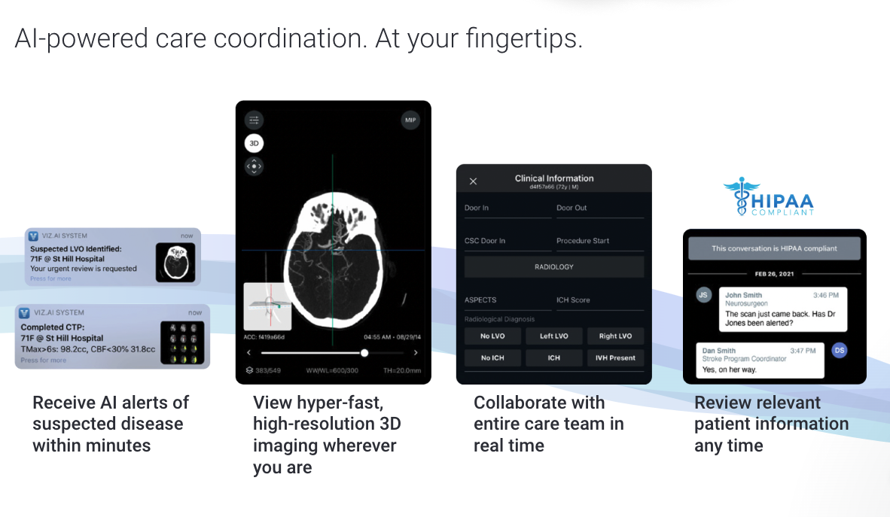

**LLMs are at the forefront of the AI revolution in healthcare. However, there are ongoing concerns about the security of medical data used to generate content with LLMs. Discover what steps you need to take to ensure your LLM solution is secure and compliant with HIPAA or GDPR, in case you use OpenAI solutions.**

## What are LLMs?

Large Language Models (LLMs) are a type of artificial intelligence model designed to understand, generate, and interact with human language at a large scale.

LLMs are trained on vast amounts of text data, enabling them to learn language patterns, grammar, facts about the world, and even writing styles. This training allows them to perform a wide range of language-based tasks including text generation, translation, summarization, question answering, and conversation.

## **How can LLMs be used in healthcare (a use case)**

[Viz.ai](https://www.viz.ai/) uses LLM to support medics in faster diagnostics. Their AI-powered care coordination solution leverages advanced, FDA-cleared algorithms to analyze medical imaging data, including CT scans, EKGs, echocardiograms and more, providing real-time insights and automated assessments to accelerate diagnosis and treatment.

Source: Viz.ai webpage

## Securing medical data when using LLMs

Is using one of the most popular LLM providers – OpenAI – secure? You should always consult with a legal professional since every situation is unique. However, generally speaking, **OpenAI API is eligible for GDPR and HIPAA compliance**.

What does this actually mean? You can use OpenAI to build LLMs that learn from medical data. However, you need to be aware of the following aspects:

### How to prevent training from your data

If you decide to use Chat GPT offering, you have to use business products offered by OpenAI such as ChatGPT Team or ChatGPT Enterprise because only these plans ensure no training from your data. So obviously a free version of ChatGPT is not an option. To be HIPPA eligible you need to use API to ask for zero data retention.

### 30 days data retention

OpenAI may retain API inputs and outputs for up to 30 days. After 30 days, API inputs and outputs are removed from their systems, unless the OpenAI is legally required to retain them.

### Zero data retentions (ZDR) are eligible for some endpoints

You can chat with support to enable ZDR in eligible endpoints. [The list of endpoints is accessible on the OpenAI page](https://platform.openai.com/docs/models/how-we-use-your-data). 

### ZDR doesn't refer to images

It’s important to know that only text data are GDPR and HIPAA-compliant. Avoid importing scans, or images because OpenAI can store them.

### Business Associate Agreement (BAA)

[OpenAI enables the signing of Business Associate Agreements (BAA)](https://help.openai.com/en/articles/8660679-how-can-i-get-a-business-associate-agreement-baa-with-openai) in support of customers’ compliance with HIPAA. Keep in mind that only endpoints that are eligible for zero retention are covered by the BAA.

If you want to delve into the OpenAI privacy policy, read the article that will navigate you through the [OpenAI ChatGPT Team & Enterprise privacy terms](https://brightinventions.pl/blog/openai-chatgpt-team-enterprise-privacy-policies-explained/).

<h2>discuss your LLM solutions with us</h2>
Let's talk about your tech challenge while building healthcare solution. Our experts offer free consultations in 48 hours.
<a href="/our-areas/healthcare-software-development/"><button>book a free consultation</button></a>
