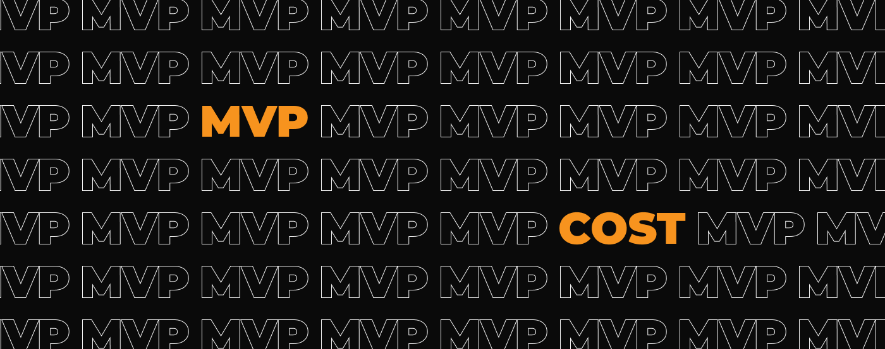

**How much does building MVP cost? There is no easy answer to that question. It’s like buying a car. You can buy an operating car for less than 10 000 dollars. Yet you can also buy a Ferrari for over 1 million dollars. It depends on how advanced the product you have in mind. Check out the main factors that affect the cost of developing MVP.**

## How advanced your app should be

Well-advanced apps like Uber or Google Maps may cost hundreds of thousands of dollars. Fortunately, **startups usually don’t have to begin with that budget**. The smart way to start app development is to create a prototype and then the MVP. MVP stands for Minimum Viable Product. It’s the very first version of your solution containing crucial features only. Then you can release MVP to a small group of users and see how they respond to it. According to the valuable feedback, you can develop your app eliminating crucial mistakes at the very beginning. 

MVP helps you invest less money to check if your idea has market potential. You start something small and develop it according to your users' needs.

It’s a bit like buying a cheaper car just to see if driving to work is fine by you. Let's assume that you just passed your driving test and want to check if driving to work will be better for you than riding a bus. If you’re not sure what you want, the smart way is to buy a cheap car. Eventually, if you rather commute using buses there is a chance to sell your car without a feeling of a bad investment. However, if driving a car turns out to be a perfect solution for you – you can start to save money for a better vehicle.

<EbookDynamic sectionTitle='Limited budget? Get our free ebook and start building smarter' ebookName='From-MVP-to-a-Final-Product.pdf' ebookDescription='Discover how an MVP can help you validate your app idea without breaking the bank.' ebookImage='/images/mvp_ebook_cover.png' ebookAlt='MVP ebook cover' />

## The cost of app infrastructure

When startups try to estimate the project, they sometimes overleap the fact that the budget should include not only the app itself but also the whole infrastructure behind it. **Software needs to coexist with outside systems that generate extra costs**. The most important is the server infrastructure needed to exchange data. It is impossible to predict the cost of server infrastructure without going into detail. **The price depends on what server provider you would choose and how big the infrastructure needs to be**. It’s like the budget for gasoline. Every car has a different fuel burn efficiency.

## The cost of app maintenance

Guess what? It’s like owning a car. 🙂 Buying a vehicle is probably the biggest but only the first payment of the new owner. Every car needs regular services and sometimes repairs. It relates to the software development world. **Launching MVP doesn't mean the work is over. Even if you wait with adding new features, you still have to take care of the app's maintenance**. 

Both Google and Apple regularly upgrade their systems. On top of it, new mobile devices are launched every year. Every app needs to be adjusted to these changes. That brings extra costs such as developing and testing the new versions of the app.

What is more, Google and Apple provide changes on their app stores that often affect every app owner. As an example, Google demanded from app owners information about the age range of their app users. It might not be time-consuming to meet these types of requests. Still it is crucial to keep an eye on them otherwise your app may be even banned from the store.

## Developing an app for iOS and Android doubles the price

It sometimes **comes as a surprise to startups that developing an app for Google Play and App Store comes with 2 separate development processes which double the budget**. When you plan to eventually develop an advanced product, it isn't advisable to do [cross-platform software for both stores](/blog/native-app-development-vs-cross-platform/). Apple and Google have their different requirements, processes, and tools. Thus, you need two teams with different coding skills to create products for both top app stores. However, **building two products for iOS and Android isn’t a must**!

That is why our team at Bright Inventions loves to build MVPs to analyze the app market potential and check if it is necessary to create both versions for iOS and Android. Developing only one of them is not such a rare case. For example Instagram was first launched on AppStore only.

<h2>Do you want to estimate your MVP?</h2>
Contact us to book a free consultation in 48 hours. Based on your requirements and product idea we will estimate your solution.
<a href="/our-areas/mvp-development/"><button>let's discuss your solution</button></a>

