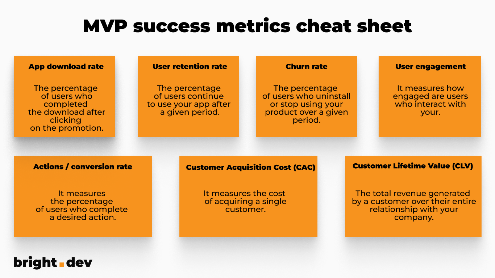

**You have an idea, design, and maybe even a software development team to build your mobile application. Still haven't you forgotten about something? What about establishing key targets that you want to achieve? Only then can you verify if your product is successful. Check out how to do that!**

- - -

## Table of contents

[Metric #1: App Download Rate](/blog/metrics-to-measure-mobile-mvp-success-cheat-sheet/#metric-1-app-download-rate)

[Metric #2: User Retention Rate](/blog/metrics-to-measure-mobile-mvp-success-cheat-sheet/#metric-2-user-retention-rate)

[Metric #3: Churn Rate](/blog/metrics-to-measure-mobile-mvp-success-cheat-sheet/#metric-3-churn-rate)

[Metric #4: User Engagement](/blog/metrics-to-measure-mobile-mvp-success-cheat-sheet/#metric-4-user-engagement)

[Metric #5: Actions and Conversion Rate](/blog/metrics-to-measure-mobile-mvp-success-cheat-sheet/#metric-5-actions-and-conversion-rate)

[Metric #6: Customer Acquisition Cost (CAC)](/blog/metrics-to-measure-mobile-mvp-success-cheat-sheet/#metric-6-customer-acquisition-cost-cac)

[Metric #7: Customer Lifetime Value (CLV)](/blog/metrics-to-measure-mobile-mvp-success-cheat-sheet/#metric-7-customer-lifetime-value-clv)

[MVP success metrics – cheat sheet](/blog/metrics-to-measure-mobile-mvp-success-cheat-sheet/#mvp-success-metrics--cheat-sheet)

- - -

Let’s assume that you chose an Agile way and decided to build [MVP (Minimum Viable Product)](/our-areas/mvp-development/), so you can quickly release your solution and verify it with users. While working on the MVP, **at the very beginning, you should establish your goals and ways to measure them**. Naturally, they can change as the product evolves and you gain a better understanding of the market.

## Examples of MVP success metrics

Here are some MVP success criteria for validation of your MVP, along with recommended tools to help measure them:

### Metric #1: App Download Rate

This metric is crucial for mobile MVPs and indicates how appealing your app is to users and whether your marketing efforts are effective.

To calculate the download rate, use the following formula:

App Download Rate (%) = (The number of users who download the app / The number of users who click promotional content) x 100

Remember that downloading isn’t everything, though. [50% of Android apps are uninstalled within 30 days after the download](https://www.businessofapps.com/news/half-of-android-apps-are-uninstalled-within-30-days-after-download/). If your download rates are satisfactory but the number of active users is extremely low you might be dealing with a **high uninstall rate**. 

That’s why the app download rate cannot be measured without the retention rate (keep on reading to discover that).

Tools to track app download rate: 

You can track app downloads using tools provided by well-known mobile app stores: **Google Play Console** for Android apps, and **App Store Connect** for iOS apps.

### Metric #2: User Retention Rate

It measures what **percentage of users continue to use your app after a given period** such as 30 days after app installation. User retention rate might be a crucial measurement to see if your product has loyal and engaged customers.

To calculate the user retention rate, you can use the following formula:

User Retention Rate (%) = \[(The number of users at the end of a specific period - The number of new users acquired during that period) / The number of users at the start of the period] x 100 

**Tools to track user retention rate:** 

**Mixpanel, Firebase + Google Analytics** and **Amplitude** will be of help in measuring user retention rate.

### Metric #3: Churn Rate

This metric **measures the percentage of users who uninstall or stop using your product** over a given period. It helps identify potential issues with your app that might be causing users to churn. 

To calculate the churn rate, you can use the following formula:

Churn Rate (%) = \[(Customers at the Start of the Period - Customers at the End of the Period) / Customers at the Start of the Period] x 100 

There are many possible reasons why your users might delete your app or simply stop using it. The most common are:

* **Wrongly targeted or misleading ad campaigns** – users download the app only to realize that it’s not useful to them or it doesn’t offer what was promised.
* **UX issues** – your app is too difficult to navigate or not enough visually appealing.
* **Tech issues** – your app has performance issues, it frequently crashes, etc.
* **Too many notifications** – we all know that notifications are a powerful feature for mobile apps but be careful. With that power comes responsibility.
* **Too many ads** – what can we add here? Make your app worthy for users, then reasonably monetize. 😉

**Tools to measure churn rate**

Tools like **Mixpanel, Amplitude, or Kissmetrics** offer features to monitor and analyze churn rates.

### Metric #4: User Engagement

This metric **measures how engaged are users who interact with your mobile MVP**. You can track actions such as making a purchase, time spent on the app, and viewing certain screens.

Here's one of the ways to calculate user engagement:

User Engagement Rate (%) = (Number of Engaged Users / Total Users) x 100 

The definition of "engaged users" can vary depending on your business. You should choose the activities that will define your active user and track them with the preferred tool.

**Tools to measure user engagement**

Tools like **Firebase, Mixpanel, and Amplitude** offer features to measure user engagement and provide insights.

### Metric #5: Actions and Conversion Rate

This metric **measures the percentage of users who complete a desired action**, such as signing up, making a purchase, finishing onboarding, or filling out a form. Some of these actions directly impact the revenue generated by your MVP. So this is a metric that every app owner wants to measure.

The formula for calculating the conversion/action rate is as follows:

Conversion Rate (%) = (Number of Conversions / Total Number of Visitors or Users) x 100 

Action Rate (%) = (Number of Actions / Total Number of Visitors or Users) x 100 

**Tools to measure conversion rate**

Tools like **Firebase, Google Analytics, Kissmetrics, or Optimizely** can help you track and optimize your conversion rates.

<EbookDynamic sectionTitle='Delve deeper into MVP development with this ebook' ebookName='From-MVP-to-a-Final-Product.pdf' ebookDescription='Download the free ebook and find out how to quickly validate your idea with MVP.' ebookImage='/images/mvp_ebook_cover.png' ebookAlt='MVP ebook cover' />

### Metric #6: Customer Acquisition Cost (CAC)

This metric **measures the cost of acquiring a single customer**. It is calculated by dividing the total cost of sales and marketing efforts by the number of new customers acquired during the same period. You can compare the budget spent for different acquisition channels and eventually make a decision on which activities are the best option for your solution.

Based on your company's marketing budget you should establish a maximum cost per customer acquisition that you can spend to get clients. It’s a key metric to establish at the beginning, so your financial books are well-balanced. 

It’s wise to benchmark your CAC. Every industry has to consider different costs. You might consult your marketing budget with marketing freelancers or agencies that specialize in targeting campaigns in your industry. You can also discuss your estimated bids on digital marketing specialist groups on Facebook or LinkedIn, however, remember to verify the answers.

To calculate CAC, you can use the following formula:

Customer Acquisition Cost (CAC) = Total Sales and Marketing Expenses / Number of New Customers Acquired 

**Tools to measure Customer Acquisition Cost**

Tools like **HubSpot, Salesforce, Adjust, Google Analytics (connected with Firebase), and Google Keyword Planner** can assist in estimating, tracking, and analyzing customer acquisition costs.

### Metric #7: Customer Lifetime Value (CLV)

This metric **measures the total revenue generated by a customer over their entire relationship with your company**. Calculating CLV involves multiplying the average value of the purchase by the number of purchases made by the customer in a year and then multiplying that by the average length of time, a customer remains active. 

Here's a basic formula for calculating CLV:

CLV = (Average Purchase Value x Average Purchase Frequency x Average Customer Lifespan) 

**Tools to measure Customer Lifetime Value (CLV)**

Tools like **HubSpot, Salesforce, or Kissmetrics** can help you track and analyze customer lifetime value.

## MVP success metrics – cheat sheet

Here’s the summary of all mentioned metrics with short definitions. Enjoy!

## Choose the right metrics and analytics tools for your MVP

Remember, these are just a few examples of metrics. There are others and maybe even more suitable for your specific MVP and industry. 

Final things to remember about MVP analysis:

* It's important to choose the most relevant metrics for your business goals and use tools that provide accurate and actionable insights. 
* Don’t surround yourself with too much data, though. Choose only key metrics that you want to follow. 
* Choose metrics at the beginning of your MVP development. Don’t start to think of analytics after the launch. By then you should have a clear plan of what to measure.

Are you planning to develop your mobile application? Feel free to contact my colleagues from [Bright Inventions ](/our-areas/mobile-app-development/)to discuss your mobile solution.
