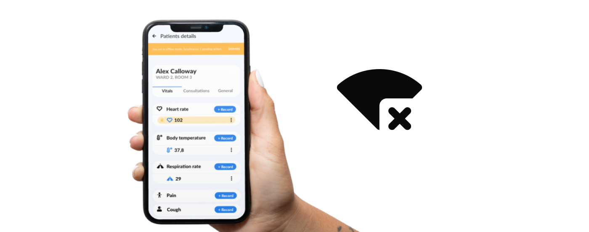
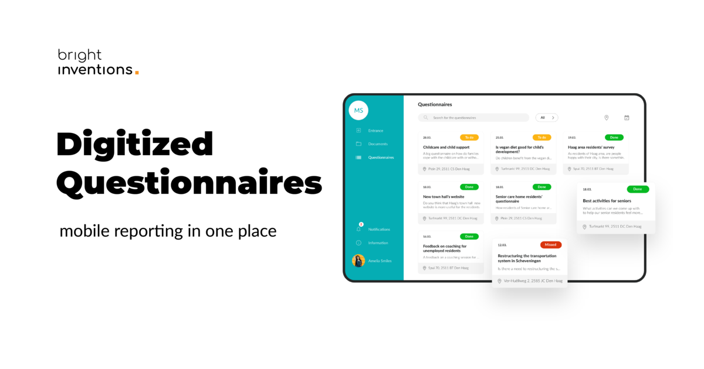
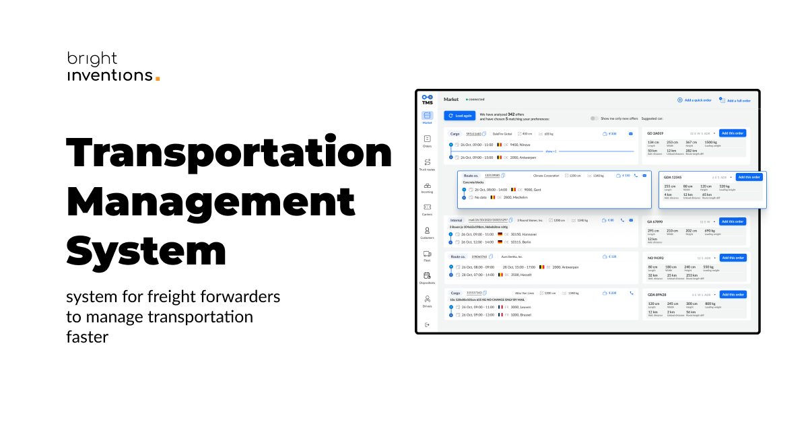
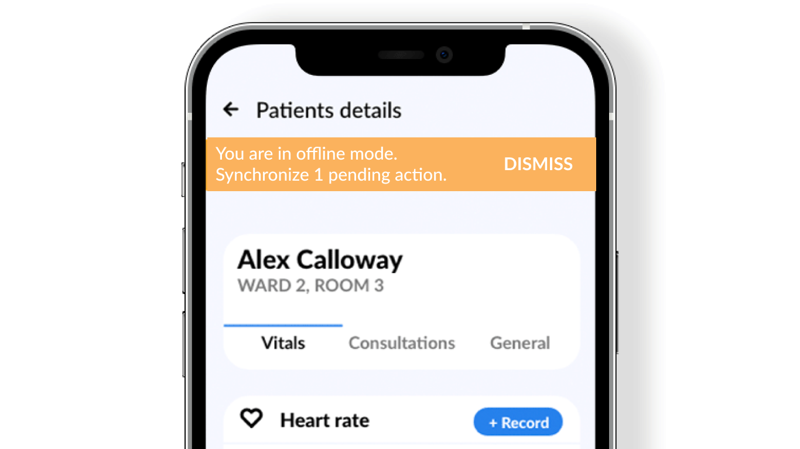

**Are you planning to release an app that has to work without an internet connection? You’ve come to the right place. Read about offline-first applications. Go through business advantages, different industries' perspectives, and design best practices. Also, look into the actual case studies!**

## What is the offline-first application?

**Offline-first mobile applications are built to fulfill their purposes with a weak or no internet connection**. In order to do so they need to include a feature that is called offline mode. Offline mode can be built for **iOS and Android applications**.

Offline mode is a way to get access to the app's services without an internet connection. For example, let’s think of the document-sharing app. The app enables you to create a document offline and save it on your phone. As soon as you get the internet connection back the app will synchronize the data and share the document online with people in your organization.

## Business advantages of the offline-first application

There are a couple of business advantages of apps with offline mode:

### Your app is more reliable

Users have access to most features even offline. They’re **not limited by a weak internet connection** and can keep up with their work.

### Your users won’t lose any data

Data provided offline will be stored on the device and then synchronized when the internet connection is sufficient. However, **it's important to keep the users in the loop with the informative UI** (more on that later). So users are aware that data needs to be synchronized. It's essential because users can, unaware of the consequences, lose their offline data by deleting the cache, formatting the phone, or simply uninstalling the app.

### The offline-first approach is a necessity in some industries

While building a mobile solution for industries like **medical care, retail and transportation you have to offer an offline mode** in order to distinguish your product. 

## Offline-first examples for various industries

We have developed offline-first apps for many industries. Get access to actual case studies below.

### Offline-first app for healthcare and medical care

Tech used by doctors, nurses and other caregivers has to be a reliable tool that supports their actions and helps them eliminate mistakes. Remember, the patient's health is at risk here. 

Let’s imagine an app for care homes staff that enables them to submit information about patients' vital signs measures, taken medicine, etc. **Caregivers should be able to provide that with a phone or tablet on the go in patients' rooms no matter the internet connection**. Then the data should be synchronized as soon as the internet connection is sufficient. So other care providers and family members are well aware of the patient’s actual state. That's why offline mode is a crucial feature for healthcare.

**Check out the actual case study of [healthcare eMAR software solution](/projects/emar-healthcare-solution/) with an offline mode that we helped to build**.

### Offline-first app for retail and restaurants

Retail apps with payment features definitely should have an offline mode. **The quality of the internet shouldn’t affect the transaction**. So if you plan to build an app for retail and restaurant including a payment feature, an offline-first approach is a mandatory way to go.

**Check out actual case studies of retail apps with an offline mode that we built and scaled – [Just Eat POS](/projects/system-for-restaurants) and [Just Eat POS Mobile App](/projects/system-for-restaurants-mobile).**

### Offline-first app for digitalized workflow

Imagine an app that enables you to fill out forms or questionnaires wherever you are. It might be useful for social workers who visit various places and create reports. They can fill out documents offline knowing that they will be synchronized later and be accessible on different devices for other coworkers as well.

**Check out actual case studies of a [digitalized workflow app](/projects/app-digitized-surveys) with an offline mode that we built.**

### Offline-first app for construction

Construction sites are places where access to the internet might be limited. That’s why building software for that industry, should include offline mode too. Especially when end users of the app are going to be construction site staff.

As an example let’s think of an app that enables storing pictures from the construction site and sharing them with clients, contractors, and coworkers. **A user can take pictures, store them offline, and then the app will synchronize files**. It means sharing the pictures with other app users when the internet connection is restored.

**Check out an actual case study – an offline-first [application for construction company](/projects/document-management-apps-construction/) that we build for our client from Germany.**

### Offline-first app for road transportation

Applications enabling communication between forwarders and drivers should give access to crucial features even offline. **Drivers cannot focus on accessing a strong internet connection, so apps have to meet their needs**. Transportation apps with offline mode still can, for example, share a vehicle localization offline.

**Check out an actual case study – the [Transport Management System](projects/transportation-management-system) with an offline-first application that we are building for a freight company.**

## Design best practices for offline-first apps

While building offline-first apps your **design has to be well-informative so the user is aware that they operate in offline mode**. Also, the user has to be assured that data will be synchronized as soon as the internet connection is back.

This is an example of the mockup of the app in offline mode:

We’ve explained [offline UX design](/blog/ux-design-healthcare-medical-apps-case-study#ux-design-for-offline-mode) in our other blog post. Feel free to check it out.

The offline mode might be a challenge, but this feature is crucial for many industries.
