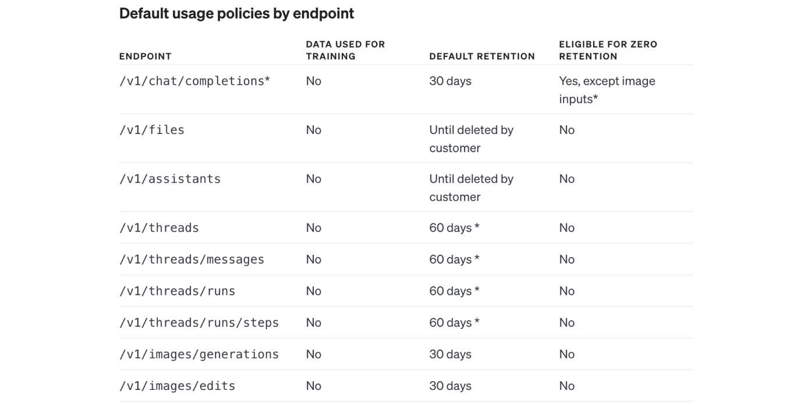

In my last [blog post](/blog/openai-chatgpt-team-enterprise-privacy-policies-explained/) we have been tackling privacy when using ChatGPT Team and Enterprise plan. Today, we will discuss privacy for a product that will be used with a majority of OpenAI integrations. It will be OpenAI API. Compared to   already described products it has the best privacy controls which I will dive into.

## OpenAI Trust Portal
I have already mentioned it my other blog posts, but it’s worth to remind it. [This]( https://trust.openai.com/) is your go-to place for privacy and security when it comes to OpenAI. Upon this page, we can see that OpenAI is CCPA, GDPR, SOC2 and SOC3 compliant. You can download or request security papers from OpenAI. You can see the status of their infrastructure, all privacy policies, PII usage, data processing agreement or terms of service. It’sighly recommended to start your privacy journey here!
## OpenAI Enterprise Privacy
Throughout your privacy journey, you should also visit [Enterprise Privacy portal](https://openai.com/enterprise-privacy). It gives you more insight into how your data is used if you choose OpenAI API.

## OpenAI API

To interact with OpenAI API you have to create an account (different than for ChatGPT, those are two different services) and attach payment. After it, you can start to interact with Playground or create API keys and integrate it with your app.
The first thing to mention is that OpenAI API doesn’t train from business data:

<blockquote>
    
We do not train on your business data (data from ChatGPT Team, ChatGPT Enterprise, or our API Platform)

    <footer>[Enterprise Privacy portal](https://openai.com/enterprise-privacy)</footer>
</blockquote>

The playground is simply a wrapper for API and it will not be used for training:

<blockquote>
    
API and Playground requests will not be used to train our models.

    <footer>[Community portal](https://community.openai.com/t/what-terms-of-service-privacy-policy-apply-to-playground/136036/10)</footer>
</blockquote>

So what about data storage?

<blockquote>
    
OpenAI may securely retain API inputs and outputs for up to 30 days to provide the services and to identify abuse. After 30 days, API inputs and outputs are removed from our systems, unless we are legally required to retain them. You can also request zero data retention (ZDR) for eligible endpoints if you have a qualifying use-case. For details on data handling, visit our Platform Docs page.

    <footer>[Enterprise Privacy portal](https://openai.com/enterprise-privacy)</footer>
</blockquote>

Same as other OpenAI services we do have 30 days mentioned. What is new here, is ZDR - zero data retention. We are eligible for it when using API routes:
`/v1/chat/completions` (except image inputs), `/v1/embeddings` and `/v1/completions`. For `/v1/audio/transcriptions`, `/v1/audio/translations`, `/v1/moderations` ZDR is enabled by default. You can chat with support to enable ZDR in eligible endpoints.

What does it mean for us, software developers? When we are building our apps via eg. Langchain and using OpenAI embeddings (check the [blog post](/blog/build-llm-application-with-rag-langchain/) of my colleague Paweł Polak on how to do it), we can steer out from data retention by OpenAI if using certain endpoints. This is important if we want to make our solution HIPPA-compliant. You can read more about it in the next paragraphs.

*ZDR endpoints example. For full list please refer to [OpenAI docs](https://platform.openai.com/docs/models/how-we-use-your-data)*

Who can store the data if it is retained?

<blockquote>
    
Our access to API business data stored on our systems is limited to (1) authorized employees that require access for engineering support, investigating potential platform abuse, and legal compliance and (2) specialized third-party contractors who are bound by confidentiality and security obligations, solely to review for abuse and misuse.

    <footer>[Enterprise Privacy portal](https://openai.com/enterprise-privacy)</footer>
</blockquote>

What is worth mentioning, if you upload files via `/v1/files` or using `/v1/assistants`, the default retention of data is:
<blockquote>
    
Until deleted by customer

    <footer>[OpenAI docs](https://platform.openai.com/docs/models/how-we-use-your-data)</footer>
</blockquote>

Regarding compliance, for GDPR OpenAI can execute:
<blockquote>
    
 Data Processing Addendum (DPA) with customers for their use of ChatGPT Team, ChatGPT Enterprise, and the API in support of their compliance with GDPR and other privacy laws 

    <footer>[Enterprise Privacy portal](https://openai.com/enterprise-privacy)</footer>
</blockquote>

In case of SOC2:
<blockquote>
    
 Our API Platform has been audited and certified for SOC 2 Type 2 compliance 

    <footer>[Enterprise Privacy portal](https://openai.com/enterprise-privacy)</footer>
</blockquote>

Apart from those, by having ZDR possibility we are eligible for HIPAA compliance:
<blockquote>
    
 We are able to sign Business Associate Agreements (BAA) in support of customers’ compliance with the Health Insurance Portability and Accountability Act (HIPAA). Please reach out to our sales team if you require a BAA.  

    <footer>[Enterprise Privacy portal](https://openai.com/enterprise-privacy)</footer>
</blockquote>

There might be exceptions here for your use case though:

<blockquote>
    
 only endpoints that are eligible for zero retention are covered by the BAA. You can see a list of those endpoints.  

    <footer>[OpenAI Help portal](https://help.openai.com/en/articles/8660679-how-can-i-get-a-business-associate-agreement-baa-with-openai)</footer>
</blockquote>

With OpenAI API, you have also the possibility to finetune the model. What about data privacy in that case?
<blockquote>
    
 Yes, you can adapt certain models to specific tasks by fine-tuning them with your own prompt-completion pairs. Your fine-tuned models are for your use alone and never served to or shared with other customers or used to train other models. Data submitted to fine-tune a model is retained until the customer deletes the files.  

    <footer>[Enterprise Privacy portal](https://openai.com/enterprise-privacy)</footer>
</blockquote>
What it means is that upon fine-tuning the model, your fine-tuned model is only for your use case and data remains there unless you delete it.

Last but not least, what is also important to mention is that 
<blockquote>
    
 OpenAI encrypts all data at rest (AES-256) and in transit (TLS 1.2+), and uses strict access controls to limit who can access data. 

    <footer>[Enterprise Privacy portal](https://openai.com/enterprise-privacy)</footer>
</blockquote>

As we can see, OpenAI API guarantees the best data control and privacy within all its offerings. In another blog post, I will describe Azure OpenAI service that is often taken into the equation and compared with OpenAI API. Stay tuned!