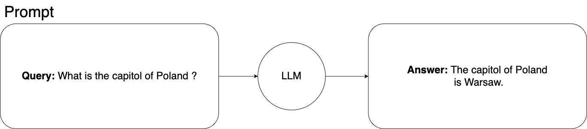
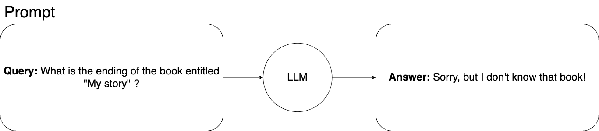
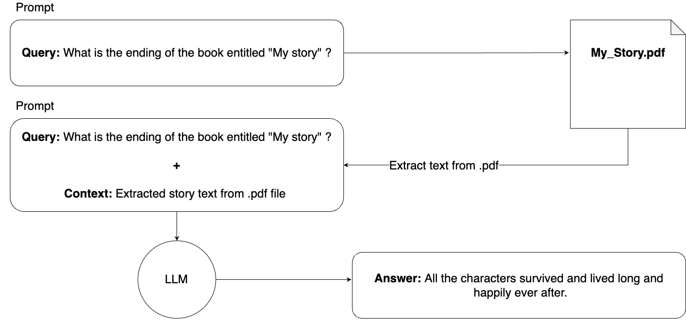

Imagine that your company has access to a powerful AI tool that can process vast amounts of data and extract significant conclusions, identify key information, and effectively summarize it. Such capabilities could significantly enhance the efficiency of your employees' work, allowing them to focus on the most valuable aspects of their job, rather than on time-consuming data processing. In this context, Retrieval Augmented Generation (RAG) opens new perspectives. RAG i allows for the integration of AI models with specific, internal data of your company, enabling not only processing but also intelligent interpretation and utilization of this knowledge. In this article, we will explore how to accomplish this.

**Retrieval Augmented Generation (RAG) definition**

**RAG** is a technique that allows expanding the knowledge of the pre-trained language model with real-time information retrieval from a large database of documents.  

The basic prompt schema for querying a machine learning model looks like this:

In this situation, we ask the machine learning model about the capital of Poland. This is general knowledge, and our model has no problems with the answer.

**Going deeper with Retrieval Augmented Generation in machine learning**

Fancy to go deeper with this simple example? Let's say we would like to have a machine learning model that can answer questions about the plot of our original, never-published 300-page book titled 'My Story,' the only source of which is a .pdf file on our private laptop. Therefore, there is no chance that the model came into contact with this book during training, nor is there any chance it could find any information about it elsewhere.

If we asked the learning model about this story, the model could not answer it. This is how it would look:

In such a situation, **Retrieval Augmented Generation (RAG) comes to the rescue.** We can simply expand the knowledge of the machine learning model by adding contextual information to the prompt.

In theory, it would look as follows:

In theory, it would work. The model receives our query along with the entire book, so it now knows the story and can answer our query. However, **there is a practical problem with this solution.**

The number of tokens that we can use with one prompt is limited. For example, **for ChatGPT-4, this limit is 8192 tokens; even for GPT-4 Turbo, the limit is 128,000 tokens.**

Let's assume that one page of our book has an average of 500 words. 300 pages times 500 words equals 150,000 words in the entire book. We should remember that the number of used tokens consists of the prompt query, prompt context, and the machine learning model's answer.