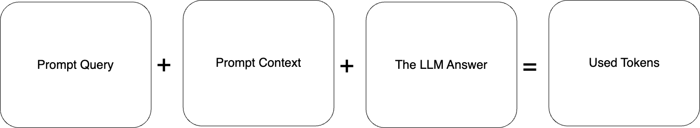
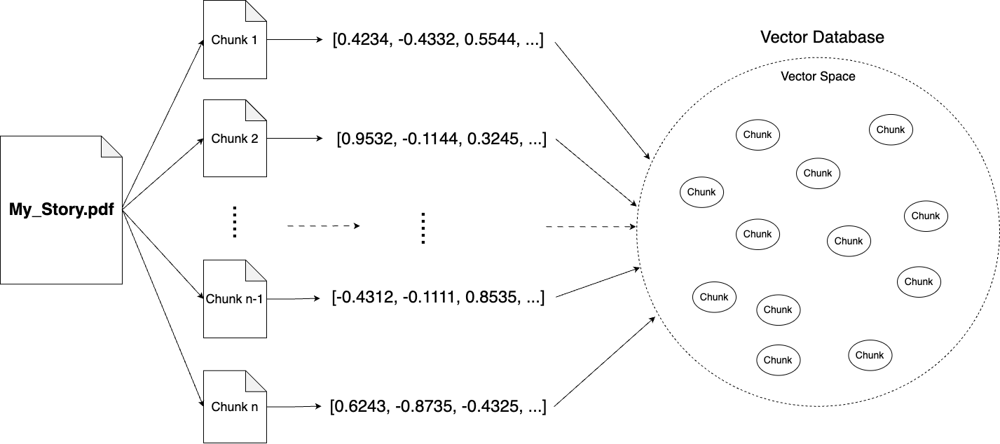

**Imagine that your company has access to a powerful AI tool that can process vast amounts of data and extract significant conclusions, identify key information, and effectively summarize it. Such capabilities could significantly enhance the efficiency of your employees' work, allowing them to focus on the most valuable aspects of their job, rather than on time-consuming data processing. In this context, Retrieval Augmented Generation (RAG) opens new perspectives. RAG i allows for the integration of AI models with specific, internal data of your company, enabling not only processing but also intelligent interpretation and utilization of this knowledge. In this article, we will explore how to accomplish this.**

## Retrieval Augmented Generation (RAG) definition

**RAG** is a technique that allows expanding the knowledge of the pre-trained language model with real-time information retrieval from a large database of documents.  

The basic prompt schema for querying a machine learning model looks like this:

In this situation, we ask the machine learning model about the capital of Poland. This is general knowledge, and our model has no problems with the answer.

## Going deeper with Retrieval Augmented Generation in machine learning

Fancy to go deeper with this simple example? Let's say we would like to have a machine learning model that can answer questions about the plot of our original, never-published 300-page book titled 'My Story,' the only source of which is a .pdf file on our private laptop. Therefore, there is no chance that the model came into contact with this book during training, nor is there any chance it could find any information about it elsewhere.

If we asked the learning model about this story, the model could not answer it. This is how it would look:

In such a situation, **Retrieval Augmented Generation (RAG) comes to the rescue.** We can simply expand the knowledge of the machine learning model by adding contextual information to the prompt.

In theory, it would look as follows:

In theory, it would work. The model receives our query along with the entire book, so it now knows the story and can answer our query. However, **there is a practical problem with this solution.**

The number of tokens that we can use with one prompt is limited. For example, **for ChatGPT-4, this limit is 8192 tokens; even for GPT-4 Turbo, the limit is 128,000 tokens.**

Let's assume that one page of our book has an average of 500 words. 300 pages times 500 words equals 150,000 words in the entire book. We should remember that the number of used tokens consists of the prompt query, prompt context, and the machine learning model's answer.

This amounts to 150,000 tokens for the context alone. By adding the prompt query and the machine learning model's answer, the total will be even higher. Even if sending such a prompt were possible, it would simply be a waste of resources and money. We don’t need the entire context of the book to answer our queries.

**It seems obvious that we need to divide our book into chunks,** and for the context of the prompt, attach only those chunks that are relevant to our question. Dividing the text into chunks is a simple task, **but how do we determine which parts are necessary to get the answer to our query?**

Here, the technique of representing text as numerical vectors, known as embeddings, comes to the rescue. There is another blog post where you can learn more details about how this technique works.

For now, it's enough to understand that **embedding is a technique that converts text into numerical vectors, which retain the meaning of the converted sentence.** Depending on the sentence's meaning, these vectors are positioned at specific locations in the vector space. So, now we know that before running our prompt, we have to first prepare the data (the book in our case) by dividing it into chunks, converting them into numeric vectors with the embedding technique, and saving them in a vector database.

This process looks like this:

Great! We have prepared our data so that we can easily find exactly the parts of the book that are useful for our query.

With this knowledge and the data prepared, let's start the process of obtaining answers from the machine learning model once again. The image below describes all the steps undertaken during this process.