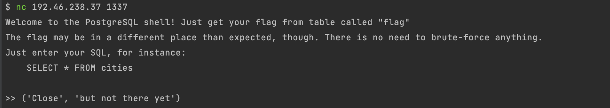
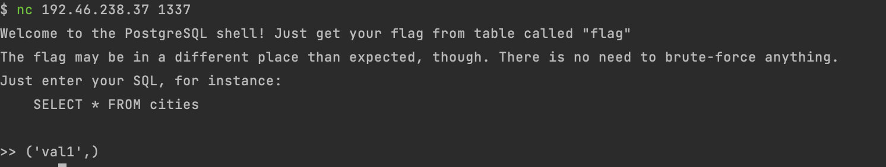
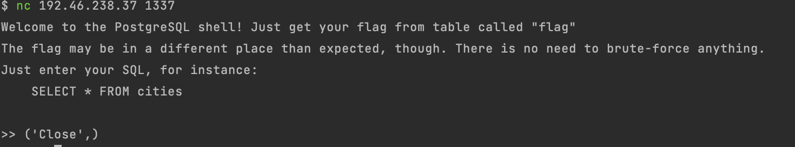
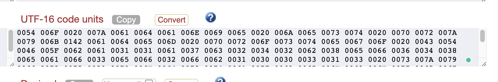
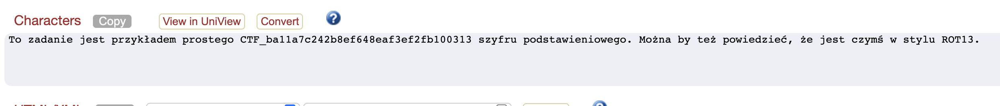

Some time ago (15.10-16.10) I took part in the Sekurak Mega Hacking Party CTF contest. I have already created the [first post](https://brightinventions.pl/blog/sekurak-mshp-ctf-summary-part-1) about challenges that I had managed to solve. This post will describe another challenges which I was pretty close to solve. 😉

## **postgres**

The task was as follows: 
You have access to Postgres console. You have to read the flag. 
`nc 192.46.238.37 1337`

Upon accessing the console  with nc command view was as follows, disappearing within a few seconds:

<div className="image"> </div>

Due to disappearing I decided to use script interaction with a server which will allow for entering more commands:

```
const p =  $`nc 192.46.238.37 1337`
p.stdin.write('SELECT * FROM cities;');
p.stdin.end()
```

So upon being able to execute the comments, I simply did `Select * from flag` but of course, it did not work.

<div className="image"></div>

So decided that the flag must be somewhere near the metadata of the table. Tried the DB version, current database and current user... Nothing interesting there... Also as a user `ctf`, I was not able to get info about `information_schema` which would contain more info. Suspected that...

So tried with below to somehow deserialize table information:

```
const p =  $`nc 192.46.238.37 1337`
p.stdin.write('SELECT json_object_keys(to_json(json_populate_record(NULL::public.flag, \'{}\'::JSON)))\n;')
p.stdin.end()
```

Response:

<div className="image"></div>

Getting closer. Got the column name. Selecting it allows selecting a value from the flag table which was `Close`. 

<div className="image"></div>

You might remember that the second value was `but not there yet` but it is not shown in the schema above. Tried several more approaches and here I have stopped.

Turns out my thinking was correct but using the wrong query to do so. After deserializing the table to XML: 

```
const p =  $`nc 192.46.238.37 1337`
p.stdin.write('SELECT query_to_xml(\'select * from flag\',true,true,\'\'));
p.stdin.end()
```

Which gave back the CTF flag: 

<div className="image"></div>

So close 😭

## **crypto-basic**

"Decrypt" following text to find text originally written in Polish to find a flag: 

```
6IGU6IGv6ICg6IG66IGh6IGk6IGh6IGu6IGp6IGl6ICg6IGq6IGl6IGz6IG06ICg6IGw6IGy6IG66IG56IGr6IWC6IGh6IGk6IGl6IGt6ICg6IGw6IGy6IGv6IGz6IG06IGl6IGn6IGv6ICg6IGD6IGU6IGG6IGf6IGi6IGh6ICx6ICx6IGh6IC36IGj6ICy6IC06ICy6IGi6IC46IGl6IGm6IC26IC06IC46IGl6IGh6IGm6ICz6IGl6IGm6ICy6IGm6IGi6ICx6ICw6ICw6ICz6ICx6ICz6ICg6IGz6IG66IG56IGm6IGy6IG16ICg6IGw6IGv6IGk6IGz6IG06IGh6IG36IGp6IGl6IGu6IGp6IGv6IG36IGl6IGn6IGv6ICu6ICg6IGN6IGv6IW86IGu6IGh6ICg6IGi6IG56ICg6IG06IGl6IW86ICg6IGw6IGv6IG36IGp6IGl6IGk6IG66IGp6IGl6ISH6ICs6ICg6IW86IGl6ICg6IGq6IGl6IGz6IG06ICg6IGj6IG66IG56IGt6IWb6ICg6IG36ICg6IGz6IG06IG56IGs6IG16ICg6IGS6IGP6IGU6ICx6ICz6ICu
```

As "decrypt" word was there and the format was known to me it looked like it is not real encryption but base-64 encode.

After decoding to UTF-8: 
`联聯耠聺聡聤聡聮聩聥耠聪聥聳聴耠聰聲聺聹聫腂聡聤聥聭耠聰聲聯聳聴聥聧聯耠聃联聆聟聢聡耱耱聡耷聣耲耴耲聢耸聥聦耶耴耸聥聡聦耳聥聦耲聦聢耱耰耰耳耱耳耠聳聺聹聦聲聵耠聰聯聤聳聴聡職聩聥聮聩聯職聥聧聯耮耠聍聯腼聮聡耠聢聹耠聴聥腼耠聰聯職聩聥聤聺聩聥脇耬耠腼聥耠聪聥聳聴耠聣聺聹聭腛耠職耠聳聴聹聬聵耠聒聏联耱耳耮`

Hmmm tried to google translate it from Korean, the Chinese - something about Confucius was there. Ok, dead end.

Tried to change the encoding to binary representation, hex one etc... Tried to change to image... Have not seen the pattern that was there so I abandoned that tasks. 

Turns out that one had to convert to UTF-16 and observe that all chars are moved by 8 bits. After changing 8 char at the start to 0 char in each nibble, message with CTF flag started to emerge.

<div className="image"></div>

<div className="image"></div>

Which in English means "This message is example of an easy substitution cipher. You can say it is something like ROT13".  Flag is inside.

Clever! 

So all in all Sekurak CTF was really interesting and well prepared. This was my first start so hope to find more flags in the future 🕵️
