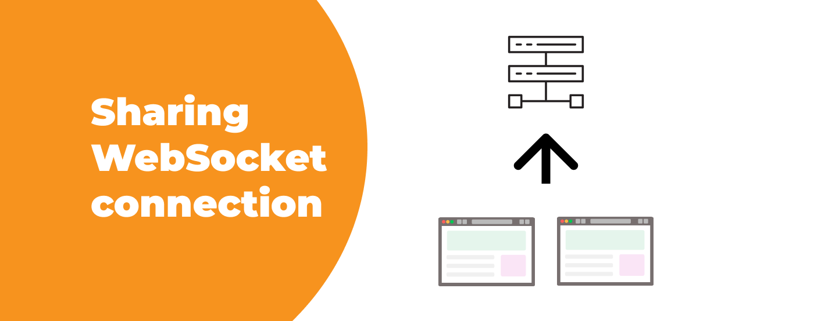

**WebSocket connections are like special communication channels that allow web browsers and servers to talk to each other in real-time. However, when you have multiple tabs or windows open in your browser, each one establishes its own WebSocket connection. This can be wasteful and affect the performance of your web application.**

But don't worry! In this blog post, **we'll explore a solution that lets you optimize WebSocket usage when your users open your application in different tabs or windows**. By sharing WebSocket connections between those tabs and windows, we can make your web application work more efficiently and smoothly. So, let's dive in and discover some helpful strategies for achieving seamless WebSocket connection sharing between browser tabs and windows.

<div className="image"></div>

## Introducing Shared Workers

In order to achieve WebSocket connection sharing between browser tabs and windows, we can leverage the power of web workers. **Web workers are essentially separate threads, totally independent of other scripts with no access to the DOM**. They can execute tasks in the background, what makes them particularly useful for performing complex computations and preventing the web page from freezing or becoming unresponsive.

**A shared worker is a special type of web worker that can be shared between multiple browser tabs or window**s. Unlike regular web workers, which are dedicated to a single web page, shared workers exist independently of any specific web page or user interface. They allow multiple browser contexts, such as tabs or windows, to communicate and share resources. By utilizing shared workers, we can create a persistent entity that manages WebSocket connections and facilitates their sharing across different browser contexts. Also, we don’t have to worry about closing the connection. Shared workers will stop to exist if there are no tabs or windows referencing them anymore, so the connection will be automatically closed.

## Implementing WebSocket connection sharing with Shared Workers

To implement WebSocket connection sharing between browser tabs and windows, we'll follow these steps:

### Create a shared worker

Start by creating a shared worker using the Shared Worker API. This worker will act as the central entity responsible for managing the WebSocket connection. Add a message handler to receive data from the worker and do whatever you please with it. 

```typescript
// No bundler
const worker = new SharedWorker("./worker.js");

// Webpack 5
const worker = new SharedWorker(new URL("./worker.ts", import.meta.url));

worker.port.addEventListener('message', (event: MessageEvent): void => {
  // Do whatever you like with data
});
worker.port.start();
```

### Establish the WebSocket connection

Inside the shared worker, create a WebSocket object and establish a connection with the server. This connection will be shared among all browser tabs and windows. Add a connection handler and store ports in an array. It's also crucial to forward each received message to all MessagePort objects.

```typescript
const ports: MessagePort[] = [];
const ws = new WebSocket('wss://some-url.com');

addEventListener('connect', (event: MessageEvent): void => {
  const port = event.ports[0];
  this.ports.push(port);
});

ws.addEventListener('message', (event: MessageEvent): void => {
  ports.forEach((port) => {
    port.postMessage(event.data);
  });
});
```

That's it. You will now be able to share the connection and receive messages simultaneously in all tabs and windows.

## Challenges and solutions: memory management

While shared workers provide an efficient solution, **there is one challenge to address: memory management**. Since there is no built-in mechanism to determine if a Message Port is still active or not, references may accumulate over time, potentially leading to memory leaks. To mitigate this issue, we can leverage WeakRefs. **By using WeakRefs, we can check if a Message Port has been garbage collected**, ensuring efficient resource utilization.

```typescript
export class BrowserPort {
  private readonly weakRef: WeakRef<MessagePort>;

  constructor(port: MessagePort) {
    this.weakRef = new WeakRef(port);
    port.start();
  }

  isAlive(): boolean {
    return !!this.weakRef.deref();
  }

  postMessage(message: unknown): void {
    this.weakRef.deref()?.postMessage(message);
  }

  addEventListener(event: string, handler: (event: Event) => void): void {
    this.weakRef.deref()?.addEventListener(event, handler);
  }

  removeEventListener(event: string, handler: (event: Event) => void): void {
    this.weakRef.deref()?.removeEventListener(event, handler);
  }

  close(): void {
    this.weakRef.deref()?.close();
  }
}

let ports: BrowserPort[] = [];

addEventListener('connect', (event: MessageEvent): void => {
  const port = event.ports[0];
  ports.push(new BrowserPort(port));
});

// At some point we would like to send a message

if (port.isAlive()) {
  // It's alive! We can send a message.
  port.sendMessage('msg');
} else {
  // It's dead! We have to remove it from the array.
  ports = ports.filter(innerPort => innerPort !== port); 
}
```

**Another solution is to send a special control message in the body of the `onbeforeunload` event handler**. Keep in mind this method isn't reliable and browser may choose to ignore the message and not pass it to the worker at all.

```typescript
// Browser
window.addEventListener('onbeforeunload', (): void => {
  worker.port.sendMessage('UNLOAD');
});

// Worker
let ports: MessagePort[] = [];

addEventListener('connect', (event: MessageEvent): void => {
  const port = event.ports[0];
  ports.push(port);

  port.addEventListener('message', (event: MessageEvent): void => {
    if (event.data === 'UNLOAD') {
      ports = ports.filter(innerPort => innerPort !== port); 
    }
  });
});
```

## Unexpected alternative solution for memory problems

It turns out that there is another way to detect when an object gets garbage collected. There is the FinalizationRegistry available, which is capable of observing the process and keeping a record of any reclaimed object. You can use it in a similar way to the IntersectionObserver.

```typescript
const registry = new FinalizationRegistry((heldValue) => {
  console.log(`Object ${heldValue} reclaimed!`);
});

const target = new WeakRef([]);
registry.register(target.deref(), "some_identifier");

Array.from({ length: 50000 }, () => () => {});

// You will see: "Object some_identifier reclaimed!" in your console
```

Remember not to hold references to MessagePort instances. In other words, make sure to use WeakRefs to store them.

This alternative seems to be a better solution for use-cases where you expect a huge number of ports to be opened at the same time. Instead of iterating over them repeatedly, you will be able to simply exclude them when needed.

## Conclusion

In this blog post, we've explored the concept of sharing WebSocket connections between browser tabs and windows. By leveraging shared workers, we can optimize resource usage and enhance the performance of web applications in multi-tab or multi-window scenarios.

Shared workers provide a powerful mechanism for establishing a central entity that manages WebSocket connections and facilitates communication between different browser contexts. **By creating a shared worker and utilizing the MessagePort API, we can pass messages seamlessly between browser tabs and windows, enabling them to share a single WebSocket connection**.

While there are challenges to consider, such as memory management, utilizing appropriate techniques like WeakRefs can help mitigate potential issues. It's important to implement suitable strategies to ensure efficient resource utilization and prevent memory leaks.

**By implementing WebSocket connection sharing, you can enhance the efficiency, responsiveness, and overall user experience of your web application**. Users can seamlessly interact with your application across multiple tabs or windows, while avoiding unnecessary resource duplication.

Happy coding!

<div className="block-button"><h2>Senior frontend developers wanted</h2><div>We are looking for talented professionals to help us paint a bright future. Join a top software development company based in Poland. Build and enhance an innovative security platform for one of our clients from Israel.</div><a href="/jobs/senior-frontend-developer/"><button>check the job offer and apply</button></a></div>
