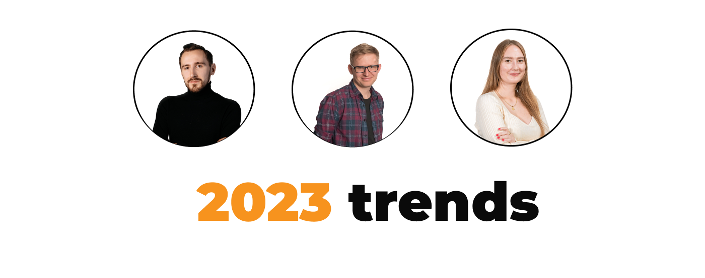
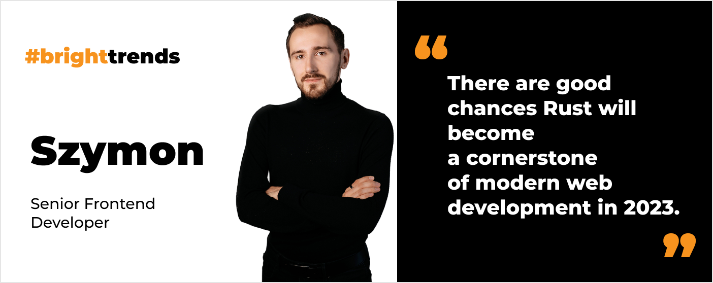
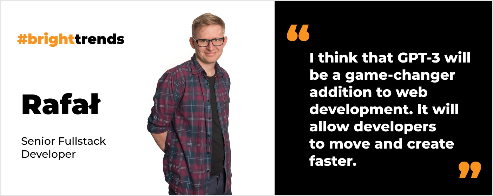
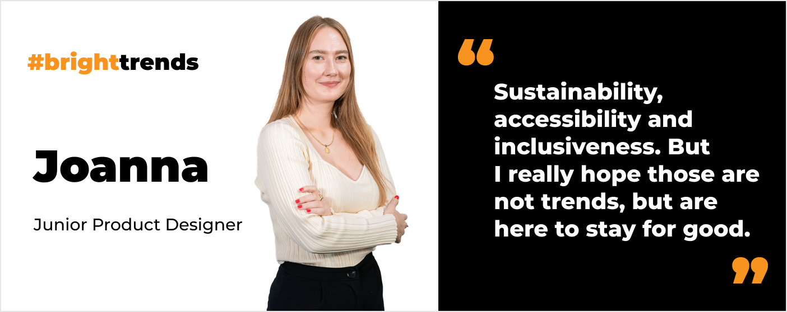

**We are heading into the year 2023. So it is time to update this article with hot trends and predictions. Let’s look at 2023 software development trends from 3 different perspectives: frontend & backend developers’ and product designer’s.**

## Rustification of web development

[Szymon, Senior Frontend Developer](/about-us/szymon-ch/):

The truth is **the times of simple websites are long over**. Now, it’s a reign of complex web applications. Thousands of source code files have to be processed in order to produce an experience users love so much. The problem is, **tools like Babel or Webpack seem to have reached their limits** and can no longer offer a good developer experience. But fear not! 

There is a new generation of build tools storming the market and gaining more and more popularity. **It all started last year with the Next.js 12 release and their transition from Babel to SWC**. This year, they announced a Rust-based bundler, which promises to be hundreds of times faster than its JavaScript counterpart. I must admit, we all loved to hear that! Furthermore, **Rust can be compiled into WebAssembly and run natively**. This brings a huge performance boost if we don’t have a choice and have to make complex calculations in a browser.

In my opinion, **there are good chances Rust will become a cornerstone of modern [web development](/our-areas/web-development) next year**. The frenzy is just beginning. Other tools like TypeScript compiler will take part in it and more companies will invest in such innovations. This momentum cannot be reduced now as it’s far too late. I think it’s the most exciting shift in the industry since the popularization of frameworks and libraries such as React, Vue and Angular.

It all sounds so good, but **should I start learning Rust**? To be honest, I have already started.

## GPT-3 is a game changer

[Rafał, Senior Fullstack Developer](/about-us/rafal-h/):

You probably heard, for some time, that AI will take over the world and programmers will be out of jobs. Well, the future is one step ahead. 😉 **What is GPT-3? It is a language processing model** which is mainly used for transforming the text which is learned upon. Venture is led by OpenAI nonprofit organization. **GPT-3 is different from its predecessors in terms of numbers it can take in as trainable parameters**. The learning data contains mostly from web crawling. GPT-3 is publicly accessible via many forms. One of the loudest releases was [Dalle](https://openai.com/dall-e-2/) which allows generating of an image from a simple text prompt. 

Recently [Chat-GPT](https://openai.com/blog/chatgpt/) was presented, allowing us to conduct a chat with AI in a conversational way. An interesting thing about this solution is that **you can ask Chat-GPT to generate a code then follow up with another code styling**, add some other auth mechanism or do some refactoring. And boy, he can do it. [Here ](https://github.com/elyase/awesome-gpt3)you will find curated repo with possible examples GPT-3 can do now. You give a machine a text prompt and it can generate for you HTML markup, SQL code or Regexp. How cool is that? 

What does it mean for us developers? For now, I think that GPT-3 will be a game-changer addition to web development. It will allow developers to move and create faster. I think it will not make the web developer occupation obsolete but **will make us even more full stack developers – more oriented on the business goal rather than technical means**. So jump aboard GPT-3 train and make sure to use its benefits wisely!

## Here comes neobrutalism

[Joanna, Junior Product Designer](/about-us/joanna-c/):

As for the [product design](/our-areas/product-design), here are my predictions of upcoming trends for 2023:

### Strictly UI wise

* **Typographical designs** are here to stay. Readable quirk fonts and experimenting with different typefaces is something we have already seen in 2022 and surely we can look out for this in 2023.
* **Neobrutalism** is the new minimalism with a twist. Definitely not for everyone, but if you want to stand out - go for it.
* **Glassmorphism** - I feel like Apple leads in this style. A semi-transparent background has become some sort of a standard.

### Overall Product Design wise

**Sustainability, accessibility** and **inclusiveness**. But I really hope those are not trends, but are here to stay for good (stay tuned for the upcoming blog post on accessibility).

### Interaction Design wise

I feel like the motion design is going to get more and more popular. Microinteractions are a great way to add something extra to the user experience. [Material Design 3](https://m3.material.io/styles/motion/overview) has even come up with some guidelines regarding transitions and microinteractions. Immersive scroll (or scrollytelling if you like) is taking users to another level of exploring websites.

- - -

Do you want to read more predictions? Check out our [trends for healthcare development](/blog/technology-trends-in-healthcare).
