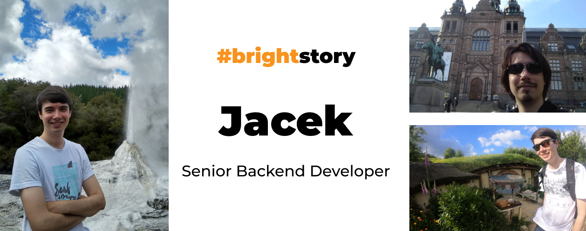
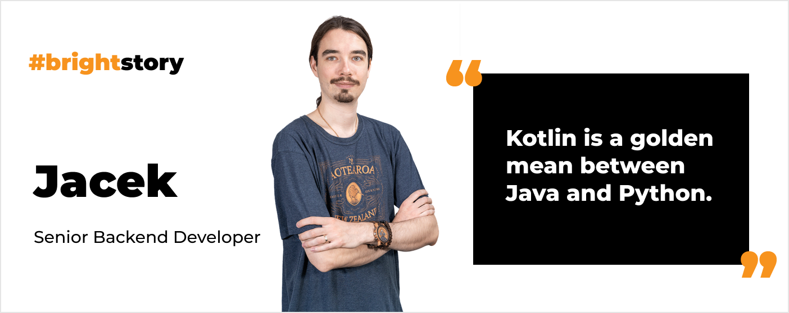
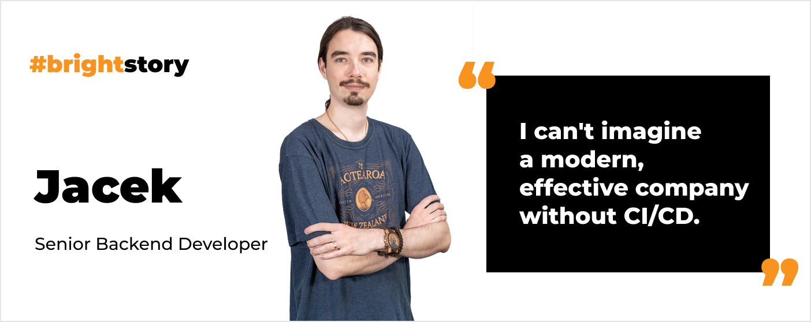
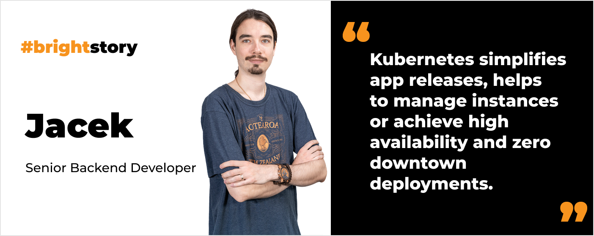
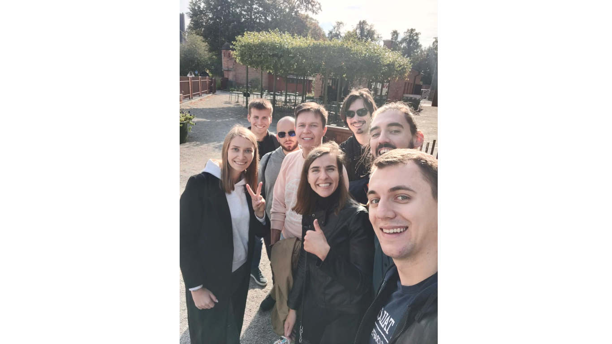
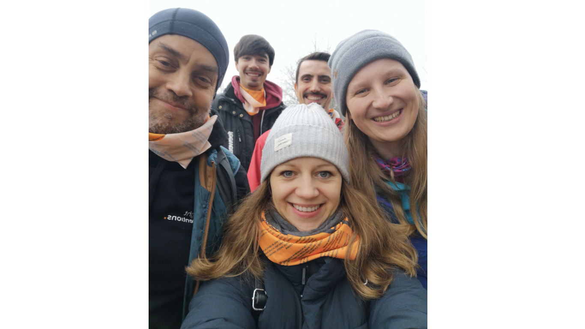
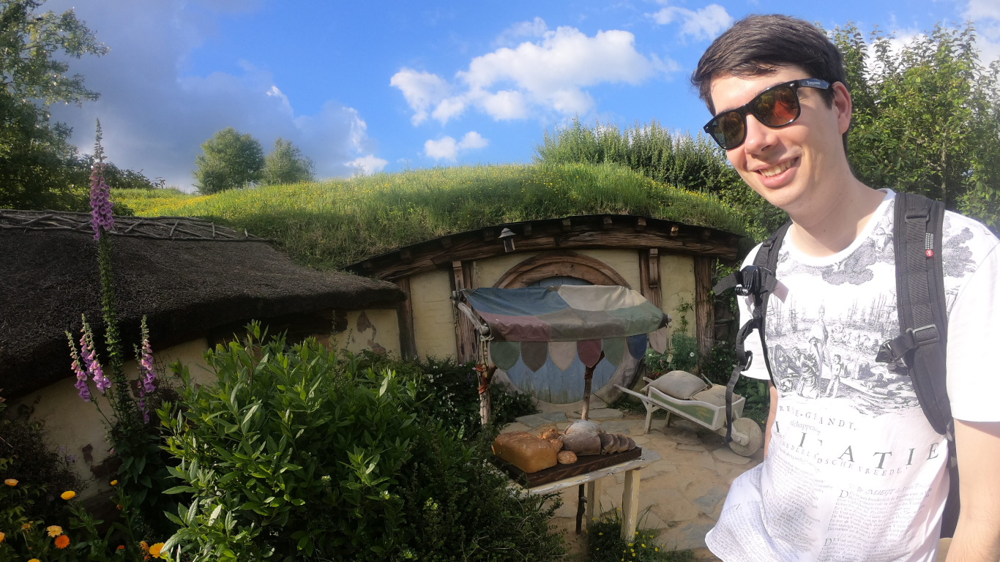

**From R&D engineer to backend developer. Read Jacek’s career story. Find out why he can’t imagine a company without CI/CD. Uncover his tips on how to start pipeline automatization in your project. Also, find out what device he built for his family recently.**

## You started your career as R&D Engineer. Share with us your road to becoming a software developer.

I studied **Automatic Control and Robotics** at Gdańsk University of Technology. During my master's studies, I chose **Signal Processing** as my specialty. My college cooperated with a Swedish college – Blekinge Tekniska Högskola, so I got a chance to study for one semester in Karlskrona. I also did my master's thesis there because they greatly focused on learning through practice. Thanks to that university I wrote my thesis in cooperation with an IT company in Gdańsk. It was a real project for a real company, no theoretical work. What’s more, this company eventually offered me a job, so I joined them.

**I started my career as an R&D engineer** working closely with IoT. My stack was mostly **Python and Raspberry Pi** at first. Then I started to learn **Java and DevOps** due to the company’s needs. That’s when I got to know about **pipelines, Kubernetes, automation**, etc. Eventually, I learned **Kotlin**.

## From Python to Kotlin. That’s an interesting journey.

**Python is a great language to start** your programming career. It’s greatly utilized in data science and artificial intelligence. However, **Java and Kotlin are much more friendly to use** **in [web development](/our-areas/web-development/)**. For me, **Kotlin is a golden mean between Java and Python**. You get to use all the awesome libraries, tools and practices from Java, but the syntax is really clean and pleasant like in Python. That's why I like working with it. 

## Part of your work is DevOps. Do you think that every backend developer should possess DevOps skills?

Yes, I believe that’s our duty. Nowadays automatization and CI/CD are necessities. **I can't imagine a modern, effective company without CI/CD**. Besides that, **as a developer, you should know how to deploy and deliver your application to clients** – this gives a whole new perspective on your work.

## How to start learning CI/CD? What’s your advice?

First of all, you shouldn’t be scared of the number of tools available on the market. You should focus on one tool or just try to automate your project. **Choose one flow that you do manually and step by step turn it into a pipeline**. 

If you want to try AWS as your provider, you can start by using their web console, and then try to do the same using the AWS CDK tool. After that, you can just put the AWS CDK code and commands in some pipelines. Most of the tools have great documentation that will help you start.

<h2>Join Jacek!</h2>
Are you a backend developer who understands Java/Kotlin & Spring really well and who would like to work with AWS on a daily basis? We want you on our team!
<a href="/jobs/senior-backend-developer/"><button>apply and work with Jacek</button></a>

## You also work with Kubernetes. What are the pros and cons of it?

Kubernetes is a powerful tool to run whole systems. However, not every project needs it. If you operate on a small scale, it’s not something essential. Also, **Kubernetes has a high entry threshold. It’s not something to tackle while starting your DevOps adventure**.

**Kubernetes also requires time for maintenance**. You have to manage it, do updates, and monitor flows. You cannot just set it up and then get back to it after a month. You have to spend some time a week to ensure that everything works properly.

However, in the long term, **this investment is worth it**. After proper configuration, **Kubernetes simplifies app releases, helps to manage instances or achieve high availability and zero downtown deployments**. It is a great tool to ensure that our apps will run just as we want them to.

## How do you find yourself at Bright Inventions?

I enjoy working here. **Since I joined the company I felt like I was among old friends – it was really a warm welcome**. After time this feeling only strengthened. **People are great, as well as the technologies we use**. We aren’t afraid of implementing new solutions. We also focus on knowledge sharing. We have regular internal meetings where we exclusively share knowledge. Also, we do it outside of the company by organizing workshops, webinars, and publishing blog posts.

It's mind-blowing for me that people just want to write blog posts. No one feels obliged to do it, yet they still publish them. **I love this spirit of knowledge-sharing that I’ve experienced since joining Bright Inventions**.

During Bright Inventions team trip to Stockholm.

## You recently took Bright Development Time. Can you explain what that is and what did you do then?

Once a month at Bright Inventions **we can spend some time (typically a day) working on non-project staff**. For instance, **we can attend a conference, create an open library, test new tools**, and so on. The goal is to develop our skills. 

**I decided to take Bright Development Time to build a device similar to a baby monitor**. It's a microcontroller with a microphone and Bluetooth speaker. Now my wife and I use it to monitor our baby daughter while she sleeps.

Thanks to this project **I learned a lot about working with an ESP32 microcontroller**. I also found interesting libraries that helped me to work with a sound signal.

I’ve also conducted a webinar for our team to share my experience and technical challenges while building the device. I plan to share more about it on our blog soon.

 Jacek and other bright people at the team retreat. 

## You are a home winemaker. What wine have you made recently?

I made an experimental wine from elderberry lately. Unfortunately, it wasn't drinkable at all. My bad. I left it to ferment for too long.

For my wedding, I made two three-liter bottles of red wine. Also, every guest got a small bottle as a gift. We even named it “Le Chaple” (as a reference to our surname).

 Le Chaple wine as a gift for our wedding guests. 

When I started reading books about winemaking, I discovered that it is a lot about chemistry and ingredients calculations. To achieve predictable results, you cannot use universal wine recipes because all fruits are different. 

To make the process easier, **I’ve recently started working on a Flutter mobile application**. Depending on fruits and desired wine parameters, **it will calculate the ingredients and even** **notify about important actions to take**. Had I had it before, maybe the elderberry wine wouldn’t have gone to waste?

## What else do you enjoy doing after hours?

I love to travel. My biggest adventure was **visiting New Zealand**. My wife and I lived there in a camper which was our home for 3 weeks. This year we plan to go to Portugal. Apart from that I like spending time at a lake and fishing, although I don’t have many achievements in this area.

 Jacek in Hobbiton – New Zealand. 

<h2>Experienced backend developers wanted. Apply today!</h2>
We're on the lookout for senior backend developers who understands Java/Kotlin & Spring really well and who would like to work with AWS on a daily basis.
<a href="/jobs/senior-backend-developer/"><button>join our backend team</button></a>

