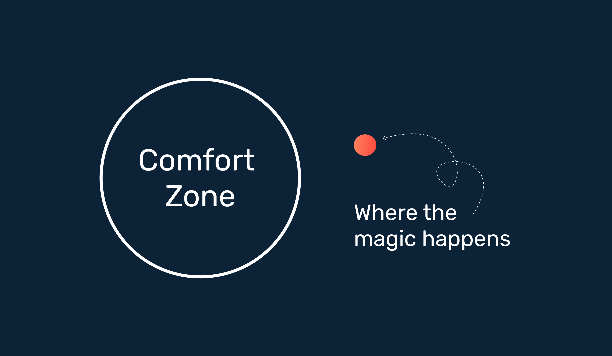
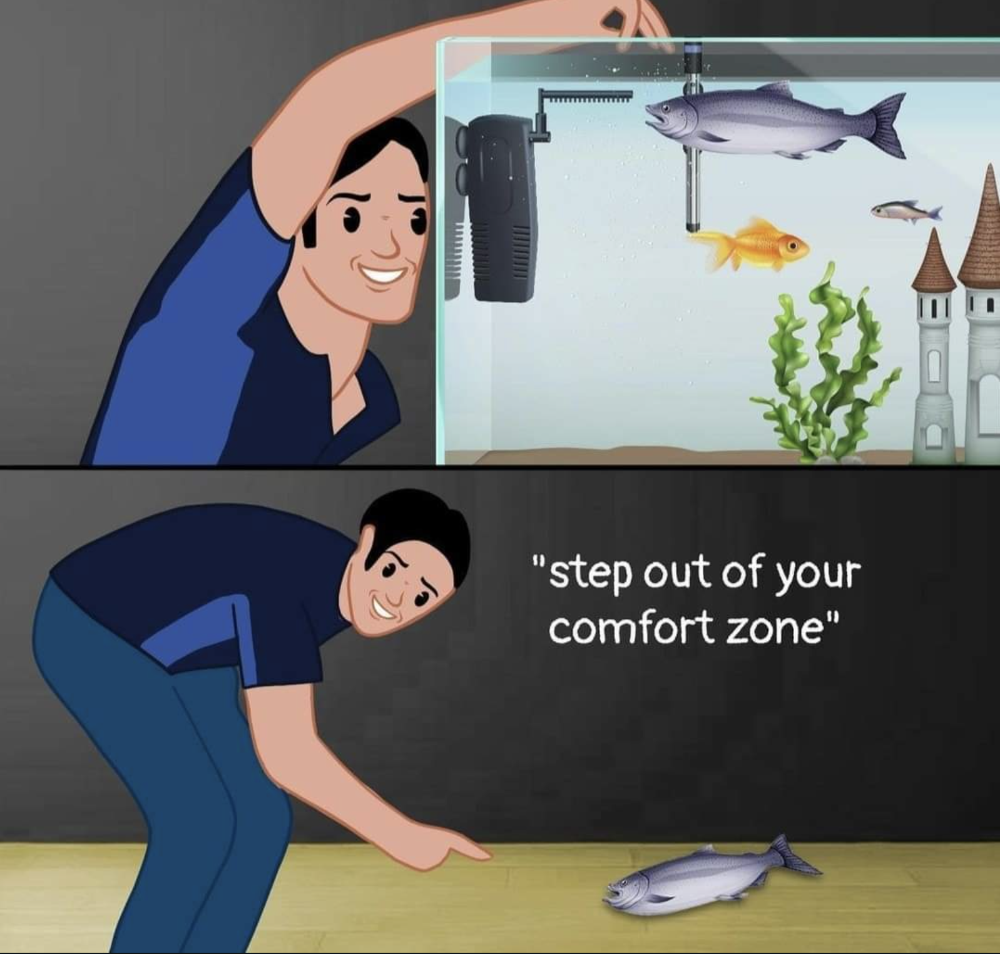

**Do you enjoy leaving your comfort zone? If your answer is a reluctant "probably not," you're not alone. The comfort zone is that cozy space where everything feels familiar and easy – like an MTB rider in the woods or a Netflix enthusiast on their favorite couch.** 😎

 

## 🧐 What is Leaving Your Comfort Zone?

Leaving your comfort zone means venturing into new territory, doing things you might not naturally gravitate toward. It's like swapping a Netflix binge for an engaging book (or a blog-post 😉) about self development. But why should you willingly go into discomfort? The answer lies in personal progress and growth.

When you step out of your comfort zone, your brain forges fresh neural pathways. Over time, these experiences become habits, leading to new skills and an expanded comfort zone. It's not just about trying new things; it's about connecting with people you might never have encountered and embracing previously unthinkable possibilities.

## 👧 My Personal Journey

I used to feel apprehensive about new people and unfamiliar situations, but life repeatedly pushed me out of my comfort zone. One significant moment occurred when COVID-19 struck, necessitating a reevaluation and adaptation of my two tourism-related businesses. I found myself transitioning to a different role, working for someone else (hello, Bright Inventions team 👋), in the tech industry (I'm 'not exactly' a technical person 😇). This shift was entirely outside my comfort zone. However, this experience transformed my perspective, teaching me that change is an opportunity for growth and learning.

## 🌚 Identifying your Needs

I believe it's common for people to sometimes be uncertain about their needs, direction in life, and what's truly good for them.

Stepping out of your comfort zone is like widening its boundaries. We go beyond our comfort zone and use it as a litmus test to determine if something aligns with our needs. This process makes it easier to identify and, consequently, fulfill those needs.

## 🧠 The Role of Dopamine

When we embark on unfamiliar journeys or learn new skills, our brains release dopamine, responsible for that exhilarating feeling when you achieve something new. It's your shortcut to feeling good!

## 🗣️ Speaking the Uncomfortable Truth

Leaving your comfort zone also involves speaking uncomfortable truths, which can lead to a change in the situation among the same people, rather than changing the people themselves. Otherwise, you'll continue to encounter the same challenging situations with different individuals.

## 👟 Take Small Steps 

Leaving your comfort zone is best done in small steps and increments. Sometimes, taking a small step beyond the zone is better than leaping far beyond it.

Life has a way of pushing us out of our comfort zones precisely when we need it most. It challenges us to adapt, learn, and grow, making us better versions of ourselves.

So, don't shy away from discomfort. Embrace it. Life's greatest adventures and profound discoveries often (or may I say - always) lie just beyond your comfort zone. 

 And I (and dopamine 💥) guarantee that you will feel great about yourself with every step!

<GiphyEmbed url='https://giphy.com/gifs/MenInKiltsSTARZ-starz-106-men-in-kilts-jMr74AT81aG5SHPVQz' />

source: \
[https://mind.help/topic/dopamine/](<https://mind.help/topic/dopamine/
https://news.cornell.edu/stories/2022/03/leaving-your-comfort-zone-inspires-motivation-growth>)\
[https://news.cornell.edu/stories/2022/03/](https://news.cornell.edu/stories/2022/03/leaving-your-comfort-zone-inspires-motivation-growth)\
cover image source: \
[https://www.memesmonkey.com/](https://www.memesmonkey.com/topic/comfort+zone)
