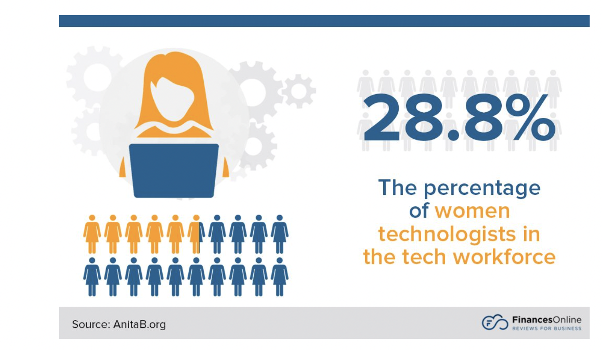
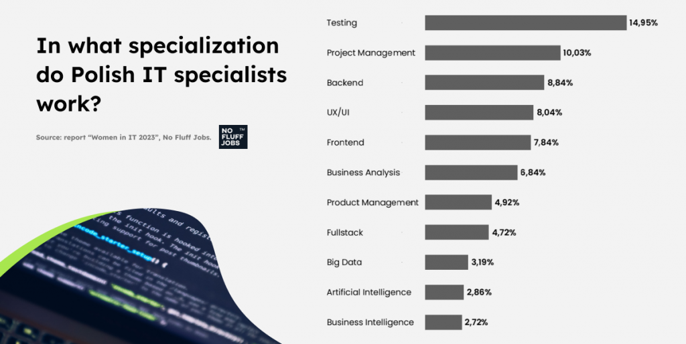
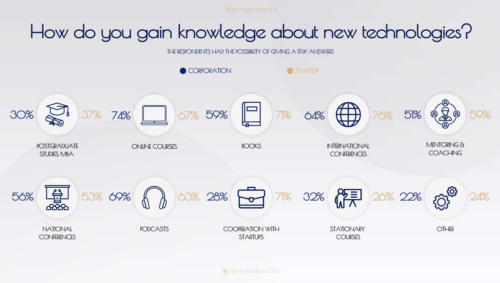

Gender diversity in each industry (not only tech) is important for several compelling reasons. **We all know that diverse teams bring a variety of perspectives and experiences to problem-solving which leads to more creative solutions and innovations, as different viewpoints are considered.** We also know that fostering an inclusive and diverse work environment can improve employee morale and job satisfaction. This, in turn, can lead to higher retention rates and increased productivity. As the tech industry operates on a global scale, understanding diverse cultural backgrounds and market dynamics is even more crucial. **Diverse teams are better equipped to navigate international markets and cultural nuances.**

Still while looking at IT industry we can see many women facing barriers to entry and advance in tech careers due to biases, stereotypes, and lack of access to mentorship opportunities. It is also commonly known that they have been underrepresented in senior IT management roles including positions like CTOs, CIOs, and CEOs of tech companies **[despite some visible rise of female leadership in recent years](https://oatuu.org/the-rising-trend-of-women-ctos-shaking-up-the-industry/).** According to a recent study, women hold just 10% of CTO positions at Fortune 500 companies and according to a report by The World Bank, **[women make up less than a third of the world’s workforce in technology-related fields.](https://www.womentech.net/women-technology-statistics)**

Source: https://financesonline.com/women-in-technology-statistics

## **organisations that support women in tech** 

Despite the aforementioned challenges, there is a growing number of female founders and entrepreneurs in the tech space, particularly in areas like health tech, ed tech, and e-commerce. **Also many organisations and advocacy groups work to promote diversity and inclusion in the IT industry. Many initiatives include mentorship programs, scholarships, and increasing female representation at tech conferences and events.** Each with its own unique goals and objectives. [Among some well-known international ones we can find:](https://www.cio.com/article/215709/16-organizations-for-women-in-tech.html) 

💃 **[Girls Who Code](https://girlswhocode.com/)** - to close the gender gap in technology by inspiring and educating girls in computer science and coding, providing them with the skills and confidence to pursue tech careers.

💃 **[Women in Technology](https://women-in-tech.org/)** - to empower and support women in the tech industry through mentoring, networking events, and educational programs, with a focus on leadership and career development.

💃 **[AnitaB.org](https://anitab.org/)**  - to increase the representation of women in technology and improve the workplace for all women by connecting, inspiring, and guiding women in tech.

💃 **[Black Girls CODE](https://wearebgc.org/)** - to introduce programming and technology to girls of color, with a focus on underrepresented communities, and to provide them with the skills and opportunities to pursue tech careers.

💃 **[TechWomen](https://www.techwomen.org/)** - to empower, connect, and support women in STEM (Science, Technology, Engineering, and Mathematics) from Africa, Central Asia, and the Middle East by providing professional mentorship opportunities in the United States.

💃 **[National Center for Women & Information Technology ](https://ncwit.org/)-** to increase the diversity of the technology workforce by encouraging and supporting the participation of women, as well as underrepresented groups, in IT and computing fields.

## **tech space for women in Poland** 

While there has been progress in recent years, there is still work to be done to achieve greater gender diversity in the Polish tech sector. The current state of women in tech in Poland reflects a broader global trend of underrepresentation and unique challenges faced by women in the tech industry. 

Source: [https://nofluffjobs.com/insights/raport-kobiety-w-it-2023](https://nofluffjobs.com/insights/raport-kobiety-w-it-2023/)

**There is still the shortage of visible tech female role models which may be also discouraging for some young women from pursuing tech careers.** It is important to highlight and celebrate successful women to inspire the next generation. I am really glad that there are positive developments in Poland such as v[arious organizations and communities dedicated to supporting and empowering women in tech.](https://brightinventions.pl/blog/polish-organizations-that-support-women-in-tech/)

There are also special educational institutions and organizations that offer programs to encourage girls and young women to pursue STEM education and tech careers. And also some tech companies are actively working on fostering more inclusive and diverse workplaces, including gender diversity.

## **Strong Women in IT**

[Strong Women in IT](https://strongwomeninit.com/) was initiated in 2018 as a concept and then it became a respected brand, engaging directly with around 350 women at the C-level from the tech industry. I**ts mission is to show ambitious, entrepreneurial, and strong women and make true female leaders more visible in IT area so that they can serve as role models and inspire other female specialists to pursue careers in technology.** I believe that this kind of initiatives can be really encouraging for girls and young women who are pondering about pursuing Science, Technology, Engineering, and Mathematics career as well as to women who just would like to collaborate with tech companies in different non-tech roles to create a more inclusive ecosystem.

**This year Strong Women in IT (SWIT) is breaking records with 251 remarkable stories from inspiring women across Europe, America, Asia, and Africa.** Each finalist brings unique inspiration, shares challenges, and offers different perspectives. They are all ready to serve as role models for others.

**One standout discovery is that over 50% of SWIT finalists now prefer mentoring as their learning method of choice.** This shift underscores the collective desire to support fellow women, build communities, and share experiences for growth.

In these turbulent times, SWIT finalists openly discuss their fears and the daily uncertainties they face. Yet, they remain resilient and inspired by new technologies. A notable change is in how we work: only 3% prefer the traditional office model. The majority see the future of work as a blend of full remote or hybrid arrangements. 

**If you want to see more detailed statistics and insights, you can download the full report [HERE](https://strongwomeninit.com/en/download/).  There are dozens of stories of influential women in the global tech industry. Among them is also mine - in which I am telling a bit about my story and road to IT industry.** 

## **find your role model** 

Having a role model when entering IT industry, or any field, is valuable for many reasons. **First of all, [role models can inspire and motivate you as a newcomer.](https://www.womenintech.co.uk/the-importance-of-role-models-for-women-in-tech) They demonstrate what is possible and provide a source of inspiration for those who might be unsure about their own potential.**

Role models can also challenge stereotypes and biases. In male-dominated fields like IT, having female role models, for example, can challenge the stereotype that tech is exclusively for men - I even don’t know why this kind of stereotypes still exist, but they do. So, role models can offer guidance and advice based on their own experiences. This can be invaluable while navigating a new industry. 

**And I think just seeing someone who looks like you or has a similar background succeed in the industry you want to enter can boost your confidence and self-belief.** 😊 What is more, role models can provide you with a realistic view of what to expect including challenges and setbacks, and how to overcome them. They can be also a source of emotional support and encouragement, especially during difficult times in one's career. So, find your own - the role model or role models - who will help you understand your strengths, inspire to act and support in further development. 

And at the same time remember that you are [your own role model](https://www.educative.io/blog/being-your-own-role-model-woman-tech) and you are setting your own standards for success.
