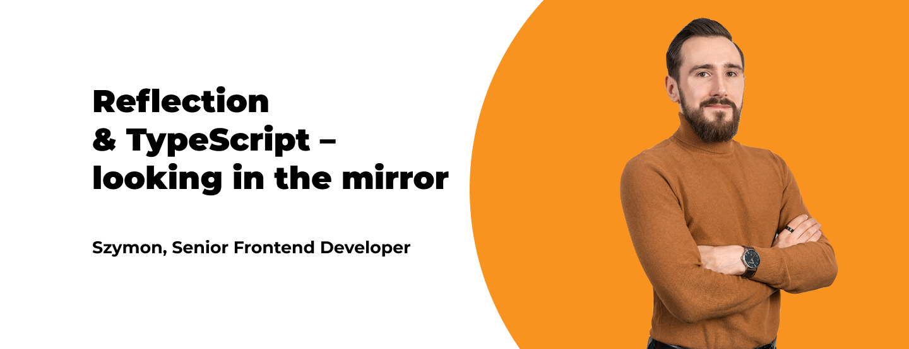
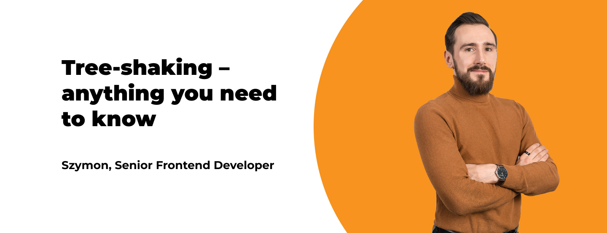

**The 14th edition of the Polish conference Warsaw IT Days (Polish: Warszawskie Dni Informatyki) takes place in Warsaw on 31st March (online) and 1st April (onsite). Conference’s agenda promises hundreds of presentations for students and professionals. Szymon Chmal, Senior Frontend Developer at Bright Inventions will give two presentations (online and onsite).**

Szymon Chmal is a senior frontend developer with a holistic view of software and a mind full of brilliant ideas. He’s in love with React, but open to new technologies regarding both frontend and backend areas. Technology is for him just a tool used to provide business value to software products he is working on.

Do you want to know more about Szymon? [Read an interview](/blog/frontend-developer-with-an-appetite-for-backend-meet-szymon).

## Watch Szymon’s webinars for Warsaw IT Days

Szymon’s presentations at Warsaw IT Days are dedicated to mid and experienced frontend developers. They will be held in Polish.

### Reflection and TypeScript – looking in the mirror (Polish: Refleksja i TypeScript, czyli spojrzenie w lustro)

Join WEBDEV Stage (onsite) to learn more about the reflection mechanism - what should we know about it? What are its strengths and limitations? Which libraries will help us to sharpen the reflection?

**When: 1st April, 09.50-10.20 room 101**

### Tree-shaking – anything you need to know (Polish: Tree-shaking – z czym to się je)

What is tree-shaking? How does it work? And what to do when it doesn’t work? Szymon will guide you through tree-shaking step by step. 🙂 This speech will be available as VOD for Warsaw IT Days’ attendees. 

**When: it's VOD. Whenever you want. 😉**

## Let’s meet (virtually) at Warsaw IT Days

[Register for Warsaw IT Days](https://warszawskiedniinformatyki.pl) and listen to Szymon’s speeches.

You’ll also have a chance to listen to Szymon (onsite) at the [4developers](https://4developers.org.pl) conference in April. He will speak there as well. More on that soon!
