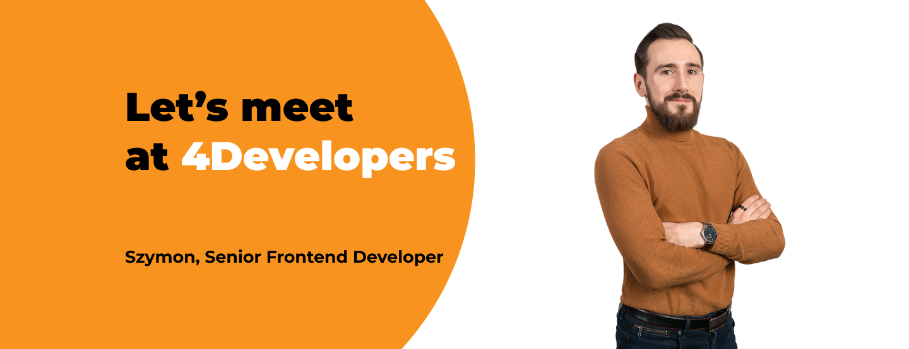

**Szymon Chmal, Senior Frontend Developer at Bright Inventions, is among the speakers at the 2023 edition of 4Developers. The event takes place on the 18th of April in Warsaw. Szymon will speak about the Reflection mechanism in Typescript.**

Szymon Chmal is a senior frontend developer. He’s in love with React, but open to new technologies regarding both frontend and backend areas. Technology is for him just a tool used to provide business value to software products he is working on. 

Before conquering the 4developers stage Szymon will have two presentations at another IT event [Warsaw IT Days](/blog/szymon-chmal-from-bright-inventions-among-warsaw-it-days-speakers). Busy days are ahead of him. 🙂

Do you want to know more about Szymon? [Read an interview](/blog/frontend-developer-with-an-appetite-for-backend-meet-szymon).

## Deep dive into Reflection and TypeScript at 4Developers

Szymon will guide 4developers attendees into Reflection Mechanism in TypeScript. He will explain what Reflection gives and what are its limitations. After focusing on some theory, Szymon and the attendees will together write a simple IoC container.

**When: Apr 18th, 4.00 - 4.45 PM, Warsaw (onside)**

## Meet with Szymon at 4Developers

[Tickets for 4developers](https://eventory.cc/event/4developers-2023/tickets) are still available. If you plan to attend, don't forget to say hi to Szymon. 👋
