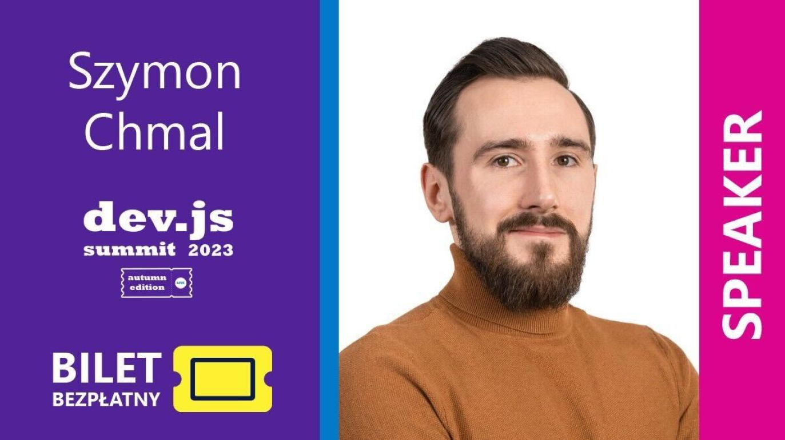

**Are you planning to attend the dev.js Summit (online) Autumn Edition? Don’t miss a talk by Szymon Chmal, Senior Frontend Developer at Bright Inventions. Join the online event comfortably from your office or home on 12 October 2023. Tickets are free!**

## Szymon’s talk – The New Face of Hydration

If you are creating applications in React, you have probably encountered the concept of hydration. The bright side of this process is that our application, initially rendered on the server side, becomes interactive. Not long ago, hydration had to be performed in an "all or nothing" mode and often became noticeable to the end user. Fortunately, the situation has changed with the latest version of React. Hydration can now be divided into phases and even prioritized. What exactly does this mean? You will find out during this presentation.

**Szymon will uncover the new face of hydration on October 12 at 2.30 p.m. online. [Claim your spot now](https://devjssummit.pl/)!**

## Learn more about bright speaker

Szymon is a senior frontend developer with a holistic view of software. In love with React, but open to new technologies regarding both frontend and backend areas. Technology is for him just a tool used to provide business value to software products he is working on.

Do you want to know more about Szymon? [Read this interview](/blog/frontend-developer-with-an-appetite-for-backend-meet-szymon/).

## See you online

[Get a free ticket now](https://devjssummit.pl/)! Also, find out what other speech you can find in the dev.js Summit agenda.
