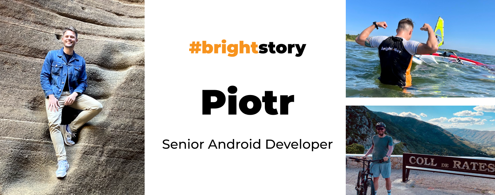
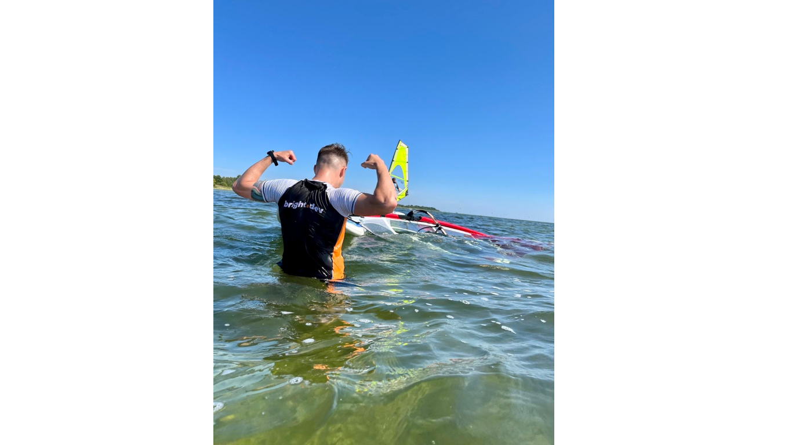
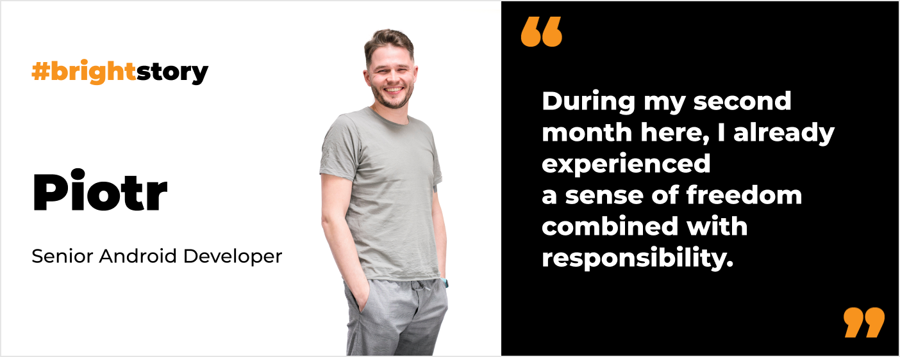
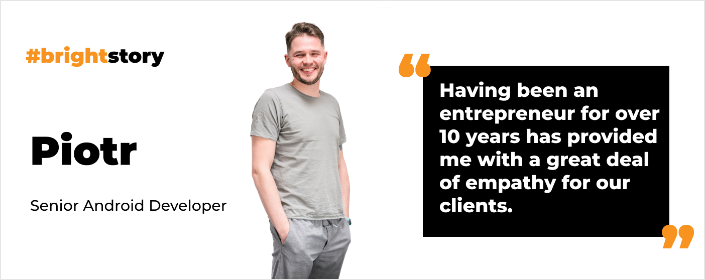
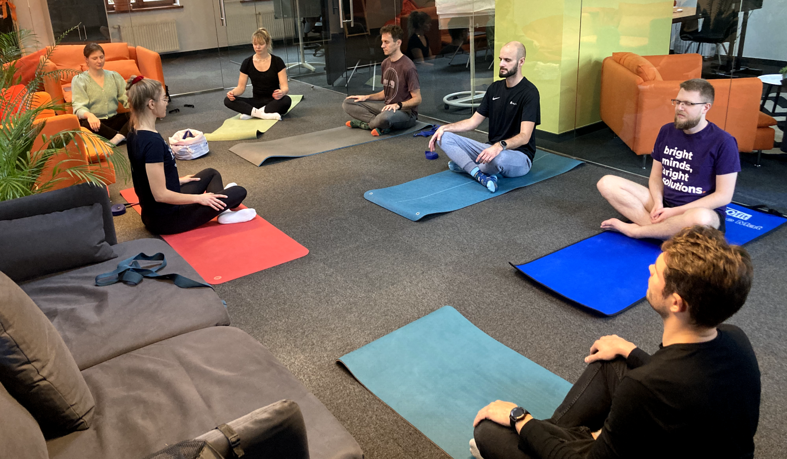
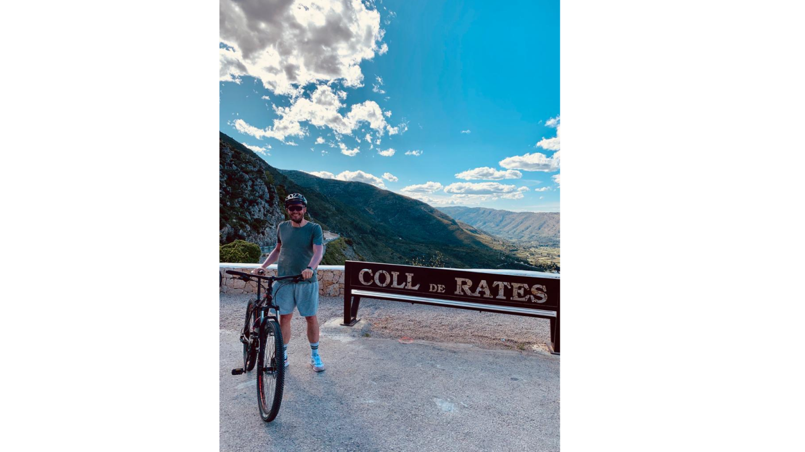

**Piotr is an experienced entrepreneur and Android Developer who always brings much more than lines of code. His broad perspective helps to truly create the software that matters. Explore how his passion for music led him to Android development. Also, find out how sports activities transformed his life and work.**

## Before you joined Bright Inventions you were an entrepreneur. Tell us more about your business.

The company I co-founded was providing **digital signage solutions**. In practice, we owned a nationwide screen network, used as an information and advertisement tool. Our top product was a digital signage network in the health sector. My business partner was responsible for advertising, while **I was handling the technology side of the business**.

## Did your business eventually direct you toward Android development?

Answering that question isn't straightforward. To begin, I should mention that **I am a sound engineer by profession**. I graduated from Gdansk University of Technology. Despite taking on some work at a Musical Theatre in Gdynia and in a recording studio, I found that it wasn't a promising career path for me. I decided to pivot. I've always loved computers - as a teenager, I was building websites with HTML and PHP, so programming wasn't unfamiliar to me.

**My interest was sparked by Android development when I realized how easily it synced with my other passion – playing drums**. Smartphones have accelerometers and track motions like shaking, tilting, and swinging. I read on the internet about a guy who used that to build an app that simulates drums. Being a drummer myself, this intrigued me, so **I decided to develop an app that turned my phone into a drumstick**. It was incredibly satisfying and fun.

Later, I took several courses on Android development. Eventually, my company received an order to build an Android app for a bank, providing me with the opportunity to work on a commercial project.

Bright dev after hours

## How did you land in Bright Inventions?

I sold my business and chose to freelance for a while and work on my own apps. In the end, freelancing wasn't the perfect solution for me, as I love to work in a team, so I began searching for a full-time job. 

I recall coming across a job offer from Bright Inventions on a job board, but I didn't apply at that time. Soon after that, **I heard wonderful things about Bright Inventions (and [Ula](/about-us/ula/) in particular)** from a friend, so I decided to submit my application. This happened over four years ago. 🙂 Now I cannot imagine another career path for me.

## How would you sum up these 4 years at Bright Inventions?

I can say that it has been a period of rapid and profound learning. I don't just mean technical knowledge, but I've also deeply dived into the business aspects of software development. 

**It's remarkable how quickly I gained a substantial amount of trust**. During my second month here, I already experienced a sense of freedom combined with responsibility. I have always been a person who ensures meeting all deadlines and who self-imposes a goal-oriented working model. It's wonderful that the team at Bright Inventions quickly recognized that and almost immediately placed their trust in me.

## What are the biggest challenges you faced during these last 4 years?

One of them occurred shortly after I joined Bright Inventions. I became a part of a highly rewarding project that aimed to **build a solution for humanitarian aid**. It felt amazing to build software that impacts and improves people’s lives. However, it wasn't easy. I had to learn a lot of new things quickly. **It was the first time I worked on integrating peripheral devices and implemented biometric authentication methods**.

Another challenge was quite satisfying too. **My colleagues and I had the opportunity to build the entire architecture from scratch for a new Android app** we were supposed to create for our client. We were trusted to choose the right technologies. We aimed to implement everything new that Android had to offer, including Jetpack Compose and multi-module architecture.

**We spent several months establishing the right architecture, but it was worth it**. Sometimes, when you opt for the newest technologies, you may face challenges due to their immaturity. In this case, we tackled the challenge smartly, making decisions that now contribute to the project's smooth functionality. Adding new features to this app is a pleasure, not only from my experience but also from the experiences of other developers who were part of this project.

## Having owned a business, does it help you with daily interactions with our clients?

Absolutely! Having been an entrepreneur for over 10 years has provided me with a great deal of empathy for our clients. I have a deeper understanding of certain business processes, and **I particularly enjoy projects with challenges because they not only pique my interest but also drive me**. The longer the journey, the more satisfying it is to reach the destination, don’t you think? I always try to embrace the process and understand both sides.

## I'm aware that sports have become a crucial part of your life. Tell us what you train and why.

It all began when the pandemic struck in 2020. **Bright Inventions' founders, [Daniel](/about-us/daniel/) and [Michał](/about-us/michal/), offered us a new work benefit – free workouts led by a professional triathlete, [Bartosz Banach](https://bartoszbanach.pl/)**. It was a life-changing moment for me, especially during the pandemic when we were forced to stay home, and being active definitely helped me get through it. We could choose from running, mountain biking (MTB), and swimming workouts. I started to attend MTB and running workouts. 

Biking has certainly become an integral part of my life. Before 2020, I cycled like most people – occasionally. Now, I ride 200 to 400 kilometers a month. In addition to cycling, I run, do yoga, take long walks, and go to the gym.

**Let me share my Garmin stats for October 2023:**

* 351 kilometers of cycling,
* 108 kilometers of active strolling,
* 96 kilometers of running,
* 3 hours of yoga.

Friday yoga at Bright Inventions’ office

## What have sports brought to your life?

Discipline, without a doubt. Regardless of the weather, I have to stick to my training routine. It has certainly changed me.

**Sports also help clear the mind**. This is something I've heard from many people at Bright Inventions. When I'm struggling with a task, what do I do? I shut off my computer and go for a walk or a workout. When I return, I often have new ideas for solving my challenges.

## Why is Spain your regular vacation spot?

Exploring Spain on the bike

**I’ve always been in awe of Spanish culture, language, and cuisine**. The fact that the Spanish language is relatively easy to learn fascinated me. I started learning it in college, and having a roommate from Spain for a while helped me a lot.

Spain is a **perfect destination for MTB enthusiasts**. The country offers breathtaking views, and its mountainous terrain ensures you'll face some challenges along the way. Mountain biking entails hard work, and I love it. Combining it with stunning scenery, delicious food, and the company of friends, it’s the ideal holiday for me.
