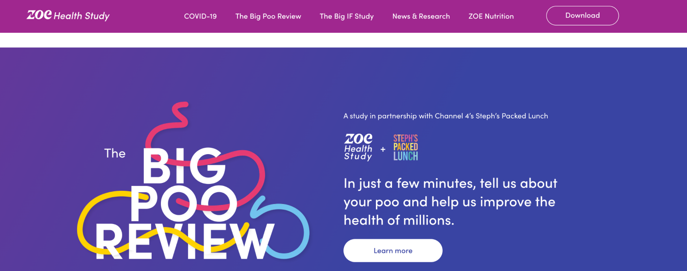

**Invisible diseases represent a vast group of patient disorders. Developing software for people suffering from them requires an extra empathetic approach to deliver a truly user-centric experience. Are you prepared to create a credible and trustworthy solution? Read our article to find out!**

**People with invisible diseases often navigate their lives, both private and professional, while managing their conditions**. These conditions are typically chronic, remaining with them for longer periods, even though their symptoms may not be visible to others.

Invisible diseases include **mental health issues**, **neurodiverse conditions** like ADHD and autism, **chronic pain and fatigue conditions** such as fibromyalgia, as well as **autoimmune disorders** like multiple sclerosis (MS) and lupus.

<EbookDynamic sectionTitle='dive into the future of HealthTech with our comprehensive guide' ebookName='Scale-Your-Healthtech-Solution-Successfully.pdf' ebookDescription={'Unlock exclusive insights and expert advice now! Claim your free copy!'} ebookImage='/images/healthtech_guide_cover.png' ebookAlt='cover' />

## Patient-centric approach in healthcare software solutions

Developing technology solutions for patients with invisible diseases may require **additional effort to achieve a patient-centric/user-centric approach**. 

### Throughout the process of understanding your users, it's essential to consider several factors:

1. **Your users may be very secretive about their disease.** 

Understanding the privacy concerns and stigma associated with invisible diseases is crucial in building trust and ensuring user comfort.

<blockquote><h2>Breaking down the encrypted database</h2>
One of the security tactics we implemented was breaking down the encrypted database into two – each stored in a different AWS services’ physical location. The first database stored basic user data, such as name or email address. The second database kept sensitive medical information, including medication intake or physical symptoms and side effects. Through this decision, we made sure that – in case of a data breach – the attacking party wouldn’t be able to access all the information. This way, there were virtually zero chances of matching symptoms or medication intake to specific patients’ names.
<footer>Mateusz Klimczak, Partner & Head of Delivery at Bright Inventions</footer></blockquote>

Read more about building [an app for people with Parkinson’s](/projects/solution-for-parkinsons-patients/).

2. **People with invisible diseases may be distrustful, including towards technology.** 

Initially, they might approach your app with a degree of skepticism, making the onboarding process more critical than ever. Crafting an engaging, reassuring, and personalized onboarding experience is key to overcoming initial mistrust. 

Delve into building [empathic app onboarding](/blog/data-driven-development-femtech-app-onboarding/) with our other blog post.

3. **Despite users' skepticism, they might still turn to technology to help manage their disease.** 

This indicates a need for solutions that are not only secure but also intuitive and genuinely useful in navigating the complexities of their condition.

One of the examples of software that needs to engage users with simple and empathic design is yet again a solution for Parkinson’s patients:

<blockquote><h2>Inclusive and empathic UX/UI design</h2>
From the beginning, we understood that the key element of the solution must have been inclusive and empathic UX/UI design. The app had to be friendly in use for patients suffering from tremors or other movement disorders. Also, as the elderly constitute the majority of patients suffering from Parkinson’s, the challenge was to deliver a legible, highly intuitive interface that would minimize the chances of mistakes. If an accidental input were to take place, though, the interface also needed to allow the option to undo the action.
<footer>Mateusz Klimczak, Partner & Head of Delivery at Bright Inventions</footer></blockquote>

4. **Some taboos might be a reality for people with particular health disorders.** 

Approaching sensitive topics with empathy and care can help in creating a solution that feels inclusive and supportive. Also, don’t be afraid to include a fun factor even in the most unconventional circumstances.

ZOE app serves as a prime example of a healthcare solution that approaches taboos with humor for a meaningful cause. The creators of the ZOE app were not afraid to address bowel movements - a topic essential to every human being's health, yet rather avoided in conversation.

ZOE with their outside-of-the-box messaging was able to convince 142,768 people in the United Kingdom to take part in the survey. Explore insightful results of the “[The Big Poo Review](https://zoe.com/learn/fascinating-insights-from-the-big-poo-review)”.

5. **Your users shouldn’t be your guinea pigs because they will quickly lose trust in your solution.** 

Implement tech trends with extra caution. A great example of this is introducing currently hot AI-based solutions. 

<blockquote><h2>Approaching AI in mental health methodically</h2>
Generative AI is something I am currently responsible for while working on a mental health care application. While developing a solution supporting people's mental well-being, we need to approach this methodically. The last thing we want is to launch an AI solution that ends up discouraging people who are seeking mental health support, for example, by being ununderstandable by a bot.  That's why we are currently focusing on creating various proofs of concept to determine which areas of the application can truly be enhanced with AI. Before we even begin testing them with users, we need to identify clear signs of the value that AI can deliver. The AI-based solutions must be primarily trustworthy for our mental health app users.
<footer>Sławek Kopaczewski, Fullstack Developer at Bright Inventions</footer></blockquote>

## Examples of features to incorporate in applications for people with invisible diseases

When developing applications for individuals with invisible diseases, it's essential to focus on features that address their unique needs while fostering engagement and support:

### Gamification and engaging features

Introduce elements that motivate users to manage their disease daily. These could include reward systems, progress tracking, and interactive educational content. Explore our other blog post on [patient engagement solutions](/blog/delivering-patient-engagement-platform/).

### Support group and community finder

Help users connect with support groups or communities facing similar challenges. This feature can offer emotional support and practical advice, making users feel less isolated.

### Accessible information on clinical data and programs

People with invisible diseases (especially chronically ill) often hold hope for new scientific discoveries that could improve or save their lives. However, access to clinical research data is usually restricted, and the material is often written in specialized language. Summarizing current medical progress in straightforward language can be a crucial feature, providing hope and information in an accessible format.

## Deliver empathetic solution

Remember, what you can't see might still hurt. So, while delivering solutions for patients with invisible diseases, don't treat them merely as users, but as people who might have been waiting for years for aid that would support them at difficult times. You owe them an empathetic solution because your 'users' truly deserve it.