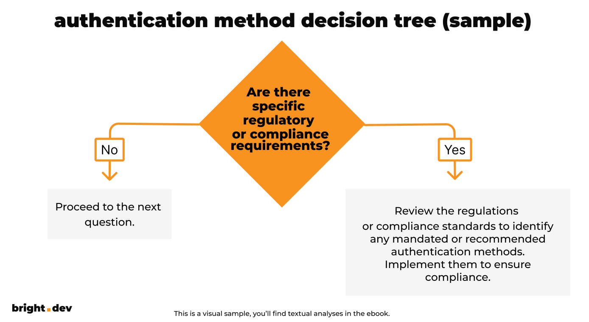

**Download our free ebook with an authentication method decision tree. We've taken into account user experience, regulatory requirements, privacy concerns, and security when selecting an authentication method for an application.**

<EbookDynamic sectionTitle='Download the free ebook with a decision tree' ebookName='Optimise-Sign-In-Experience.pdf' ebookDescription='Answer 6 question to determine the best authentication method for your application.' ebookImage='/images/cover-sign-in-ebook.png' ebookAlt='Sign-In ebook cover' />

## The decision tree included in our free ebook divides decision factors into 6 questions:

Here are examples of the questions:

* Are there specific regulatory or compliance requirements?
* What is the sensitivity of the application or data?
* Does the application support multiple platforms and devices?

Dive into the first question with this sample:

According to your answers, we prepared the proper recommendations. Download the free ebook to have the whole picture and streamline your sign-in process.