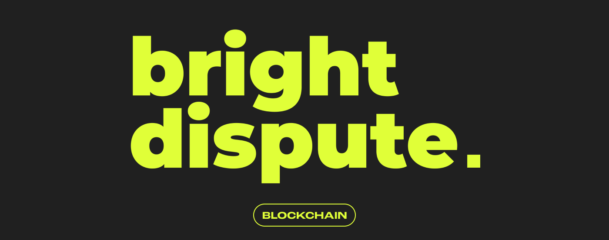
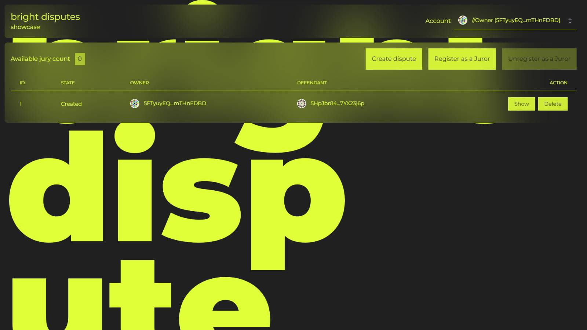

**In the ever-evolving world of blockchain technology, decentralized applications (dApps) are making significant strides, particularly in legal agreements and dispute resolution. Among these innovations, Bright Disputes stands out as a transformative solution for conflict resolution on Substrate-based blockchains, leveraging the capabilities of smart contracts.**

## Understanding Decentralized Applications (dApps)

Decentralized applications, or dApps, are an integral part of the blockchain ecosystem, offering enhanced security, transparency, and user autonomy. Unlike traditional applications, dApps run on a peer-to-peer network of computers, making them immune to single points of failure and offering a new level of user trust and interaction.

## The Role of Bright Disputes in Blockchain Conflict Resolution

Bright Dispute Showcase serves as a demonstration tool, designed to help users understand the intricacies of Bright Disputes. Utilizing a Command Line Interface (CLI), the application showcases the step-by-step process of a dispute resolution, from initiation to conclusion, using predefined user accounts. It illustrates the dispute resolution process:

* Initiating a dispute involves specifying the defendant's public key and case details, followed by creating the dispute.
* Users can observe the CLI commands used at each stage, enhancing their understanding of the application's functionality.
* The process involves multiple stages, including defendant confirmation, jury selection, and voting phases.
* Juror anonymity is maintained during voting, and private keys play a critical role in the process.
* The resolution of the dispute occurs when a majority decision is reached, followed by the distribution of token deposits among the successful party's jurors and the judge.

## Navigating the Bright Disputes Showcase Interface

This section delves into the various aspects of the application's interface, highlighting its user-friendly features and the seamless integration of key functionalities. The application interface consists of several views, the first of which is a list of disputes. On this page, users can view all created disputes, their statuses, the public keys of the authors, and the defendants. Users have the option to view details of each dispute or delete them. 

It's worth noting the dropdown in the top right corner, which allows for the selection of predefined users. Below the application logo, there's a counter of registered jurors, alongside buttons for registering and deregistering users from the jury pool. There is also a button for creating new disputes, leading to the creation form.

