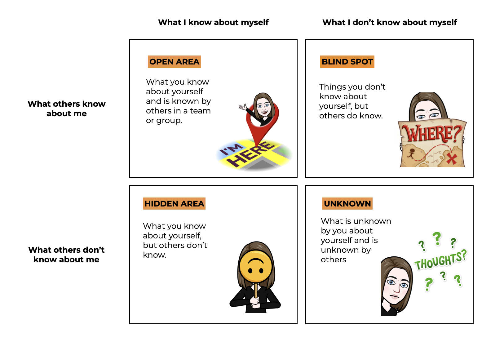
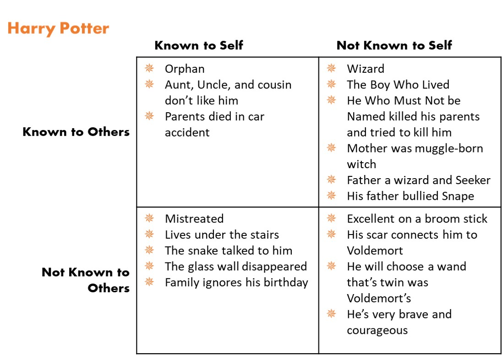

The [Johari Window](https://kevan.org/johari) is a communication model developed in 1950s by two American psychologists, Joseph Luft and Harry Ingham. The name ‘Johari’ came from joining their first two names. The model has different  practical applications in today’s world. It can be used to better understand own self, improve communication, enhance interpersonal relations with others or discover oneself’s strengths. **It is also indicated as feedback/disclosure model of self-awareness.**

**The Johari Window is 4-box matrix. The first quadrant is the open area (also known as the arena), then we have the blind spot, the third one is the hidden area (also known as the facade) and the fourth one is the unknown**. **Each quadrant offers us a different approach to self-development and contains information about our self-awareness and how others see us.** The information can be transferred from one area to another through mutual trust. Let us now take a deeper look at each of them. 

## **\#1 OPEN AREA** 

The open area contains things that you know about yourself and that others in your environment know about you. This includes all the information which is public - your behaviours, knowledge, skills, attitudes or employment history. This is the area of communication. **The goal should be to make the open area as big as possible which is connected with asking for and receiving honest and real-time feedback.** The more you know about yourself and people know about you, the more productive your cooperation might be.

## **\#2 BLIND SPOT** 

This quadrant includes information about yourself known by others, but not by you. These may involve for instance habits that you are not aware of or behaviours you do automatically without much notice. **This is an area where opinions received from others may help you grow.** By asking for feedback from others you may get to know more about yourself. Learn where you blind spots are. 

## **\#3 HIDDEN AREA**

This area is about your feelings or personal things you keep to yourself. It is your hidden or secret self that you do not want to share with others. This information does not have to relate with work. These may be your hidden qualities or stories you want to keep from others. **Reducing hidden area and disclosing some personal information may be helpful for other to understand you. But to do that at first we have to build trust.** 

## **\#4 UNKNOWN**

In this quadrant you will find the information no one (including yourself) knows about your personality. They might be repressed feelings, undiscovered abilities or talents, some subconscious behaviours or reactions. The unknown area is quite big in case of people with a low self-esteem or inexperienced ones with little self-knowledge. **However, the unknown area is a space for real discoveries where your personal growth may arise from. You just have jump at the different opportunities given to you by others and learn that making mistakes is an unavoidable part of growth.** Many people discover they unknown areas just by trying out new things. 

## **Better version of yourself thanks to Johari Window**

We are all good or very good at something and other people know about it. But there are also areas in which we need much improvement to grow. Johari Window is a great tool to support individual development and build feedback culture in your team. Soliciting feedback from others can help us grow further and discover the abilities or skills we have never dreamt about. **Getting feedback is a gift and we should be grateful for every feedback we obtain even though we might be not always happy about what we hear. The goal is to listen to the feedback and stay open to what we hear.** Ponder on the feedback you get and ask questions to understand better how you can improve. Try to identify your blind spots thanks to feedback your receive. **It takes time, determination, effort and regularity to move from blind spots to open area.** But always close the loop and take actions on the feedback you get. 

Remember that people we should ask feedback for are not only people around us, who works with us or live with us, these people are also ourselves. **We should ask ourselves for self-feedback and focus on our own weaknesses and areas we hide from others.** Sometimes it is really freeing to share them with others. People around you can help you overcome your imperfections, change them or just accept them. 

###### Source: https://www.barbaravevers.com/2018/11/character-development-using-johari.html

I really encourage you now to complete Johari Window on your own. **What would you put in the open area or the hidden are? What kind of qualities your friends or colleague would put in the blind spot if I ask them about what your cooperation look like? And how about the unknown? Have you ever had a new experience that has taught you about something you have never been aware of?** 

Johari Window is a toll which may help you get to know yourself better, improve your self-awareness in relationships and increase your self-awareness in a professional life. As an inspiration take a look at the Johari Window of Harry Potter by Barbara V. Evers **because each of us has some magic inside we do not know about yet.** ❤️
