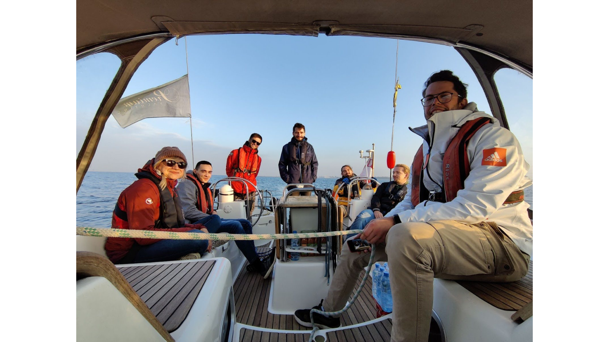
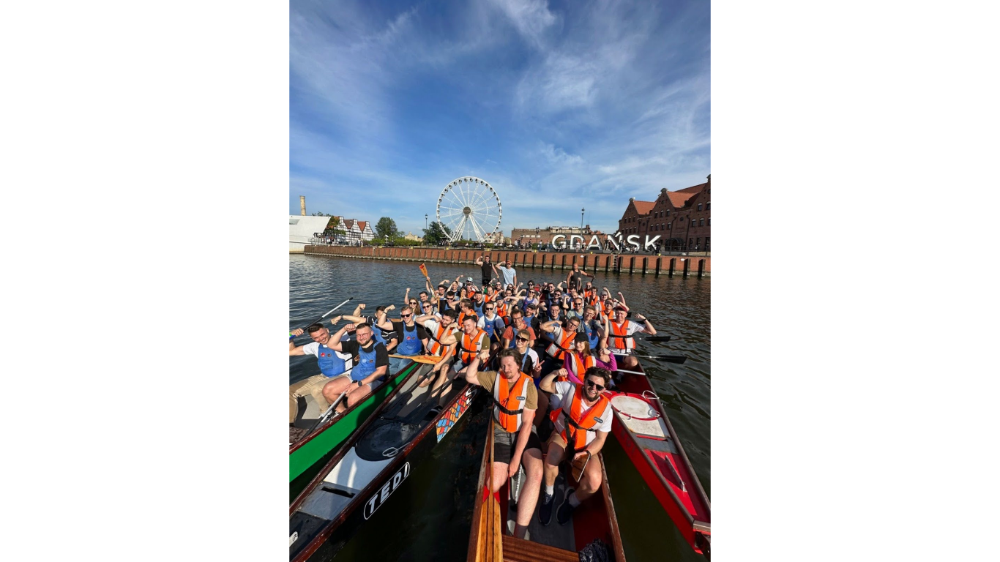
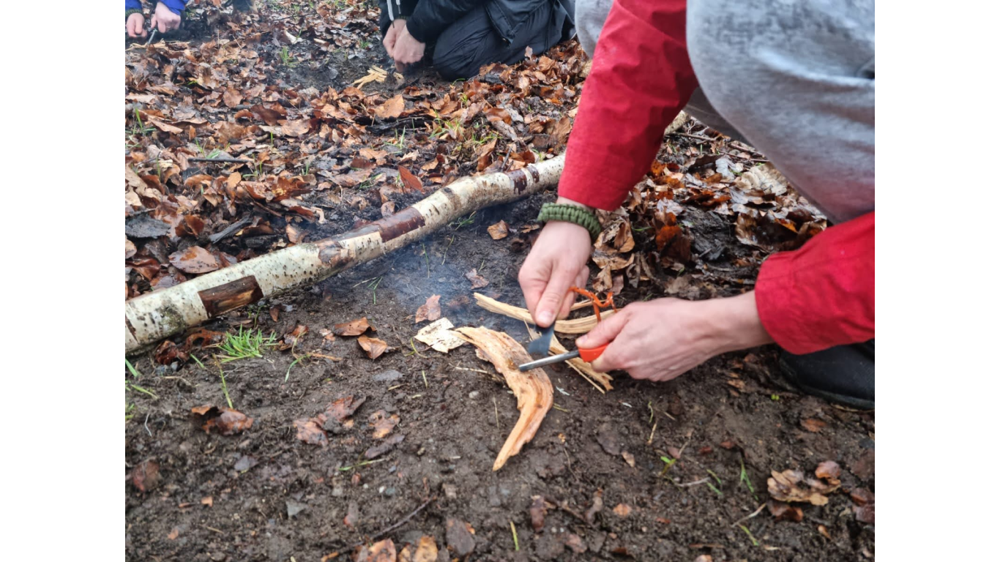
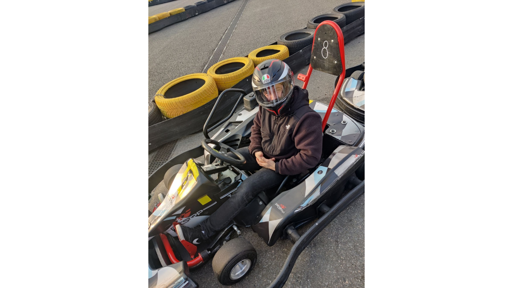
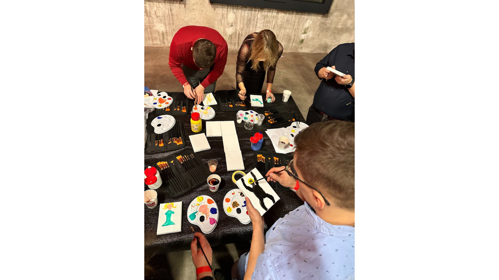
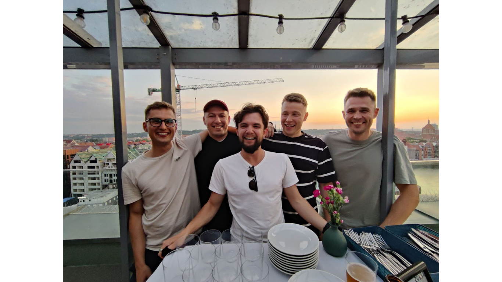
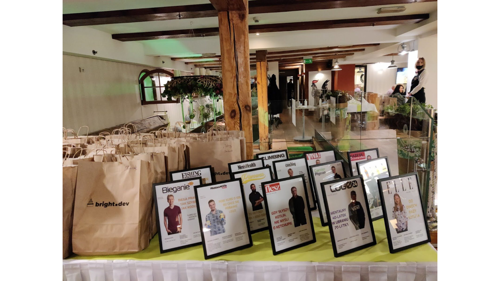
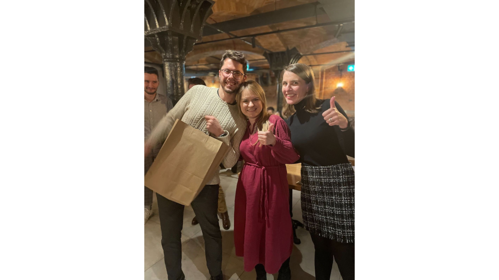
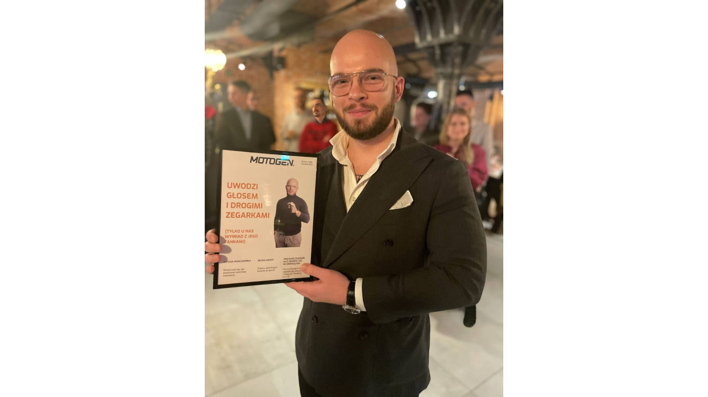

Team building is a form of integration that provides team members with the opportunity to collaboratively perform various tasks. However, what matters in these activities is mutual cooperation, the possibility of discussion, overcoming challenges, and, above all, having fun together. Thanks to this, the team has a chance to get to know each other better, engage in conversations beyond the office environment, and build relationships.

Teamwork is one of five core values at Bright Inventions. We constantly make sure that thanks to the team building events our team integrates, gets to know each other better and, as a result, works better together and copes with the minor and major problems that may arise in everyday work. It also helps us to be closer in remote work times.

## **Team building at Bright Inventions**

The main glue that binds our team together are the quarterly integrations.  Four times a year we organise core team building initiatives at Bright integrations (March, June, September, December), which always consist of two partsThe first part of team-building adventure is about facing different challenges together, and doing some group tasks. We are always randomly assigned to a group and can thus get to know people with whom we do not have the opportunity to work on a daily basis. It is a great opportunity to exchange ideas, experiences and support each other in carrying out tasks. And what are these tasks? Well, it varies: 

* we sailed yachts and worked together to operate the yacht,

* we kayaked (in double kayaks, so we had to help each other ;)) or worked together on a dragon boat race,

*  te took part in outdoor games - we were navigating some places on the map and solved,

* we were on go-kart races,

* and many more including some artistic workshops.

As you can see our values as teamwork and positive attitude are really close to us at integrations. :)\
\
After our team-building activities, we usually gather at a local restaurant to eat something delicious and have fun.  But it's not just about food. It's a time to relax, share laughter, and strengthen the bonds we've built throughout the day.

## The unique brilliance of Bright Christmas

One of the most anticipated meetings is always Bright Christmas. How does it differ from the rest? Of course, first we have the team-building part (this year we painted pictures together), then dinner and afterwards and afterwards we have an opportunity to reflect on the entire year. We even have a special team knowledge quiz and the awards for the most engaging blog post and the most popular post on our blog, determined by the number of views.

In addition, people who have been with us for the magical two years also receive a gift, which is heavily personalised. :) With this, we want to emphasise our gratitude towards our teammates who try to create the Bright Team with us on a daily basis.

## Project team building events

What else besides the integrations of the whole team? Project outings, of course. :) Such an initiative also works and is popular with us. It's good to get out and chat with people from the F2F team especially in the age of remote working. Relationships are revived and strengthened and more than once we hear that it is more pleasant to work together afterwards.

To sum up, fostering such integrative initiatives not only strengthens company culture and enhances team collaboration but also plays a pivotal role in boosting employee engagement. By facilitating open communication channels and fostering teamwork, these activities contribute significantly to the overall rising productivity and engagement. As a result, investing in such team-building events can yield substantial benefits for both the employees and the organisation as a whole, ultimately leading to a more motivated and cooperative team.