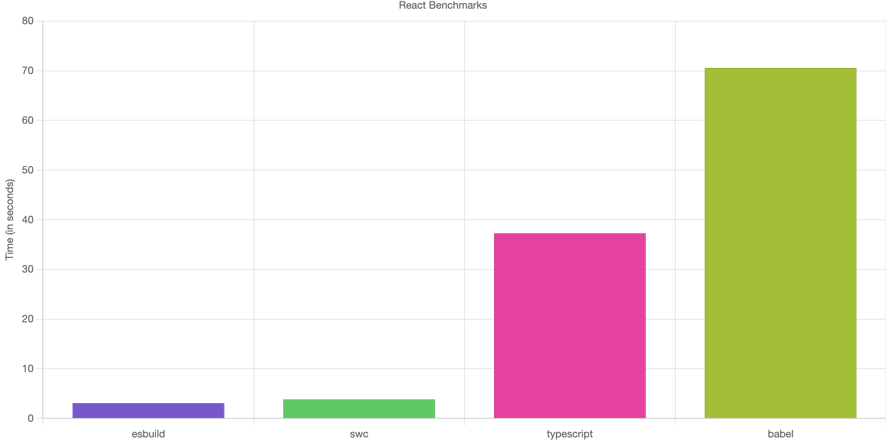

<div className="image"></div>
<br />

In the old days, there were many more web browsers competing in the market and each was supporting a different subset of JavaScript features. What's even worse, some of them weren't really focused on implementing the missing ones, therefore we were greatly limited by them. Internet Explorer is an inglorious example coming from this group. It was obsolete but really popular at the same time. The worst nightmare of a web developer wanting to use modern JavaScript.
Normally, we would have to be aware of exactly what isn't present in a browser we would like to support and simply not use it. It sounds easy, but in reality, it's not. That's when transpilers come into play. **They are able to understand the code we write and transform it**. Moreover, they also enable some non-obvious features, we use every day. Intrigued? Keep reading then!

# Why do we need transpilers like Babel?

Imagine you have to write a code, that's supported by all the browsers on the market with at least 0.5% popularity. What's even worse, your code should make use of modern APIs when possible to provide the best performance possible. In such a case you would have to dig deep into many pages of technical documentation in order to establish a baseline of what you can use and what should you not.

Thankfully, we don't have to do this anymore. Transpilers serve us well by **enabling the usage of state-of-the-art language constructs** and making us forget about not-so-fast updated browsers. They are able to rephrase certain expressions, but also polyfill missing functionalities using core-js or other libraries. For example, such simple class like this:

```javascript
class Rectangle {
  constructor(height, width) {
    this.height = height;
    this.width = width;
  }

  get area() {
    return this.calcArea();
  }

  
  calcArea() {
    return this.height * this.width;
  }
}
```

may be transformed into many more lines of code if we want to support all browsers released in the last few years. Just take a look at the following code block - it's a totally different code!

```javascript
"use strict";

require("core-js/modules/es.symbol.to-primitive.js");
require("core-js/modules/es.date.to-primitive.js");
require("core-js/modules/es.symbol.js");
require("core-js/modules/es.symbol.description.js");
require("core-js/modules/es.object.to-string.js");
require("core-js/modules/es.error.cause.js");
function _defineProperties(target, props) {
  for (var i = 0; i < props.length; i++) {
    var descriptor = props[i];
    descriptor.enumerable = descriptor.enumerable || false;
    descriptor.configurable = true;
    if ("value" in descriptor) descriptor.writable = true;
    Object.defineProperty(target, _toPropertyKey(descriptor.key), descriptor);
  }
}
function _createClass(Constructor, protoProps, staticProps) {
  if (protoProps) _defineProperties(Constructor.prototype, protoProps);
  if (staticProps) _defineProperties(Constructor, staticProps);
  Object.defineProperty(Constructor, "prototype", { writable: false });
  return Constructor;
}
function _toPropertyKey(arg) {
  var key = _toPrimitive(arg, "string");
  return typeof key === "symbol" ? key : String(key);
}
function _toPrimitive(input, hint) {
  if (typeof input !== "object" || input === null) return input;
  var prim = input[Symbol.toPrimitive];
  if (prim !== undefined) {
    var res = prim.call(input, hint || "default");
    if (typeof res !== "object") return res;
    throw new TypeError("@@toPrimitive must return a primitive value.");
  }
  return (hint === "string" ? String : Number)(input);
}
function _classCallCheck(instance, Constructor) {
  if (!(instance instanceof Constructor)) {
    throw new TypeError("Cannot call a class as a function");
  }
}
var Rectangle = /*#__PURE__*/ _createClass(function Rectangle(height, width) {
  _classCallCheck(this, Rectangle);
  this.height = height;
  this.width = width;
});
```

Moreover, thanks to their transformation features, **we are able to use JSX in our React projects**. You read it right, this particular syntax is not natively supported. It's a syntactic sugar making it easier for us to define complex component trees. 

```javascript
// JSX

<div>
  <Button>Text!</Button>
</div>

// JS
React.createElement('div', {
  children: React.createElement(Button, {
    children: 'Text!',
  }),
});
```

So, in order to make it understandable by a JavaScript engine, transpilers convert JSX into a nested tree of React.createElement (or equivalent) calls. They also enable some advanced features of CSS-in-JS libraries like server-side rendering or cherry-pick only required functions from lodash. Pretty neat, right? Let's dig in and learn more about the transformation process.

# Code analysis 101

Source code is just a sequence of characters, which don't really mean anything to the interpreter running it. Well, it's the same for humans. We have to **understand the context in order to tell what some magical word means**. The same applies to the machine, but this analysis happens in a more organized way. There are three steps involved in the process, which we will cover shortly.

```javascript
// Our source code
n * n
```

It all starts with lexical analysis. This process **converts a stream of characters into a stream of tokens** - elements defined in language syntax like identifiers or numbers.

```javascript
// Tokens
[
  { type: "IDENTIFIER", value: "n", start: 0, end: 1 },
  { type: "OPERATOR", value: "*", start: 2, end: 3 },
  { type: "IDENTIFIER", value: "n", start: 4, end: 5 },
]
```

Next, a syntactic analysis will take a stream of tokens and **build an abstract syntax tree (AST)**. In this form, tokens are organized into various nodes representing more contextual elements of language. For example, the tokens listed in the code snippet above are interpreted as an expression statement. This representation is way easier to work with and perform necessary transformations.

```javascript
// AST
{
  type: "ExpressionStatement",
  start: 0,
  end: 5,
  expression: {
    type: "BinaryExpression",
    start: 0,
    end: 5,
    left: {
      type: "Identifier",
      start: 0,
      end: 1,
      name: "n",
    },
    operator: "*",
    right: {
      type: "Identifier",
      start: 4,
      end: 5,
      name: "n",
    },
  },
}
```

Now it's time for transformation. Babel walks the tree using **depth-first search**, visiting all the nodes recursively. When we go down, we say we enter each node and exit it after we hit the bottom and go up the tree. While visiting, the transpiler may decide to make changes to the node itself or its offspring. This way Babel is able to **modify the shape of our source code**. After all necessary modifications have been made, AST is transformed back into a basic sequence of characters.
Creating your own Babel plugin
Let's use all the information we learnt in practice. Our task is to replace all 'n' identifiers with 'x' and do it only if the identifier occurs in the body of the function named 'square'.

```javascript
function square(n) {
  return n * n;
}
```

Sounds trivial, right? As I said before, transpilers make use of a visitor pattern. We need to visit FunctionDeclaration and Identifier nodes. In the first case, we will rename the identifier declared as a parameter. The second will replace the identifiers in the body.

```javascript
let paramName;

const Visitor = {
  FunctionDeclaration(path) {
    const param = path.node.params[0];
    paramName = param.name;
    param.name = "x";
  },
  Identifier(path) {
    if (path.node.name === paramName) {
      path.node.name = "x";
    }
  },
};
```

This code looks and works great at the first glance. However, it will also rename an identifier outside the function body. Let's fix it.

```javascript
const UpdateParamNameVisitor = {
  Identifier(path) {
    if (path.node.name === this.paramName) {
      path.node.name = "x";
    }
  }
};

const Visitor = {
  FunctionDeclaration(path) {
    const param = path.node.params[0];
    const paramName = param.name;
    param.name = "x";
    path.traverse(UpdateParamNameVisitor, { paramName });
  }
};
```

This time there are two visitors defined. The UpdateParamNameVisitor is used by the Visitor to traverse the function body subtree. This way we will only update the identifiers wrapped by the brackets of the function.

# Next generation compilers

The so-called 'next generation compilers' have been gaining more and more momentum recently. The revolution started with the Go language powering [ESBuild](https://esbuild.github.io/) and now it's mainly focused on Rust and tools like [SWC](https://swc.rs/). What's the point?  - one may ask. Well, back in the past, JavaScript was used to build small or medium-sized web pages. However, this changed years ago and **there are huge applications composed of hundreds of views and thousands of files** available on the market.

<div className="image"></div>

Source: [DataStation - Benchmarking esbuild, swc, tsc, and babel for React/JSX projects](https://datastation.multiprocess.io/blog/2021-11-13-benchmarking-esbuild-swc-typescript-babel.html)

On such a scale, developer experience provided by JavaScript-based tooling starts to rapidly degrade when each change in the source code is reflected after several seconds. The same principle applies to the build process. This case is even worse because **we have to pay for each second the third-party service spends preparing our application**. That's why more and more companies start to invest in such technologies.

- - -

That's it. You know now why transpilers like Babel are needed and what exactly are they responsible for. Hopefully, this knowledge will help you debug issues related to code transformation, which usually are the worst nightmare. See you next time!
