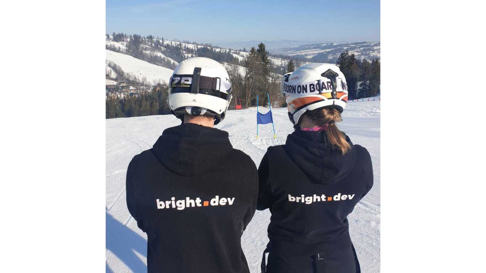
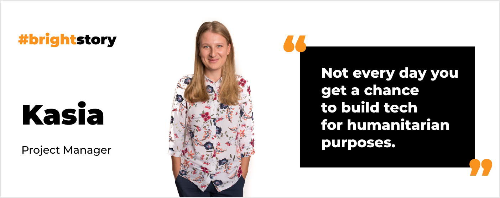
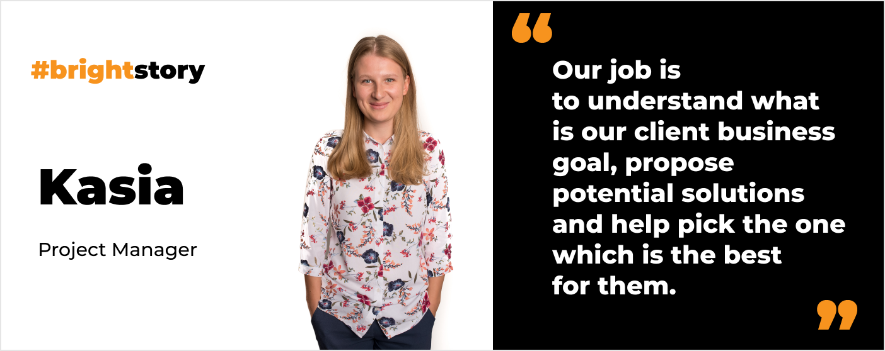
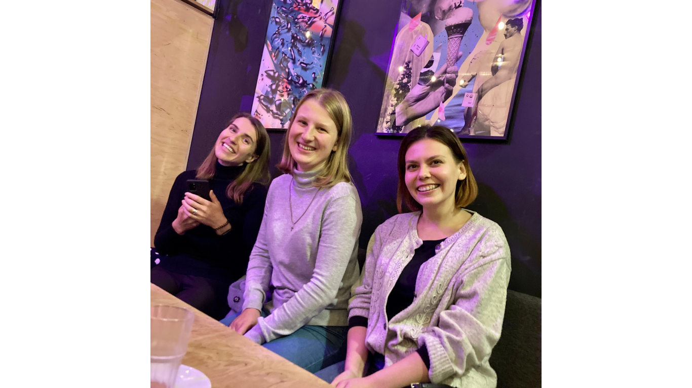

**Just days before the important MVP launch Kasia found some time to share her thoughts on her professional role and challenges. Check out how strongly Kasia goes by Scrum. Also, read her recipe for successful communication with developers and clients. Here comes the story of Kasia, the Project Manager at Bright Inventions.**

## Like many developers, you studied Computer Science. What made you go on a project management path?

During my studies, I realized that **I mostly enjoyed classes regarding project management and business perspective** in software development. Especially classes regarding Requirement Engineering. 

Also, I’ve always liked to manage. I wouldn’t call myself a natural leader, but I used to jump into that role when no one else wanted to. **PM work was intriguing because I always enjoyed having control and responsibility** for something. That’s why managing a development process felt so appealing to me.

## Have you ever thought of switching to the dev side?

I have been thinking about that from time to time. I still think about switching sides.

<h2>Do you want to join Kasia?</h2>
Join Kasia and build web and mobile solutions. Work with clients from industries such as FinTech, Blockchain, HealthTech, Retail, Logistics, and more.
<a href="/career"><button>Check our career opportunities</button></a>

## You started your IT career here at Bright Inventions. How did that happen?

Yes, **[Kasia Łukasewicz](/about-us/kasia/) who was my academic teacher at the Gdańsk University of Technology, asked if I would be interested in joining the company**. It was right before graduating the college. I guess I would have become a programmer if she hadn’t offered me that opportunity.

I’ve always thought that you had to be a developer for a few years before you went on the PM path. Obviously, having tech experience is helpful, but starting like me from a PM job is possible. 

Naturally, when I think about that times I sometimes cannot believe how lost I was at the beginning. 😉Nevertheless, I guess everyone has a difficult start and has to learn so much. Kasia’s support was crucial to me. **I started by joining the project she was managing to observe and learn**. I’m glad that I didn’t get my own project from day one because academic knowledge is not such a big support in real life. 

Yet later **when I started managing the project on my own I felt that I also got so much freedom and trust**. Naturally, with trust and freedom came responsibility. However, I still could always go to Kasia for advice. It was up to me, though. No one controlled me, everyone at Bright Inventions trusted me and was for me if needed.

## Every organization has its own version of the PM role. How would you portray PM’s role at Bright Inventions?

The Project Manager at Bright Inventions doesn’t play a typical scrum master role. I don’t only observe the process and offer suggestions. I definitely **work closely with product owners and take part in requirement specifications**. It takes a huge part of my day – to discuss what we and our client want to achieve.

As a PM your job is to **make the project move on**. You have to ensure that the client is content and that the development team is happy and feels that what they do matters. Obviously, I've never worked anywhere else, so it’s hard to compare that to other workplaces. Yet I like the fact that **I am truly responsible for the project** and no one higher up the ladder interferes in my work. 

## What are the projects you manage on daily basis?

One of the projects is the **payment instruments distribution system** developed for one of the top global humanitarian agencies. Thanks to this solution the agency team can distribute debit cards (or other payment instruments like sim cards or vouchers) to communities in need.

Our client’s efforts not only result in helping people in crises but also in supporting the growth of local economies. The cards give beneficiaries the freedom to choose what help they actually need.

The solution is used in a couple of Asian and African countries. The team I work on for that project contains 4 fullstack developers, 2 mobile devs, and 3 software testers. Working on this project is definitely rewarding. **Not every day you get a chance to build tech for humanitarian purposes**. The aspects of helping people and social justice are significant to me. I really feel that we work on something that has greater meaning.

## That's one project. Is there another project you manage?

Another project is a mobile application built for our German client representing the **building and construction industry**. The **app will help clients’ employees and contractors create and store documentation needed at construction sites**. We build native **apps for iOS and Android**. The development team at Bright consists of 4 [mobile developers](/our-areas/mobile-app-development).

There are two greatest challenges coming with this project. The first is very technical. End users cannot depend on the internet connection at construction sites. Therefore **most features have to be available offline**. That adds a lot of complexity during defining the requirements phase.

The second is that backend for our app is built by another external company. They are very open to any discussions and suggestions, but it requires additional effort on the coordination side.

We are at a very exciting stage of the project development, **just days before the MVP launch**. 

## Do you go strongly by Scrum as a project manager?

I don’t think this is the most important thing to work according to the methodology. It’s not our ultimate goal. Obviously, all methodologies are a great inspiration and offer a bunch of ready-to-take techniques. However, **the question that I should ask myself is not if I am doing everything as it is written in the Scrum guide (or any other methodology)**. The question I ask myself is: will this solution help my team achieve our goals?

Having that in mind – yes, I have managed projects in which we used almost ideal Scrum. However, I also handled a project where Scrum didn’t work for us so well and we decided to use a combination of Scrum and Kanban.

## What are the key factors of maintaining good relations with a client?

When it comes to **client-software agency collaboration** the grand rule should be a **helping attitude and a proactive approach**. The client who comes to us usually has great knowledge about the business processes but may have limited knowledge about the technology. **Our job is to understand what is their business goal, propose potential solutions and help pick the one which is the best for them**. We shouldn’t expect from the client to give us all the answers, we should seek those answers together.

Another very important factor is **open and clear communication**. Especially, when it comes to communicating any mistakes made along the way. Whenever they happen, we should analyze them, explain them to the business and decide what actions may be taken to omit them in the future. This way **we show that we care about the project as much as our client does** and we gain trust which is the key to a successful collaboration.

## And what about establishing great relations with developers?

I feel that **the key is being part of the team** and not the one who is above everybody else. We are one team, we have just different responsibilities.

To make that happen we need to truly trust each other. **As a project manager, I trust devs that they will bring their best ideas to the table**. Also, they trust me that I will do my best to support them in managing our daily work. Definitely what helps us build that trust is the **continuous and mutual feedback** between PM and devs.

## Could you answer a very popular question seen on social media? What does a project manager do all day? 😀

Talks. 😉

Obviously, a project manager’s role might depend on the project. If the process goes smoothly, the PM is practically unneeded. However, that is not usually the case. ;) Therefore, **I help with refining the requirements, defining the process, communicating between the development team and the client.** Basically, I make sure that we move forward and that both sides are happy with what we are achieving together.

## What do you do after hours?

Recently I started to sew. I love dancing, I used to dance a bit of boogie woogi. Now I go to the lyrical jazz classes. I guess my biggest passion is skiing. Unfortunately, it’s not something I can do regularly while living in Gdańsk. 😉

<h2>Join Kasia!</h2>
Build web and mobile solutions for international clients. Work with clients from industries such as FinTech, Blockchain, HealthTech, Retail, Logistics, and more.
<a href="/career"><button>Check our career opportunities</button></a>

