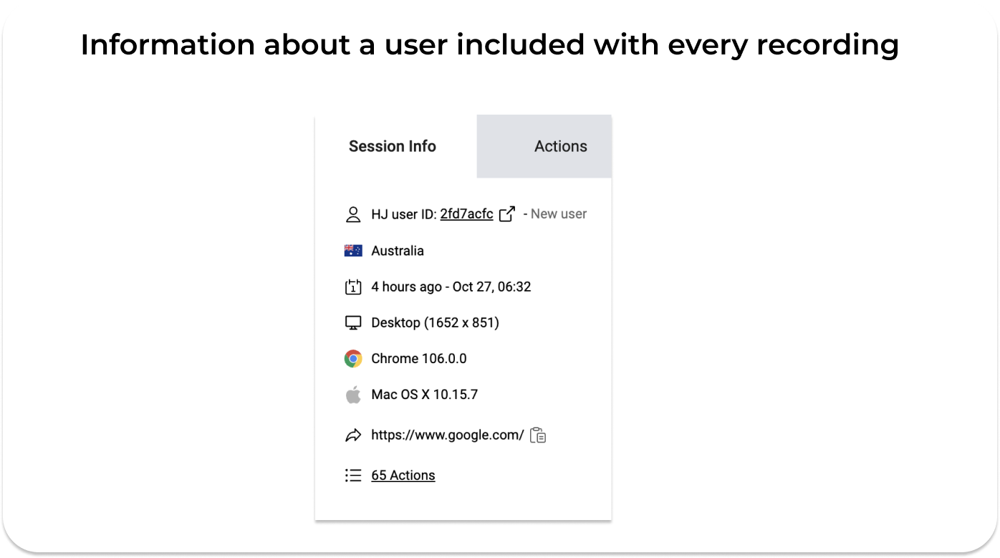

**Marketers have ideas, targets, analytics tools, and a hunger for leads. Yet, we sometimes need developers to help us achieve our goals. The most common cooperation between a developer and a marketer happens while building a brand website and landing pages. Based on my daily professional relations with developers I listed tips for effective collaboration between marketing specialists and software engineers.**

## Start by choosing the right tool for daily communication

**Emails won’t work**. I hope it’s not a shock to you. **You need a task management tool**. It’s great that both sides choose the tool that works for them. You can go for **Trello, Asana or Jira**. It’s reasonable to choose a tool that both sides have already known. Frankly, far away from emails and you’ll have a good start.

Also, setting up a common **chat channel would be useful**. Whatever is most preferably within your organization: **Slack, Teams or Discuss**. Chat channels will be useful for emergency situations.

## Don’t be afraid of questions

Probably, **you will hear lots of questions from developers**. They can be tricky. Truly listen and then answer. I sometimes made the mistake of not really listening. **I was asked what I wanted to achieve. However, I was describing the feature I expected to be built**. That wasn’t the question. I didn’t understand that difference at first. 😉 Still struggle with that sometimes.

<h2>Show the bigger picture</h2>
**It’s a good sign when developers ask questions**! They usually do it to understand your goal. Then they can recommend the most suitable tech solution to achieve it. Remember that the **feature is just the means to an end**. It’s not the goal itself. **Help developers understand the bigger picture** and you should quickly see better results of the cooperation.

## Feel free to ask questions

**If you hear some tech jargon, don’t get intimidated**. Every industry has its language, and marketing specialists have it as well. Simply ask to explain unknown terms more plainly. 

Also, if you hear that something cannot be done, don’t take “no” for an answer. **Ask why**. Maybe you can work it out another way.

## Learn how to describe a task

I am not an expert like the project managers from my team.

Nevertheless, I will write my **approach to describe the tasks:**

* **Start with the goal** you want to achieve.
* Then **list all the elements** that you expect to be built to achieve that goal.
* Include links to the product designer’s **mockups** if necessary.
* Be **specific and concise**. 
* **Provide a benchmark** to visualize your requirements if possible.

## Learn how to report the bug

Again, I am not a software tester. Here is my approach as a marketing specialist. 

<h2>Empathy is the key</h2>
Reporting bugs, just like writing a task, is all about empathy. Imagine what information a developer would need to seamlessly find the same bug you have stumbled on.

Don’t start with “something doesn’t work”. Unless you really have no idea what is going on. That might happen. 😉

**Describe shortly the issue, and provide a screenshot or screen recording**. I personally use **Screencast** for recordings. However, there are lots of other tools and widgets out there. Remember about your privacy. Don’t record all your screen with every widget and browser tab. 

Also, **include info about the device you used when the bug occurred, screen resolution, and the operating system**. All this information will simply decrease the number of following questions and make the debugging faster.

What's more, **you can use session recording tools like Hotjar or Mouseflow to efficiently report bugs**. These tools are quite popular among marketers so you might already know them. I found quite a few issues watching users’ recordings by Hotjar. 

Not only can you send a Hotjar recording, showing the issue, to your development team, but also **Hotjar will provide them with all info** mentioned earlier. Such as **screen resolution, device, or operating system**. Therefore you’ve got all of it covered by sharing one link with the recording. Using Hotjar as a reporting bug tool might be really helpful. 😉

*Example of Hotjar Session Info included with every recording*

## Discover your tester instincts

Yep. **If you ask to develop something, you should try your best to ensure that it is what you want**. It’s the same when you, for example, have posters designed. You would check out if the designer did the job as you expected.

Find **my tips on testing for marketers**:

* Test the whole flow of the website or other things you implement (step-by-step). 
* Use a couple of the most popular browsers and devices your users use (based on GA).
* Don’t forget to check everything on the mobile as well.
* List all the bugs/issues and describe them as mentioned before.

And also… chill out. 😉 You are not a professional software tester. No one expects you to be like that guy:

<GiphyEmbed url='https://giphy.com/gifs/SignatureEntertainmentUK-signatureentertainment-mel-gibson-hot-seat-BgKEiHf1xNV0h6IcSX' />

You just need to ensure that the feature is implemented correctly, especially when it deeply affects your daily job. So **when it comes to implementing a new flow for your eCommerce, SEO features, or marketing tags, I can’t imagine you don’t try to test it before the deployment** (if possible). Even if the development team does it as well, your marketing perspective brings more to the table than some might think.

## Use testing tools and extensions

Generally, you should try to get friendly with browser Inspect mode. It’s hard to avoid that adventure. 😉 However, there are tools that are useful for non-developers and can sometimes be treated as an Inspect alternative.

**Here are some examples of tools useful for web testing:**

* [Lighthouse](https://chrome.google.com/webstore/detail/lighthouse/blipmdconlkpinefehnmjammfjpmpbjk?hl=pl) – an extension that covers all essential web performance metrics assessment by Google.
* [WhatFont](https://chrome.google.com/webstore/detail/whatfont/jabopobgcpjmedljpbcaablpmlmfcogm) – a helpful extension to check out if the fonts and their colors match your brand guidelines.
* [WhatRuns](https://chrome.google.com/webstore/detail/whatruns/cmkdbmfndkfgebldhnkbfhlneefdaaip) – an extension to find out what frameworks, tags, and other tech are used on various pages. I won’t say it works perfectly but it can help you discover some benchmarks.
* [Ahrefs SEO Toolbar](https://chrome.google.com/webstore/detail/ahrefs-seo-toolbar/hgmoccdbjhknikckedaaebbpdeebhiei) – Ahrefs extension for checking out if metadata and headlines are properly implemented – SEO website structure in one place. 
* [Google Tag Assistant](https://tagassistant.google.com/) – Google tool to help you test analytics and advertising tags.

## Always assume good intentions

**We all have a common goal here**. We want to create a product that will benefit the users. Both sides might have different backgrounds, perspectives, and various ways of communicating. It may be challenging to be on the same page sometimes. 

Despite all of that **you should help developers understand your perspectives and listen to their side**. Eventually, insights from them might help you make better solutions for your users supporting your marketing goals at the same time. 😉
