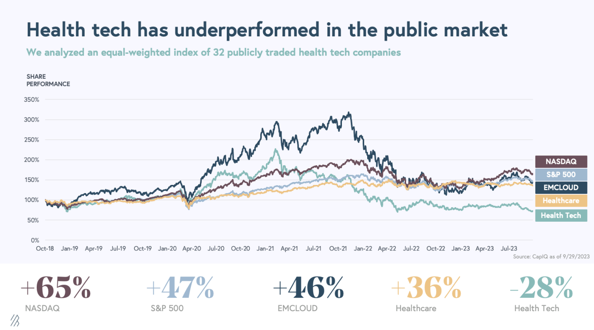
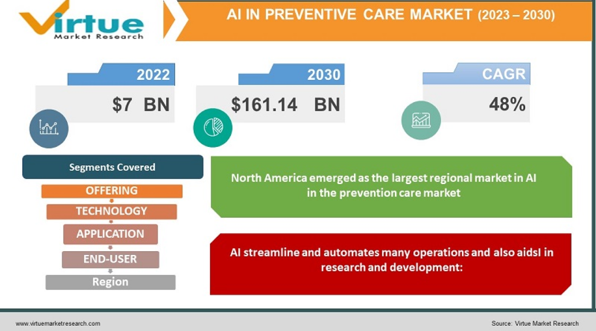

**The year 2024 comes with a promise of significant growth for HealthTech, following a period of stagnation. This growth will likely be fueled by innovations brought by Generative AI, IoT, wearables, mental HealthTech, and more. What can we expect from the MedTech sector? Read our technology trends in healthcare for 2024.**

## HealthTech will finally shake off the post-COVID-19 hurdle

While HealthTech was anticipated to flourish in the aftermath of COVID-19, it sadly became one of the most impacted sectors. Since 2021, this industry has witnessed a noticeable downturn, evident in the decline of stock values. 

Source: [State of Health Tech 2023](https://www.bvp.com/atlas/state-of-health-tech-2023)

However, 2023 offered renewed optimism, marked by significant acquisitions that signal a promising outlook for 2024.

As stated in the [State of Health Tech 2023](https://www.bvp.com/atlas/state-of-health-tech-2023) report:

<blockquote>
The health tech cohort gains during summer of 2022 and January 2023 were mainly driven by announcements of relatively large acquisitions in the health tech sector, including Amazon’s $3.9 billion acquisition of One Medical, CVS Health’s $8 billion acquisition of Signify Health, and CVS Health’s $10.6 billion acquisition of Oak Street Health.
</blockquote>

Despite the financial struggles faced by the HealthTech sector, the enduring results of COVID-19's digital transformation in healthcare could not be slowed down. **The need for digitalization in healthcare has already been established within the industry and among patients, who feel empowered to use technology to manage their health daily.**

## Advanced implementations of Generative AI in healthcare

It’s impossible to discuss innovations in healthcare without including Generative AI. It is a type of artificial intelligence that can produce new content, such as text, images, or data, by learning from existing examples and patterns. **So, what Generative Al use cases in HealthTech are we most likely to see in 2024?**

### Medical Imaging - one of the healthcare areas quickly to be transformed by AI

Medical imaging is a method used to create images of the inside of the body for medical diagnosis and treatment. It includes techniques like X-rays, MRI, CT scans, and ultrasound.

<YouTubeEmbed url='https://www.youtube.com/watch?v=dCDuMyzWS8Q' />

**Generative AI models are used to enhance medical imaging, following:**

* **Generating high-resolution images** from low-resolution inputs and reconstructing 3D images from 2D scans,
* **Complete time-consuming work** like tracing tumors, tracing structures,
  measuring the amount of fat and muscle in the body,
* **Data augmentation**: generating synthetic medical data, including images, text, or patient records or training machine learning models, especially when real data is limited or privacy concerns exist.
* **Natural Language Processing (NLP)**: generating human-like text, making them useful for tasks like medical transcription, generating clinical notes, and assisting with healthcare documentation.
* **Radiology Report Generation**: AI-driven models can automatically generate radiology reports based on medical images, helping radiologists save time and maintain consistency in their reporting.

Examples of Medical Imaging AI companies to watch: [ContextVision](https://www.contextvision.com/), [Enlitic](https://enlitic.com/).

### Embracing AI in disease diagnostics

<YouTubeEmbed url='https://www.youtube.com/watch?v=3EV6ryG2j7E' />

AI can assist in diagnosing a variety of diseases, including:

* **Cancer**: AI algorithms can analyze medical images like X-rays, MRIs, and CT scans to detect tumors and other cancerous growths.
  Diabetes: Through pattern recognition in patient data, AI can help identify early signs of diabetes.
* **Heart Disease**: AI can analyze ECG patterns to detect heart conditions such as arrhythmias as well as identify other crucial factors such as atherosclerosis.
* **Neurological Disorders**: AI can help in diagnosing conditions like Alzheimer's and Parkinson's disease by analyzing patient data and brain imaging.
* **Skin Conditions**: AI-driven image analysis tools can aid in diagnosing skin cancers and other dermatological conditions.
* **Eye Diseases**: AI algorithms can analyze retinal scans to detect diseases like diabetic retinopathy and age-related macular degeneration.

Examples of AI in disease diagnostics companies to watch: [iCAD](https://www.icadmed.com/), [Emory University](https://medicalxpress.com/news/2023-08-ai-enables-earlier-diabetes-chest.html), [Eyenuk](https://www.eyenuk.com/en/), [AinnovaTech](https://www.ainnovatech.com/), [Cleerly](https://cleerlyhealth.com/), [AI Dermatologist](https://ai-derm.com/), [SkinVision.](https://www.skinvision.com/pl/)

### Healthcare AI Chatbots – evolving from streamlining processes to actively assisting patients

While most current healthcare chatbots (also called virtual healthcare assistants) are utilized to streamline processes like appointment scheduling, **the focus for 2024 should be on exploring their potential as tools that also actively solve patient issues, for example in the mental health area**. 

<blockquote>
It is very difficult for people with mental health disorders to actually talk about these things and to tell people 'I don't feel well.' So if this person feels very stigmatized and feels like it's not easy to talk about these things, to open up to this machine and say 'Well, I feel really, really bad today' and to hear something that seems like essentially what works is that they don't feel it's a person. The only reason they can open up is because they know it's not a person. It could also be that they don't have the person in front of them, so this kind of distance is what gives them the ability to actually talk about these issues.
<footer>Dr Laura Martinengo, Research Fellow at Lee Kong Chian School of Medicine at NTU</footer></blockquote>

<YouTubeEmbed url='https://www.youtube.com/watch?v=lLhTdV47Y8E' />

The year 2024 could provide answers to crucial questions: **Is it feasible and ethically acceptable to use chatbots, integrating tools from cognitive behavioral therapy and psychology, to assist users?** Or is there a line that needs to be drawn regarding their use in mental health technology?

## Greater focus on preventive healthcare with AI

[Virtue Market Research](https://virtuemarketresearch.com/report/aI-preventive-care-market) predicts the rapid growth of AI in preventive care. In 2022, the market was valued at USD 7 billion and is projected to reach USD 161.14 billion by 2030

Source: [Virtue Market Research](https://virtuemarketresearch.com/report/aI-preventive-care-market)

In 2024, **AI diagnostic applications in HealthTech should shift their focus from merely detecting diseases to also preventing** them. For example, wearable medical devices, combined with AI applications, can monitor a patient's health. If the app detects high blood pressure, which increases the risk of heart attack or stroke, and the patient is not undergoing treatment for these conditions, it can alert either the patient or a designated doctor. 

This allows for early intervention and treatment, potentially **preventing more serious health issues such as cardiovascular diseases which are a leading cause of death globally**. In 2015, [17.7 million people died from cardiovascular diseases worldwide](https://www.bayer.com/en/pharma/economic-and-societal-impact-cardiovascular-disease). By the year 2030, this number is projected to rise to 22 million. Can we fight these predictions without AI? 

## IoT and wearables for (truly) continuous remote patient monitoring

IoT and wearables in healthcare are nothing new, but their potential has not yet been fully realized. **The focus for 2024 should be on wearable health monitoring devices that can track patients' vital signs 24 hours a day** and on implementing these technologies more broadly.

As an example check the actual [remote patient monitoring solution Camascope](/projects/remote-patient-monitoring/). This system can monitor patients' vital signs in the care home sector in the UK, alerting doctors and nurses if the vitals suggest a life-threatening condition of their patients.

Particularly interesting to follow in 2024 is the work on [battery-free wearables for MedTech](https://www.advancedsciencenews.com/powering-wearable-health-monitoring-devices-without-batteries/) powered by… humans.

<blockquote>
Using a thermoelectric generator, or TEG, to harvest the plentiful and continuously available heat or thermal energy generated by the human body and convert it into electricity, the research team from the Department of Biomedical Engineering at Zhejiang University in collaboration with the Institute of Flexible Electronics Technology of THU successfully created a self-powered, wireless wearable to monitor heart rate, sweat composition, and body motion in real-time.
<footer>Advance Science News</footer></blockquote>