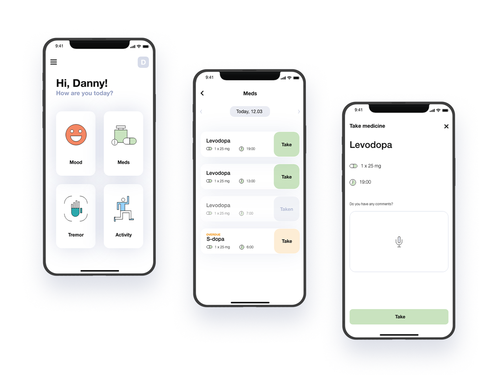
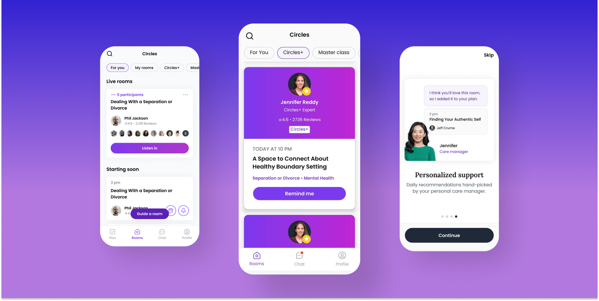

**The year 2025 will help healthcare software companies move past the industry's struggles of recent years and might provide some crucial answers. What will the direction of healthcare software growth be? Which smart healthcare devices will prove truly essential? What will be the X factor for investors? Are you ready for the answers 2025 has to offer?**

## HealthTech will transition into the post-recovery phase with AI bringing investors

The past few years have been challenging for the HealthTech sector as it grappled with the aftermath of the COVID-19 pandemic. However, 2024 has emerged as a year of recovery and renewed momentum for the industry. The State of Health Tech 2024 highlights growth, particularly in **biotech taking the lead**.

Source: [State of Health Tech 2024](https://www.bvp.com/atlas/state-of-health-tech-2024)

What's more, investors have their own type. 😉 And yes, AI is a key factor for investors, as we can read on [rockhealth.com](https://rockhealth.com/insights/h1-2024-digital-health-funding-resilience-leads-to-brilliance/):

<blockquote><h2></h2>
For early-stage startups using AI (38% of digital health companies that raised A rounds in H1 2024 were AI-enabled), big Series A rounds can help support AI upstart costs like training models or acquiring datasets.
<footer>rockhealth.com</footer></blockquote>

CB Insights' annual list of the most promising digital health startups, "[The Digital Health 50](https://www.cbinsights.com/research/report/digital-health-startups-redefining-healthcare-2024/)", also indicates the direction HealthTech is heading. Notably, 33 out of the 50 companies are developing AI-augmented solutions.

Source: [The Digital Health 50](https://www.cbinsights.com/research/report/digital-health-startups-redefining-healthcare-2024/)

<blockquote><h2></h2>
It is very difficult for people with mental health disorders to actually talk about these things and to tell people 'I don't feel well.' So if this person feels very stigmatized and feels like it's not easy to talk about these things, to open up to this machine and say 'Well, I feel really, really bad today' and to hear something that seems like essentially what works is that they don't feel it's a person. The only reason they can open up is because they know it's not a person. It could also be that they don't have the person in front of them, so this kind of distance is what gives them the ability to actually talk about these issues.
<footer>Dr Laura Martinengo, Research Fellow at Lee Kong Chian School of Medicine at NTU</footer></blockquote>

<YouTubeEmbed url='https://www.youtube.com/watch?v=lLhTdV47Y8E' />

The year 2024 could provide answers to crucial questions: **Is it feasible and ethically acceptable to use chatbots, integrating tools from cognitive behavioral therapy and psychology, to assist users?** Or is there a line that needs to be drawn regarding their use in mental health technology?

## 2025 will show how AI can be implemented wider

It's true that in 2024, everyone wanted to appear trendy and boasted about implementing AI in their solutions, even if it was a stretch at best. However, amidst the flood of news about incorporating AI, we could genuinely find companies that successfully implemented it, allowing users to experience it firsthand, especially in the chatbot area. Here is an example of an interesting AI chatbot implementation:

[AI chatbot Ebb introduced by Headspace](https://www.headspace.com/ai-mental-health-companion)

Ebb is an empathetic AI companion integrated into its app to assist users in navigating life's challenges. Ebb facilitates self-reflection and emotional processing, offering personalized recommendations from Headspace's extensive library of meditations and mindfulness exercises.

<YouTubeEmbed url='https://www.youtube.com/watch?v=ldvDbS0JGsE&t=239s' />

This year will be a time for other AI implementations to shine even brighter, particularly in areas like workflow optimization, and medical documentation recording.

<EbookDynamic sectionTitle='scale your solution with our free guide' ebookName='Scale-Your-Healthtech-Solution-Successfully.pdf' ebookDescription={'Read more about Generative AI, blockchain, cloud computing or monitoring. All top technologies that elevate healthcare in one guide.'} ebookImage='/images/healthtech_guide_cover.png' ebookAlt='guide healthcare software cover' />

### AI for healthcare workflow optimization

Various companies are leveraging artificial intelligence (AI) to optimize healthcare workflows across multiple domains:

#### Administrative task automation 

Automating administrative tasks in healthcare has become a priority for many companies aiming to improve efficiency and reduce clerical burdens. Examples include [Notable Health](https://www.notablehealth.com/), [Qventus](https://www.qventus.com/) and [UiPath](https://www.uipath.com/).

#### Personalized treatmentpPlans (precision medicine)

Creating personalized treatment plans using AI and data analytics is transforming patient care. Examples include [Tempus](https://www.tempus.com/), and [Flatiron](https://flatiron.com/).

#### Enhancing patient interaction 

Enhancing patient interaction through conversational AI and virtual assistants. Examples include [Ada](https://ada.com/), and [Talkie](https://talkie.ai/appointment-management/).

#### Data management

Improving data management for better clinical decision-making is a focus for several companies. Examples include [Innovaccer](https://innovaccer.com/), [Datavant](https://www.datavant.com/), and [Redox](https://redoxengine.com/).

#### Medical records transcription

Recording and transcribing doctor-patient communication for medical record documentation is an area that quite a few companies have been actively working on. Examples include DeepScribe, Abridge, Lyrebird Health, Tali AI, Deepgram, and Dorascribe.

## Making telemedicine even more accessible

Telemedicine gained significant popularity during the pandemic, evidenced by **the sharp increase in telehealth visits among [Medicare recipients](https://www.gao.gov/products/gao-22-104454) from about 5 million to over 53 million** in the early stages. Cost savings are a crucial factor in telemedicine growth. [A study conducted among nonelderly patients with cancer](https://jamanetwork.com/journals/jamanetworkopen/fullarticle/2800164) using telehealth shows that **the average cost savings per telemedicine visit for patients range from 147 to 186 dollars**. That means lower costs for patients as well as public or private healthcare insurance providers.

**Moving into 2024, the focus should shift towards developing systematic solutions that enhance telemedicine accessibility for groups in dire need, such as seniors and chronic disease patients.** 

Telehealth companies that will design software solutions addressing challenges like limited internet access, and technological unfamiliarity of end users have the potential to lead the way in telemedicine in the following years.

Examples of TeleHealth companies to watch: [Camascope](https://www.camascope.com/), [MedKitDoc](https://medkitdoc.de/en), [Maven](https://www.mavenclinic.com/).

## Unlocking the potential of patient engagement apps for chronic disease patients

The Patient Engagement Apps market is predicted to continually grow over the next few years. As stated on [Expert Market Research](https://www.expertmarketresearch.com/reports/patient-engagement-solutions-market):

<blockquote><h2></h2>
The global patient engagement solutions market size attained a value of approximately USD 22.74 billion in 2023. The market is further expected to grow in the forecast period of 2024-2032 at a CAGR of 17.10%, reaching about USD 94.17 billion by 2032.
<footer>Expert Market Research</footer></blockquote>

An important aspect of this market is related to managing chronic diseases, which are still not fully covered by HealthTech. 

As of 2024, the chronic disease situation in the United States is a significant health and economic concern. **Patients with chronic diseases incur average direct healthcare costs of about 6,032 dollars annually, which is approximately [five times higher than those without a chronic disease](https://www.americanactionforum.org/research/chronic-disease-in-the-united-states-a-worsening-health-and-economic-crisis/)**. The costs are mainly due to more frequent hospitalizations, emergency room visits, and greater prescription drug use. Notably, about 60% of all emergency room visits are associated with people with chronic conditions, costing around $8.3 billion in 2017.

Patient Engagement Apps are the perfect solutions to monitor, support, and prevent rising costs of hospitalizations and treatment of patients with chronic diseases. 

Get inspired by the story behind the [app for Parkinson’s patients](/projects/solution-for-parkinsons-patients/) built to engage users to monitor their symptoms better.

## The continuing rise of Mental HealthTech

In 2019-2020, 20.78% of adults were experiencing a mental illness, equivalent to [over 50 million Americans](https://www.mhanational.org/issues/state-mental-health-america). Additionally, 10.8% of adults with a mental illness are uninsured, and over half (54.7%) do not receive treatment​​. Therefore, **mental HealthTech in 2024 should continue to focus on increasing access to mental support**.

**Explore the most promising use cases of mental HealthTech:**

**TeleTherapy Platforms**: platforms enabling remote therapy sessions between mental health professionals and clients through video calls, audio calls, or messaging. [Companies worth watching: [BetterHealth](https://www.betterhelp.com/), [TeenConsulting](https://www.teencounseling.com/), [Ritual](https://www.heyritual.com/).]

**Online Support Groups**: platforms where individuals can find peer support. 
[Check the success story of the startup [Circles](/projects/online-group-support/) which emerges as a premier online support platform.]

**AI-Powered Chatbots for Mental Health**: as mentioned earlier in the article chatbots using AI can provide immediate, 24/7 support for individuals seeking mental health assistance. [Companies worth watching: [Weabot Health](https://woebothealth.com/), [Limbic](https://limbic.ai/)]

**Mindfulness and Relaxation Apps**: tech offering guided mindfulness and relaxation exercises, which can be beneficial for reducing symptoms of stress, anxiety, and depression. [Companies worth watching: [HeadSpace](https://www.headspace.com/), [Calm](https://www.calm.com/), [Buddhify](https://buddhify.com/), [Aura](https://www.aurahealth.io/)]

**Apps for Crisis Intervention**: apps providing immediate assistance to individuals experiencing a mental health crisis, offering resources such as crisis hotlines, safety planning, and immediate coping strategies. [Companies worth watching: [Suicide Safe](https://play.google.com/store/apps/details?id=gov.hhs.samhsa.app.spa&hl=en&gl=US), [Weabot Health](https://woebothealth.com/)]

**Digital Detox Apps**: applications helping users manage and limit their use of digital devices. [Companies worth watching: [ForestApp](https://www.forestapp.cc/), [Flipd](https://www.flipdapp.co/)]

## Feeling excited about 2024 in HealthTech?

We are! Let us know in the comment what other predictions you have.