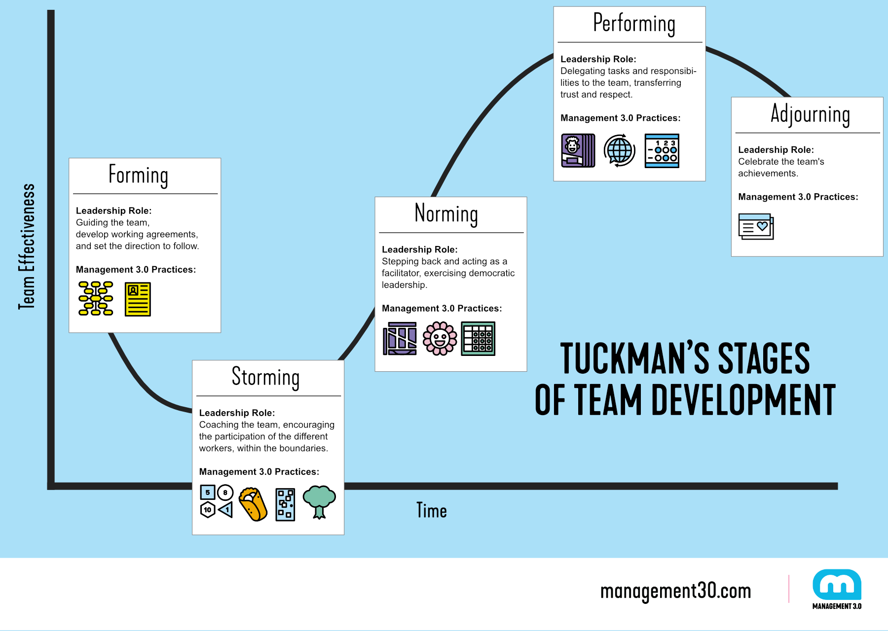

What is your definition of a team? Have your ever thought what are the components and traits of a good harmonious well-performing team? 

According to Oxford dictionary a team is:

1. a group of people who play a particular game or sport against another group of people,
2. a group of people who work together at a particular job, 
3. two or more animals that are used together to pull a cart, etc.

The second definition is fair enough if we think about teams in general, but for sure is not enough when we think about good teams. **In *Leaders Eat Last: Why Some Teams Pull Together and Others Don't,* Simon Sinek emphasizes that creating a strong team culture involves trust, purpose, values, empathy, and collaboration.** By focusing on these elements we can build high-performing teams that are capable of achieving great things. Yet the way to get there is not always the easy one. Why? 

## **the main challenges in creating teams**

Building and maintaining a successful team can be rewarding, but it also comes with its share of challenges. **Among the most common problems the organisation may encounter we can find:** 

* Unclear communication that leads to misunderstandings and a lack of cohesion among team members.
* Ineffective leadership, whether it's a lack of direction, micromanagement, or an inability to inspire and motivate, can negatively impact team morale and performance.
* Differences in personalities, work styles, and opinions leading to conflicts that hinder collaboration and decision-making.
* Lack of trust.
* Lack of diversity in terms of skills, backgrounds, or perspectives which results in generation of creative solutions and inclusive environments.
* Resistance of team members to changes i.e. new processes, technologies, or ways of working. 
* Insufficient development that hinders the ability to perform effectively and contribute to the team's success. 
* Failing to recognise and reward team members' efforts and achievements leading to decreased motivation and job satisfaction.
* For virtual or remote teams, challenges may include communication barriers, feelings of isolation, and difficulty in coordinating tasks.

## **Tuckman’s model** 

Some of the above mentioned challenges appear in a particular stage of the team creation that are well-described in “Tuckman’s Model”  - the model presents **the stages of group development proposed by psychologist [Bruce Tuckman](https://en.wikipedia.org/wiki/Bruce_Tuckman) in 1965.**  

Tuckman’s model describes the natural progression of a group or team as they work together towards achieving their goals. The stages are characterized by different dynamics and challenges that teams experience. **The original model consisted of four stages, but later, a fifth stage was added: forming, storming, norming, performing, and adjourning.** Learn about the five phases by watching how the Fellowship of the Ring gets together. 😉

https://www.youtube.com/watch?v=ysWWGf8VsOg&t=1s

It is important to note that teams may not always progress through these stages in a linear manner. I have witnessed that nonlinearity at least a few times during my career. But what is more interesting, **teams might move back and forth between stages, particularly if new members join the team or if the team faces significant changes or challenges.** Additionally, not all teams will experience every stage, especially if they are short-term or project-based.

## **Stages of team development by Tuckman**

### 1. FORMING **🤩**

In this initial stage, team members come together, get to know each other, and begin to understand the goals and tasks ahead. **There is often a sense of excitement and anticipation, but also uncertainty about roles and responsibilities. Team members may be polite and avoid conflict as they establish a sense of belonging.**

### 2. STORMING ⚡️⚡️⚡️

As team members start working closely together, differences in opinions, personalities, and work styles may lead to conflicts and power struggles. **It is common for tensions to arise during this stage as individuals vie for influence and position within the team.** Effective communication and conflict resolution skills are essential to move past this stage.

### 3. NORMING 🪴

During this stage, team members begin to resolve conflicts, establish norms, and develop a sense of cohesion. **Trust and collaboration grow, leading to better communication and a shared understanding of goals and roles.** Team members might begin to support each other and cooperate to achieve common objectives. 

###### Source: https://management30.com/blog/tuckman-model

### 4. PERFORMING 🎉

At this stage, the team has developed a strong sense of unity and synergy. **Team members are comfortable with their roles and responsibilities and work together effectively to achieve the team's goals.** Creativity, problem-solving, and high levels of productivity characterise this stage.

### 5. ADJOURNING (or MOURNING)⚰️

In this final stage, the team's project or goal has been accomplished, and the team is disbanded or transitions to a new phase. **Team members may experience a mix of emotions, including satisfaction with their achievements and sadness about the team coming to an end.** Reflection and acknowledgment of the team's accomplishments are important during this stage.

## **Leader’s support during team development stages** 

As you can see each stage comes with its own challenges and dynamics. Leaders play a crucial role in supporting teams through each of these stages. First of all, if you are a leader/manager you have to **create a safe and welcoming atmosphere for team members to introduce themselves, get to know each other, and understand the team's purpose** - especially if you your team is under a forming stage. Try also to **clearly define the roles and responsibilities** to ensure everyone is on the same page and understands what is expected from them.

During storming stage your leader's or manager’s role may resemble much more of **a conflict solver position**. **You will have to address conflicts that arise within the team, encourage open communication and guide discussions toward resolution.** Remember that if conflicts escalate, you will have to intervene as a mediator to ensure issues are handled constructively and the team relationships are not negatively impacted. **You will also become a facilitator that helps the team establish ground rules and norms for communication, decision-making, and conflict resolution.** Acknowledge the progress the team has made in resolving conflicts and working together effectively. Don’t forget about highlighting the strengths and contributions of each team member.

**During performing stage your leader’s and managers’s role may turn into mentoring**. Usually, your main goal would be providing autonomy to your team to make decisions and take ownership of their tasks. You should also support their growth opportunities and encourage the team to reflect on its processes and outcomes, and facilitate discussions on how to improve further. Sometimes leaders and managers have to learn how to delegate more responsibilities on this stage among team member to highlight their strengths and potentials. 

If your team reaches the adjourning (or mourning) phase, **remember to recognise the achievements of each and every member as the project or task comes to an end.** If it is possible, you can even organise a celebration or reflection session to acknowledge the team's successes as well as discuss future opportunities for collaboration. **Last but not least, always provide feedback that can help team members in their future endeavours.**

## **Summary - make Tuckman’s model one of your best friend** 

Throughout all the Tuckman’s team development stages, effective communication, active listening, empathy, and adaptability are key traits to exhibit. Remember as I said before that these stages are not always linear or separate, and you might cycle through them multiple times. 

If you are a leader or manager, your goal should be to guide and support the team's development through these stages so that it will positively impact the team's performance and cohesion. If you are not a a leader or manager, your goal is to support your colleagues and yourself on each of these stages.  Being aware of the different stages may help you understand your team members better and can reduce frustration and anxiety that arise during some of the stages. I hope that thank to that you will be able to work through differences and find resolutions, leading to stronger relationships and better problem-solving.

We have to remember that we as people and teams in general are not static and we (they) can change as new challenges arise. You can use Tuckman model as a tool for ongoing assessment and improvement for yourself and people around you. For me it provides a really good roadmap for team development and fostering  collaboration. 

https://www.thecoachingtoolscompany.com/get-your-team-performing-beautifully-with-this-powerful-group-development-model/