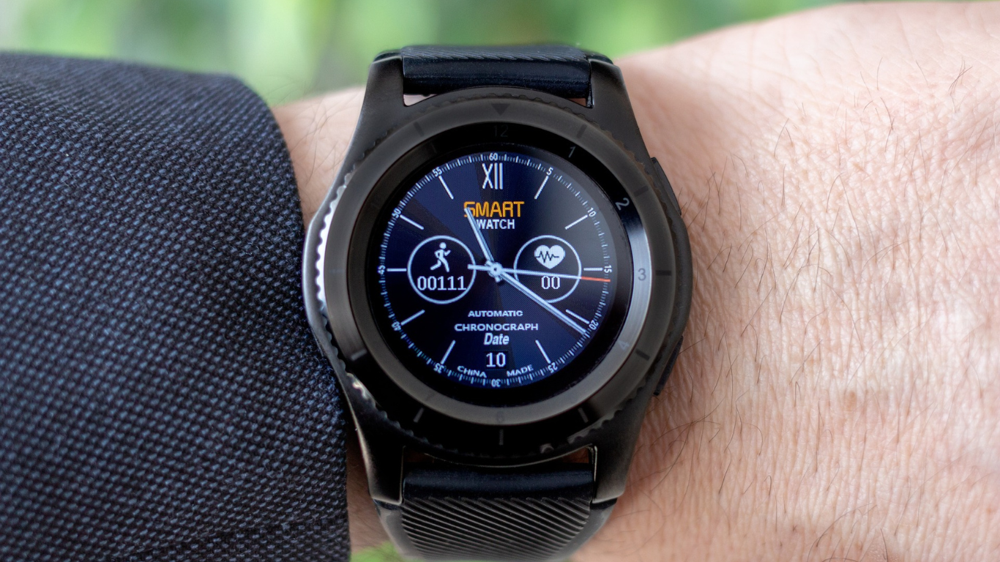
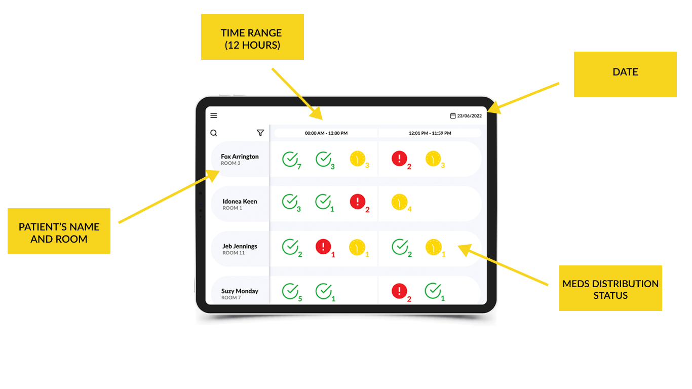

**HealthTech, eHealth, Medtech, FemTech… whatever you call it, the connection between healthcare and technology has never been stronger. If you want to delve into the promising world of HealthTech, this guide is for you!**

## HealthTech and MedTech – recognizing the difference

MedTech and Health Tech aren’t synonyms. This guide will focus mostly on HealthTech, still, it’s essential to understand the difference between these terms.

### HealthTech definition

HealthTech (known as eHealth as well) is **the implementation of technology to improve healthcare delivery and patient engagement**. It includes telemedicine, wearable health devices, and electronic health records, aiming to make healthcare more accessible and personalized.

### MedTech definition

MedTech relates more to **medical devices** and diagnostic equipment used in healthcare. This includes pacemakers, MRI machines, and surgical tools, focusing on enhancing the quality of medical treatments and diagnostics. **MedTech companies must comply with various standards, such as ISO 13485**, which specifies requirements for a quality management system specific to the medical device industry.

## Areas of HealthTech with examples

Explore some of the areas of HealthTech that are shaping modern healthcare.

### AI medical imaging

A technology that uses artificial intelligence to enhance medical imaging processes, such as interpreting X-rays, MRIs, and CT scans, leading to faster and more accurate diagnoses.

### AI Chatbots

AI-powered chatbots are interactive software applications that use artificial intelligence, particularly natural language processing, to understand and respond to human inquiries, providing information or assistance in various domains including customer service and healthcare.

### AI diagnostic

The use of artificial intelligence in medical diagnostics involves AI algorithms analyzing medical data (like images, lab results, and clinical history) to assist in diagnosing diseases and conditions more accurately and efficiently.

### FemTech

Technology focused on women's health, including reproductive health, menstrual cycle tracking, fertility solutions, and maternal healthcare.

Check an example: a [mobile app for pregnant women](/projects/pregnancy-app/).

### Telemedicine / Telehealth

Remote delivery of healthcare services, such as consultations and diagnoses, through telecommunications technology, often involving video conferencing:

* **Remote Patient Monitoring (Remote Medical Care)**

Technology that enables monitoring of patients outside of conventional clinical settings, such as in the home, using various devices to collect medical and health data.

Read the story of [Camascope, the startup enabling remote patient monitoring](/projects/remote-patient-monitoring/) for patients in the UK.

### Mental Health Tech

Digital solutions aimed at improving mental health, such as:

* **WebTherapy**

Online therapy platforms offer mental health support through digital platforms, including video calls, messaging, and web-based treatment programs.

Get inspired by the story of [Circles - an online group support platform](/projects/online-group-support/).

* **Mental fitness apps & Mood tracking apps**

Mobile applications designed to enhance mental well-being, often including activities like meditation, cognitive exercises, and stress management techniques.

* **Digital Detox**

Tools and programs that encourage reducing screen time and digital connectivity to improve mental and physical health.

### mHealth (mobile health)

It refers to the practice of using mobile devices (smartphones, tablets) for health services and information, including health monitoring and patient education.

### Precision Medicine

An approach to patient care that considers individual variability in genes, environment, and lifestyle to tailor treatments and interventions.

### Biohacking

The practice of using technology and biology in tandem to optimize health, well-being, and physical and mental performance, often involves DIY biology and self-experimentation.

### Patient Engagement Apps

Digital applications that aim to involve patients more actively in their healthcare, including tools for health tracking, appointment scheduling, and accessing medical information. It’s especially crucial in chronic disease management.

Explore the [patient engagement app for Parkinson's patients](/projects/solution-for-parkinsons-patients/).

### Techbio

An emerging field at the intersection of technology and biology, focusing on using technological advancements to understand and engineer biological systems, often related to health and medicine.

### Innovations that will drive healthcare

Technology has the power to change the daily lives of patients and medical staff in countless ways. We've listed the technologies that every HealthTech startup and enterprise should (at least) consider implementing.

If you want to know what’s especially hot in tech for healthcare in 2024, read [Top 7 Trends in HealthTech to Watch in 2024](/blog/top-trends-in-healthtech/)!

### Internet of Things & Bluetooth

The Internet of Things (IoT) in healthcare refers to the network of medical devices and applications that communicate and exchange data due to an Internet and bluetooth connection. 

How IoT enhances healthcare:

* enables patients to manage their condition by enabling real-time health monitoring, 
* helps doctors remotely monitor patients' condition 24 hours a day;
* limits the costs of face-to-face examination;
* provides analytics for disease prevention;
* seamless data sharing among healthcare providers.

Read an actual story of Camascope startup offering remote patient monitoring with the [IoT system combined with certified bluetooth devices](/projects/remote-patient-monitoring/).

### Medical devices and wearables

Devices that we have seen at doctors' offices – thanks to Bluetooth connections and dedicated applications – have turned into smart devices that have the power to save patients' lives daily. Pulse oximeters, Bluetooth thermometers, or stethoscopes are only examples of Bluetooth devices that are transforming healthcare. Now they can be used by patients at home to monitor their condition remotely.

Delve into [bluetooth devices that have the power to change healthcare](/blog/bluetooth-devices-that-change-healthcare/).

## UX Design in HealthTech

HealthTech and MedTech applications are usually comprehensive, massive systems dealing with tons of information. Patient's health history, prescribed medicine, vital sign metrics – all of this data is important for healthcare providers and must be well-designed in any system aiming to help them care for patients. That's why there are a few best practices for designing apps for healthcare:

* **Data Management**: The design must effectively manage and display large amounts of information in an accessible manner.
* **Information Prioritization**: Essential information should be prioritized and easily accessible, preferably on the main screen.
* **Iconography**: Use of intuitive icons that convey information quickly and effectively.
* **Color Coding**: Employ color coding to differentiate and highlight important data and functions.
* **Functional Aesthetics**: The design should focus on functionality over aesthetics, meeting the practical needs of healthcare professionals.

Fancy going deeper into product design for healthcare? Explore [UX design best practices in healthcare with a case study](/blog/ux-design-healthcare-medical-apps-case-study/).

## eHealth companies worth watching

If you want to look closely at some companies that are changing healthcare, we listed some startups and larger organizations that are worth watching!

**TeleHealth companies to watch**: [Camascope](https://www.camascope.com/), [MedKitDoc](https://medkitdoc.de/en), [Maven](https://www.mavenclinic.com/).

**Medical Imaging AI companies**: [ContextVision](https://www.contextvision.com/), [Enlitic](https://enlitic.com/).Online Support and Web Therapy Platforms: [Circles](https://brightinventions.pl/projects/online-group-support/), [BetterHealth](https://www.betterhelp.com/), [TeenConsulting](https://www.teencounseling.com/), [Ritual](https://www.heyritual.com/).

**AI-Powered Chatbots for Mental Health**: [Weabot Health](https://woebothealth.com/), [Limbic](https://limbic.ai/)

**AI in disease diagnostics companies to watch**: [Decorte Future Industries](https://decorte.co.uk/), [iCAD](https://www.icadmed.com/), [Emory University](https://medicalxpress.com/news/2023-08-ai-enables-earlier-diabetes-chest.html), [Eyenuk](https://www.eyenuk.com/en/), [AinnovaTech](https://www.ainnovatech.com/), [Cleerly](https://cleerlyhealth.com/), [AI Dermatologist](https://ai-derm.com/), [SkinVision.](https://www.skinvision.com/pl/)

**Mindfulness and Relaxation Apps**: [HeadSpace](https://www.headspace.com/), [Calm](https://www.calm.com/), [Buddhify](https://buddhify.com/), [Aura](https://www.aurahealth.io/)

**Apps for Crisis Intervention**: [Suicide Safe](https://play.google.com/store/apps/details?id=gov.hhs.samhsa.app.spa&hl=en&gl=US), [Weabot Health](https://woebothealth.com/)

**Digital Detox Apps**: [ForestApp](https://www.forestapp.cc/), [Flipd](https://www.flipdapp.co/)

## Fancy more HealthTech content?

[Sign up for Bright Dev Newsletter](https://bright-dev-newsletter.getresponsepages.com/) to receive our guide for successful scaling that we'll be released in February 2024. Don't miss that!