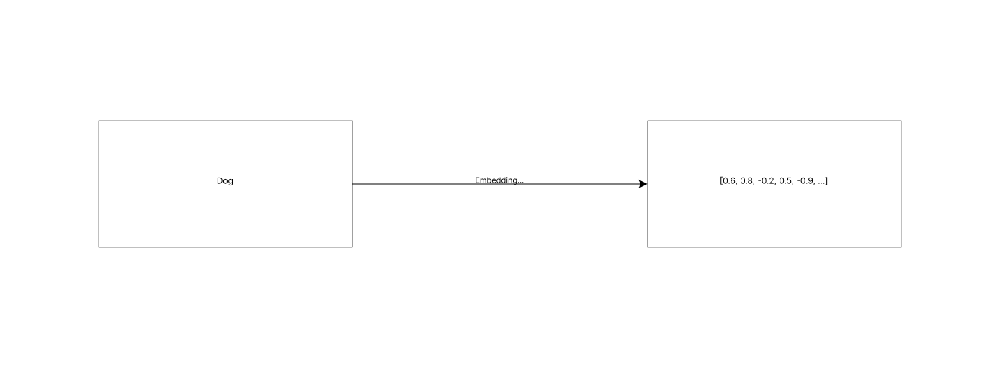
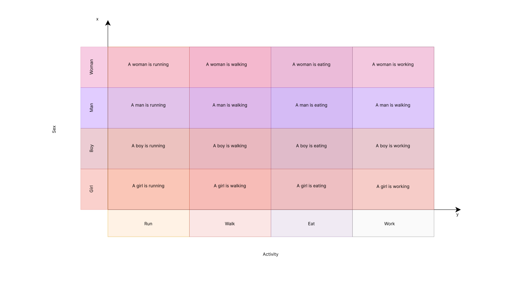
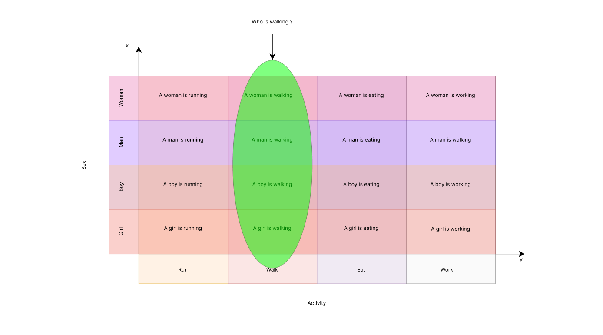

**Embeddings are an invisible, yet important part of many technologies we encounter. From internet search engines, through recommendation systems and advertisement personalization, to advanced analyses of images, videos, and technologies for speech and sound recognition – embeddings play a key role everywhere. In this article, we will explain how embeddings work and how they facilitate, and enrich our daily experiences with technology.**

As I mentioned above, vector embeddings are a popular technique to represent information in a format (typically as a vector of numerical values) that can be easily processed by algorithms, especially deep learning models. This ‘information’ can be text, pictures, video, and audio.\
\
For example, the conversion of the word 'dog' into a numerical vector representation could look like this:

## What is the embedding dimension?

**A crucial factor in determining the quality and effectiveness of the embedding is the embedding dimension. Generally, the term 'dimensionality of word embedding' refers to the total count of dimensions used to define a word's vector representation.** This number is usually established during the development of the word embedding and indicates how many distinct features are included in the vector representation of the word.

For text embeddings, these vectors are constructed in a way that captures the semantic meaning of the text. This ensures that words or sentences conveying similar meanings are close to each other in the embedded space, often referred to as a vector space.

## What does that mean? Here’s a simple example

Let's say we have a space with only two dimensions - \[x, y], where x represents sex and y represents activity.

\
Now, for example, by asking the question 'Who is walking?' the embeddings will search for vectors that include the 'Walk' sentence in the y dimension.

We can observe that the sentence "Walk" is associated with a woman, a man, a boy, and a girl. This means that all of them are walking. And thus, we get our answer: A woman, a man, a boy, and a girl are walking.  

Remember, this is a very simplified example with only two dimensions of meaning. In reality, the more such dimensions there are, the better our embedding is at guessing the meanings of saved sentences as words or phrases.

## Ready for more embedding tutorials?

In the upcoming articles, we'll delve deeper into various applications of embedding in AI. Subscribe to our [newsletter](https://bright-dev-newsletter.getresponsepages.com/) to stay updated and not miss out on any insights!