**How to design transportation management software? What are the challenges and best practices to follow? Let us answer all the questions with a case study!**

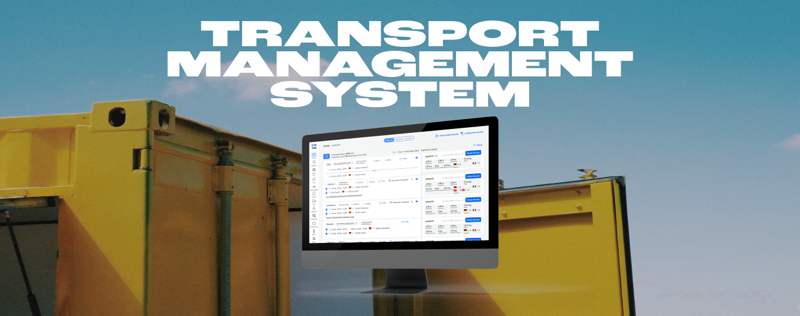

The client has reached out to us to build [customized software for freight forwarders](https://brightinventions.pl/projects/transportation-management-system/) to speed up and eventually automate the process of finding suitable transport orders and matching them with the right drivers.

**As a result of our work, it takes up to 0.5 seconds to filter out the right transport listings and display them to users**. In 1 minute the system analyzes over a thousand orders to display only the ones that meet all the requirements.

However, **that’s just the one challenge of that job. Another was a product design** which aim was to support users and help them navigate smoothly through the app.

Drawing from our experience in product design for this project, we want to share our insights on creating products tailored to the shipping industry.

## Challenges for transportation management system design

### Information Architecture

* **Designing a data-heavy** solution in the most possible accessible and readable way.
* Designing **how to display as much data as possible** on one screen without overwhelming users.

### Deep understanding of the domain

* Building work management software requires **a true understanding of a particular industry**.
* Also, it might turn out that **your design instincts go opposite to end users' needs**.

## UX persona of the transport management solutions

In this case, **end users are freight forwarders who expect fast, precise and simple solutions that will speed up their work**. They don’t want beautiful design, images, and animations which might result in slowing the app’s performance. They can’t deal with any distractions as well. They expect the tools that will assist them in matching transport jobs with the right cars and couriers.

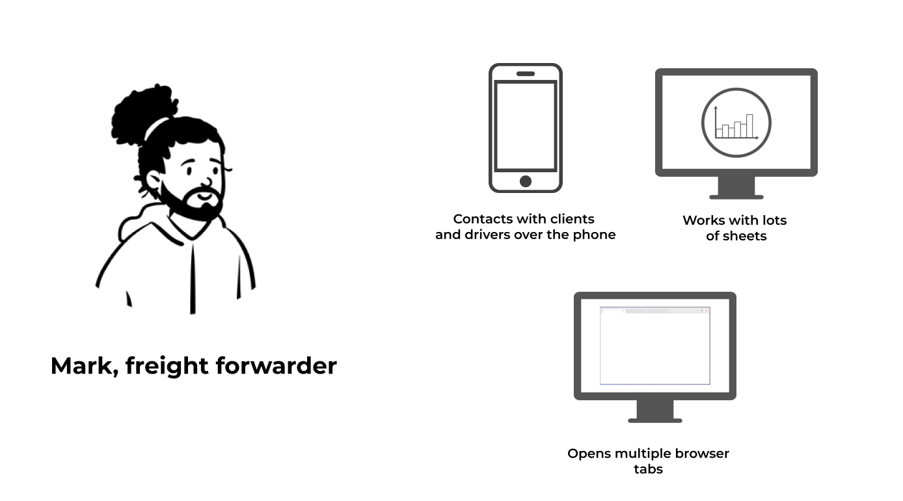

**What he says**

"I wonder if a driver has enough time to unload, so I could add another load for him?"

**What he thinks**

“It’s not affordable to take this offer.”

“Weak offer, but I have to make mileage."

**What he does:**

* takes orders from clients and plans the entire route for the driver, 
* ensures that all shipments are delivered on time and in good condition,
* maintains strong relationships with drivers and customers, 
* streamlines dispatching processes to improve efficiency and reduce errors,
* stays up-to-date with industry trends and technologies.

**What he feels:**

* stress,
* time pressure.

## Understanding the business domain – freight forwarding and road transportation

While designing prototypes for the transport management solution our design team used numerous product design techniques:

### Desk research

The process of gathering information and data by reviewing existing literature, documents, reports, and other available resources regarding the shipping industry.

### Benchmarking

It is a process of comparing an organization's products against those of its competitors or industry leaders. It involves identifying best practices, evaluating performance metrics, and using the insights gained to improve and set goals for the organization.

### Field studying

It is a research method that involves directly observing and collecting data in real-world settings or natural environments. From the very beginning of the development process, we had access to end-user representatives who were willing to give us a unique insight into their work life.

### User shadowing

It is an observational research technique used to understand how people interact with products, services, or systems in their natural environment. Bright Inventions’ team visited the client’s office to watch freight forwarders at their work, specifically to see how they interact with various software tools on a daily basis.

### Adaptive interviews

It is a research technique that involves conducting interviews. It allows for a deeper understanding of the interviewee's experiences, opinions, and perspectives.

Our team conducted many interviews during the MVP development process. However, after the MVP launch interviews still remained a powerful tool. After every crucial feature release and design update, we conduct interviews with users and improve the product according to their feedback. 

## Best UX design practices for transportation management software

Creating a visual representation of this app required **a data-heavy design approach**. It is the process of creating interfaces or systems that effectively handle and display large amounts of complex data. It involves organizing, visualizing, and optimizing the interaction with data to facilitate understanding and decision-making.

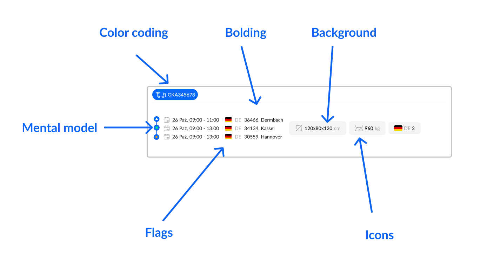

**Check out the data-heavy design practices we implemented for our client:**

### Clear information architecture

The goal of the system is to match the transport job with the matching car and driver to find the most efficient way to transport goods internationally.

So end users' requirement was to show listing next to matching cars – as many as possible on one screen. 

You **can see that transport orders are displayed on the left and vehicles on the right. Although there are many of them on screen, they stand out thanks to the white background.**

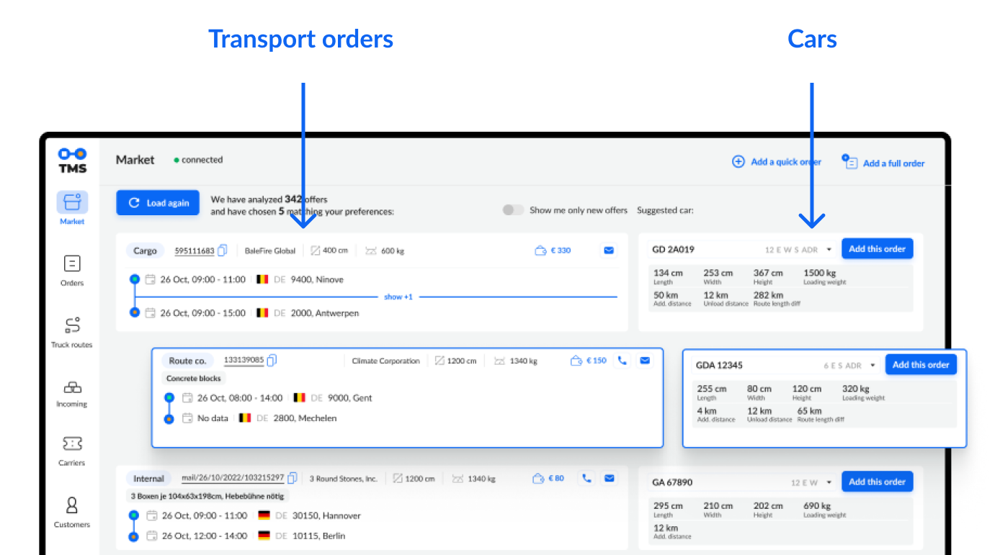

### Designing cluster information

Another product design challenge was to design clustered information. For example, one transport order could be associated with 10 vehicles which have to be accessible all in one place. **Our solution was to create scrolling bubbles**. Obviously, every scrolling has to have an indicator that shows that data should be scrolled. It might seem obvious, but these are the small details that might be sometimes missed while developing advanced systems.

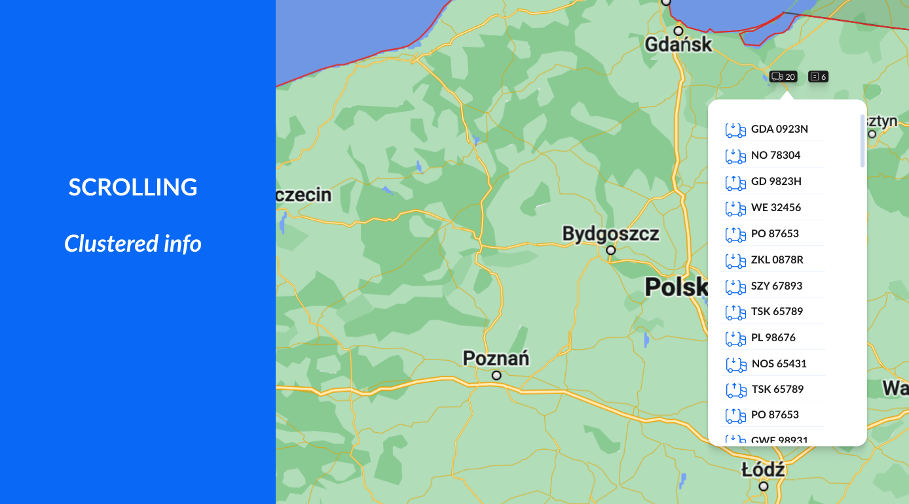

### Taking into account users' mental model

**A mental model is a person's understanding of how something works or should be used**. It shapes user expectations and interactions with a product. Designers aim to align their designs with users' mental models to create intuitive and user-friendly experiences. B**y incorporating these mental models into the design process, designers reduce cognitive load and enhance usability**, bridging the gap between intentions and user needs.

Our team incorporated users' mental model into this design:

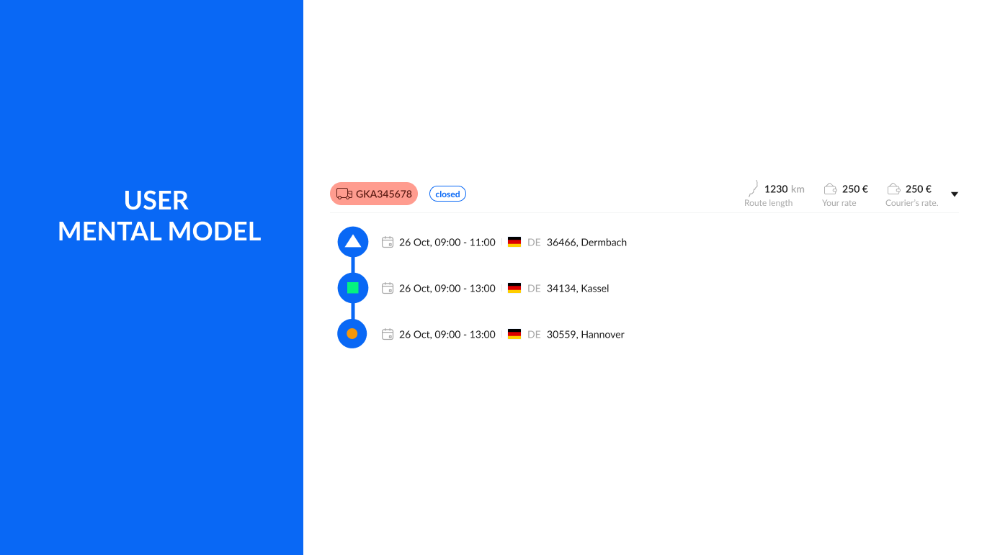

This is the routing design. The green square means loading and the orange circle means unloading which is based on the users' mental model. However these color associations and shapes don’t have to be universal to anyone, this is a specific mental model of users representing the shipping industry.

### Navigation design based on patterns familiar to users

The app’s navigation should be accessible and similar to other well-known tools users use at work. **Custom software should “ring a bell” and be a natural extension of everyday work, not something completely new users have to comprehend**. No one will sacrifice work time to learn new tools and new navigation, especially freight forwarders who simply don’t have time to spare.

### Button hierarchy

**The right UX shows you exactly what action is expected from you with one simple look**. Although this screen shows lots of data the buttons are standing out thanks to the dedicated color and the right size. Also, the Call to Action (CTA) is short but clear and informative – users know what to expect when they click the button.

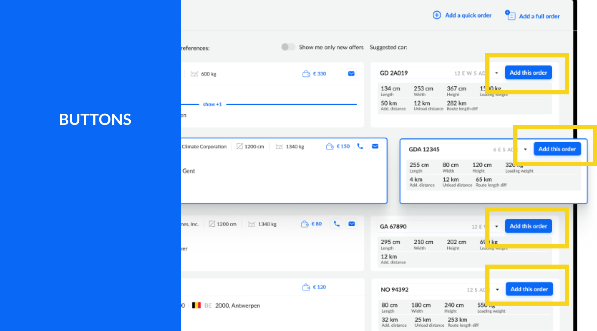

The button’s design should emphasize the hierarchy of the actions users should take. **Product designers should help users and point them in the right direction**. Yet still giving them an alternative option (secondary button). Below you’ll find an example of the button hierarchy:

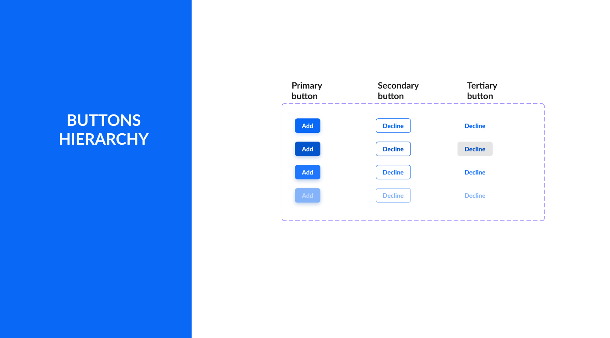

### Flags UX

Our client operates in over 40 countries, so most of their routes are international. Introducing flags next to shipping addresses is a simple but powerful touch. **With one look users can quickly scan the route info before going into details (actual address)**. It speeds up the scanning action which is very crucial for end users.

Also, postal codes are important information for the end users, so they are easily accessible next to the flags. Flags are also a useful way to design language setting dropdowns.

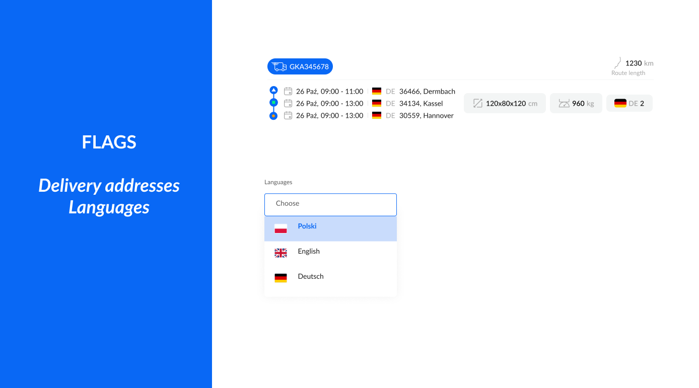

### Color coding

The mockup below shows **the universal power of colors**. In this case, colors are used to show shipping statuses. Even without knowing the app’s domain, we can assume that red color means something negative (for example car malfunction), yellow might mean delay, and blue is neutral.

These aren’t the actual statutes used in the app but we just show you the examples of associations that we quickly have while looking at these colors. 🙂

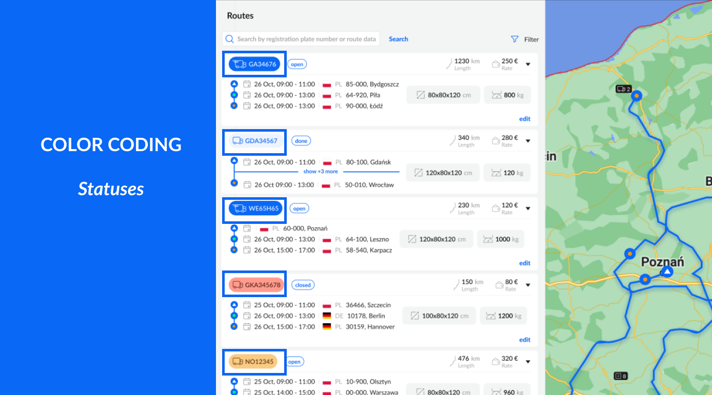

You may also notice, that a vehicle in a blue color has a different shape. This icon means that the car is on the go.

### Iconography

Every product design requires iconography. **Although icons have to be unique, they still cannot be out of the box**. No one wants to reinvent the wheel, so icons should be comprehensible. They must evoke the right associations, even if they are designed specifically for this app.

Here are examples of icons showing users’ actions available on the app:

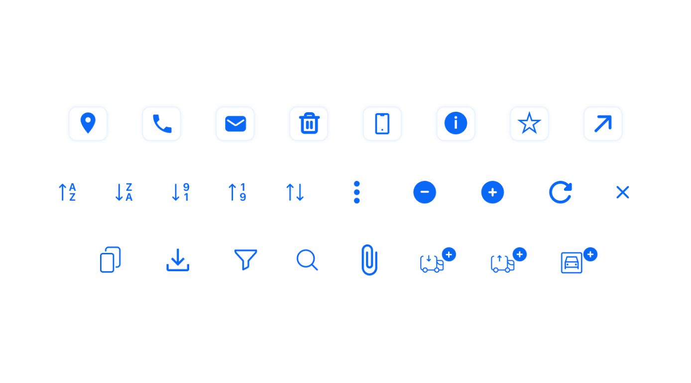

Icons are recognizable. By looking at them it’s easy to guess their meaning. Naturally, icons should also be explained in the app because product designers shouldn’t assume that users understand all their intentions. Nevertheless, these icons are approachable, easy to comprehend and remember what they mean. That’s the goal. 🙂

### Bolding

Bolding is a simple but powerful way to prioritize information. As an example take a look at the popup below. 

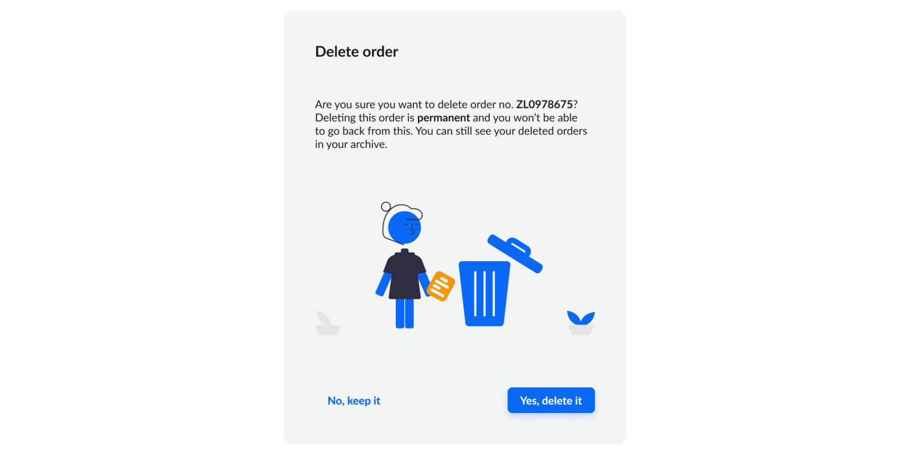

**Bolding emphasizes the crucial information in the copy, helping to scan the text**. According to [Nielsen Norman Group research](https://www.nngroup.com/articles/how-users-read-on-the-web/) conducted in 1997! 79% od people only scann information on the website, 16% read word-by-word. It is probable that the data today shows an even greater preference for scanning.

Bolding definitely helps users quickly see the crucial information on this popup - the fact that the order they want to delete will be gone permanently. 

Also, take a look at the Calls to Action (CTAs). They clearly state the actions thanks to informative copy, *Yes, delete it*, and *No, keep it*. **We should avoid using CTAs such as Yes, or No which give no context**. Again, users quickly scan the apps. Make sure they understand the consequences of their actions. 

### Designing a map in the application

Map design can be challenging because maps typically come with predetermined color schemes. If the colors are meant to signify specific information, such as distinguishing between the actual route and the car's navigation from point A to point B, additional effort is necessary. **A viable solution would involve not solely relying on colors but also incorporating various shapes**, such as dashed lines, and utilizing borders to enhance the map's clarity and visual communication.

Last but not least, **color contrast has to align with Web Content Accessibility Guidelines** ([WCAG](https://wcag.com/)) guidelines for accessibility.

## Are you planning to design and develop your solution for the logistics industry?

We are happy to discuss your product with you. We assist clients at every stage of the development process: from design to development and maintenance. Contact us and we’ll get back to you within 48 hours. [Book a free consultation now](/start-project/)!
