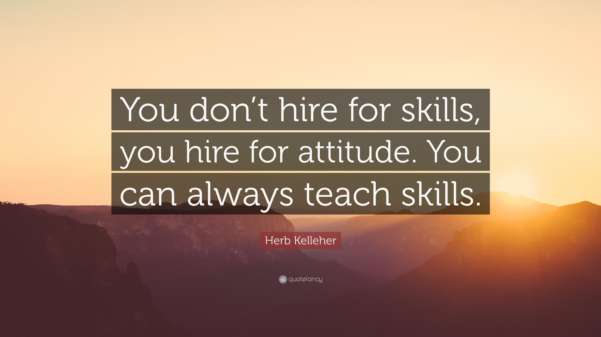
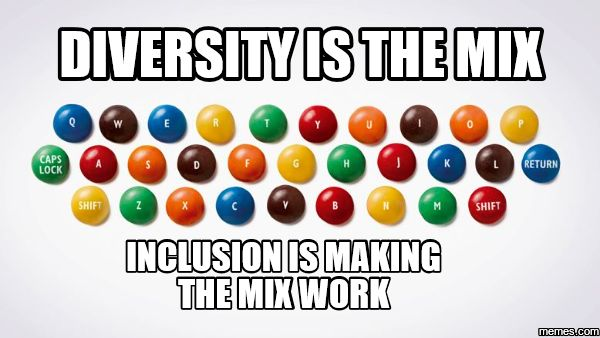
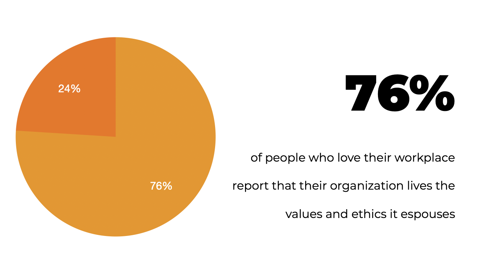

Living in a [VUCA (Volatile, Uncertain, Complex, and Ambiguous)](https://en.wikipedia.org/wiki/Volatility,_uncertainty,_complexity_and_ambiguity) world requires both individuals and organizations to adapt and thrive in an ever-changing and unpredictable environment. Being able to adjust quickly to changing circumstances is crucial to respond swiftly to emerging opportunities and threats.

The VUCA world demands constant acquisition of new knowledge and skills to remain relevant and competitive. However, there are still traits that remain constant. These are core values that we follow in private and professional life. **Core values are not just words that you put on your office walls, they are the backbone of any organisation culture.** They create the sense of identity and purpose that make people work together towards coming golas. They drive employees to promote ethical behaviours and build strong relationships. 

**At Bright Inventions we foster [the culture of responsibility, flexibility, teamwork, positive attitude and client orientation.](https://brightinventions.pl/about-us/#core-values) Our core values serve as guiding principles, kind of unifying force that helps us make sure employees are aligned with the company's mission and vision.** They foster a sense of belonging and a common understanding of the organization's goals. That is why, we have also decided to use them as one of the main tools in our recruitment process. 

## **Competence based recruitment - start here**

If you do not feel sure about building the value based recruitment process from scratch, competence based recruitment (CBR) might a good starting point for you. It is a hiring approach in which recruiter’s or hiring manager's goal is to assess candidates' specific skills, knowledge, abilities, and behaviours relevant to the particular job. **Instead of solely relying on qualifications and experience, CBR aims to match candidates' competencies with the specific requirements of the position.** 

**Before you begin the process, you have to determine what are the specific competencies required for the role you are recruiting for.** This involves understanding the tasks, responsibilities, and challenges associated with the position. Before publishing a job description conduct a comprehensive job analysis to understand and highlight the essential competencies a candidate must possess. Come up with some determined competences criteria to [the screening phase](https://resources.workable.com/stories-and-insights/phone-screen-interview) and ask all candidates the same questions. **You have to know what really matters for the role.** 

During the interview apart from behavioural questions a good choice might be requesting some work samples to evaluate candidates' technical abilities and demonstrate how they apply their competencies in practical tasks.

While planning your process take advantage of **[a structured scoring system](https://recruitee.com/articles/structured-interview)** to objectively evaluate candidates based on their demonstrated competencies. This will help you compare candidates fairly and consistently. For Polish speakers I also recommend the book "Rekrutacja oparta na kompetencjach" by Agnieszka Ciećwierz, who in a very comprehensive and at the same time simple way explains how to create such a hiring process that will help you choose the person for a particular job to be the one who best meets the employer's expectations, and consequently, will most effectively carry out the assigned tasks.

## **Value based recruitment guidelines** 

Now, when you know more or less how competence based recruitment works, replace the word “competence" with the word “value” and you may achieve even better results. **Thanks to the value-based recruitment process organization can increase their chances of selecting the best-fit candidates who follow their necessary values to excel in the role and contribute to the success of the organization.**

To start your value bases recruitment adventure you have to identify which beliefs and standards are essential to your company and which core values you want to include in the process. As a (hiring) manager or recruiter you have to make sure you understand them properly. Think how [these beliefs translate into daily behaviours and dat-to-day tasks at work](https://hbr.org/2002/07/make-your-values-mean-something). If there are not defined any core values in your organisation, take one step back and check how to discover them. 

###### Source: https://blog.deliveringhappiness.com/10-steps-to-creating-core-values-that-your-company-lives-by-infographic

Then develop a clear and well-defined values framework that will outline the key values  necessary for success in the role and in your team in general. The same as if you were choosing the primary competences, just here you choose the primary values. These values should align with the organization's culture. **Each value should have a rating scale [to minimize the potential risk for bias in the hiring process](https://brightinventions.pl/blog/cognitive-bias-how-it-affects-our-hiring-decisions/). It will help you understand what you are looking for in a candidate beyond  their commercial experience and beyond how well you get along with someone.** 

To make the whole process work well I really encourage you to implement [behavioural-based interview questions](https://www.themuse.com/advice/behavioral-interview-questions-answers-examples) to assess candidates' behaviours in specific situations. Ask candidates to provide examples of how they have demonstrated the required value in previous roles or experiences. You can also take advantage of roleplaying exercise that will help you observe how candidates behave in prospective real-life circumstances and which values may motivate their behaviours.

**A good strategy (if applicable or possible) might be also involving in the process a few interviewers including managers and team members, to obtain diverse perspectives on candidates' suitability for the role.** 

**[Ensure the value-based recruitment process is fair, transparent, and free from bias.](https://brightinventions.pl/blog/cognitive-bias-how-it-affects-our-hiring-decisions/) Values should be present at every stage of the recruitment and hiring process. This ensures you’re connecting with the right people every step of the way**

Remember that focusing on core values does not mean you should not encourage diversity and inclusion. The process just prioritizes particular beliefs and aspirations, but there is still space for diversity which encourages creative and innovative thinking. 

## **VUCA & Value-based recruitment** 

Having a strong company DNA can help individuals and organizations not only survive but thrive in the face of uncertainty and complexity. **When faced with complex decisions in recruitment process, core values provide a framework to make choices that are consistent with the company's beliefs and long-term objectives.** They let us build an effective team regardless of the environment or circumstances our organisation is facing. 

The VUCA world encourages recruiters and managers to think creatively to address emerging challenges. These quick adjustments to changing circumstances lead to improved efficiency and effectiveness in the hiring process and make us choose the best talents for the role. Some uncertainty creates gaps in the market, but value based recruitment emphasises the importance of culture fit when hiring new employees**. When a new hire’s value system aligns with the reality of the organisation, they can feel happier in their new role and do their best work.** 

###### Source: Association for Talent Development

**Creating a successful values-based recruitment plan depends on how well you know your organization, as well as the values that drive company-wide decisions and behaviors**. By knowing well what your organisation values, you can then identify those values in recruiting candidates. **The bad hiring decisions are made every day value-based recruitment is one of the tools that may help avoid them.** 

## **Food for thought**

Do you know core values of the organisation you work for?

Do you know what do the core values in your work environment mean? 

Do you feel that your core values are visible in different areas of work?

If you feel that you share the same values as we do, drop us a line via our [Career page](https://brightinventions.pl/career/) and let us talk about our future bright collaboration! 🧡
