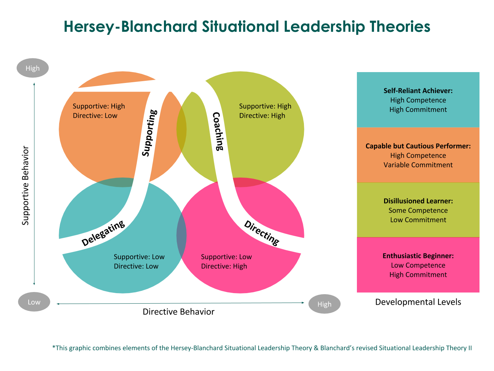

This story will be short. A few years ago when I bought a flat I also bought several plants. The gardener’s way I have gone so far taught me a lot not only about plants themselves, but also about people. My gardener's way was not always easy and maybe that is the point. So, what plants can tech us about leadership? A lot.

## **1. Diversity** 🌴🌳🌻

There are million different kinds of plants in the world. Every plant is unique. And even if you have dozens plants that belong to the same species, it is impossible to find two identical ones (or it is almost impossible). **The world of plants is rich and diversified. The same we can say about the world of people.** There are million different types of personalities around us. Being a leader means you work with different people every day. If you want out of curiosity to read about five main personality traits, take a look [here](https://www.verywellmind.com/the-big-five-personality-dimensions-2795422). 

<GiphyEmbed url='https://giphy.com/gifs/animation-plants-pots-xT9DPhySvCRg3nuTqU' />

Creating diverse team within an organization can improve the overall productivity, culture and morale of the company. **The diversity in your team can help to discover unique solutions, new perspective and make even more effective business decisions.** And what you have to learn as a manger is the way of taking care of people you work with, the same way as the gardener takes care of their plants. 

## **2. Caring** 👩🏻‍🌾

All plants at our homes or in our gardens need some care and protection to grow. We water them, fertilise, repot. A good gardener never forgets about taking care of their plants. Without this support plant will probably start fading and finally die. **Best leaders and managers never forget about taking care of their people. Weak leaders drain people. A leader who does not care about others cannot coach, develop or provide opportunities. If  you want people to grow, care about them.** They do their work every day, but without support, appreciation and fair compensation they will sooner or later leave you.

## **3. Get to know your plants** 🔆💦🌡

As we already know every plant has to be taken care of to grow. **But the point is to pay attention to individual needs of each and every.** A plant requiring “full sun” needs all the sunlight it can get, at least 6 to 8 hours of direct sun exposure per day. But there are plants which need only 3-4 hours of direct sunlight per day. There are also some that do not sun exposure almost at all. Other factors that make plants life easier are for instance proper temperature, moisture, air and nutrients. **The same works with people - people in a team need different things to grow.**

**Some people need a bit of motivation and “push” to leave their comfort zone and then they thrive. For some it is enough when you check up their progress every now and then and water their leaves with doze of appreciation.** Others will need your support all the time as they are demanding, but they can blossom one day taking your breath away. As leaders we have to learn what works best for people we work with. 

## **4. Maturity** 🌱

People just like plants can be in a different phase of maturity depending on their career level. 

The information about plant’s maturity tells you how long it takes from the moment a seed is sown to the moment when the plant is ready to set flowers. It is a tool provided to help the gardener determine when the plant will successfully grow and produce fruits. **[Hersey and Blanchard in situational leadership](https://www.toolshero.com/leadership/situational-leadership-hersey-blanchard/) suggest that managers should adapt their leadership style to an individual, their tasks and level of maturity** 

In their method the maturity level is divided into three categories: high, moderate and low. High maturity includes highly capable and confident individuals who are experienced and work well on their own whereas moderate maturity is generally divided into two groups: the first are employees who are capable but lack enough confidence to take on the responsibility to do so, and the second group has the confidence but is not willing to do the task at hand. Low maturity employees are not skilled enough to do the task but are very enthusiastic. **To take proper care of people in the organisation leaders and managers should adapt an appropriate leadership style. It helps to quickly evaluate a situation and make decisions that fit your team member’s needs.** Just like with plants. 

## **5. Cacti and succulents in your team** 🌵

Cacti and succulents are now a very common houseplant and they both have the same trait - they can survive in arid environments. The native habitat for most cacti and succulents is a desert. They are quite easy care, low maintenance and undemanding plants. Their leaves allow the plant to withstand most harsh conditions in the world. But it does not mean we can stop taking care of them. Most cacti and succulents require a lot of light, sometimes well-drained compost or diluted fertiliser. 

<GiphyEmbed url='https://giphy.com/gifs/flower-timelapse-cacti-ZNpC6BdLJLhDi' />

**In your team you have also cacti-employees.** These are usually hard working people you can trust and rely on. They get the task and no matter what they will accomplish what is needed. **They do not complain. And even in times of adversity they will do what has to be done. But as a leader you cannot forget that they also need your support, they also need 1:1 meetings, they also need appreciation and someone who will understand their concerns.** 

## **6. Re-potting** 🪴

To keep your plant alive you have to repot it sometimes. Repotting makes many gardeners anxious. T**hey are afraid that by moving a plant they may kill it. But repotting a plant is sometimes the only way to make it grow nice and tall.** There are mainly two seasons good for doing that - late winter or spring. What is interesting, young and fast-growing plants should be repotted every six months to a year, and older plants need to be repotted every few years. I am not sure if you already know what I am aiming at, but yes - we sometimes have to repot people in our team to make them thrive. 

Being confined to one project for too long can become very root-bound for them. **But before repotting them, make sure you have good soil in your new pot, enough room for all the new roots to grow and inspect if you are not pulling them too much. Then give them time to adjust and watch them grow.** 

## **7. Get rid of weeds** ✂️

Every gardener has to learn how to weed like a pro to keep their plants healthy. Removing unwanted plants from our garden is something many people just hate. But with an appropriate approach we can make weeding a less painful experience. **Maintaining a healthy, properly-functioning garden is no different than maintaining a healthy proper-functioning team and work environment.** Eliminate [toxic factors and behaviours](https://www.gottman.com/blog/the-four-horsemen-recognizing-criticism-contempt-defensiveness-and-stonewalling/) in you team as quickly as you can.

<YouTubeEmbed url='https://www.youtube.com/watch?v=1o30Ps-_8is&t=1s' />

Get into the habit of regular routine care and maintenance of your garden and it will bring a lot of benefits for you and your team. As a manager or leader you have plenty occasions to get some feedback. Talk with people and improve the workflow you have. Manage team meetings wisely. Reduce unnecessary ones. Work on limiting blockers or communications obstacles. **But be careful as “weeding” might be the one thing that can turn every gardener into a world-class complainer. And it should not be about complaining at all.** 

## **Without your plants you are not a gardener** 🌷

If nobody follows you, you are not a leader. **And people will follow you when you care about them. They will listen and speak out when you encourage clear and regular communication. They will take responsibility when you define clear roles and give them autonomy.** And they will also make mistakes and manager’s and leader’s job is to support them, motivate and provide opportunities to learn. **If you want your employees to embrace a certain behaviour, you have to model it.** And last but not least - show appreciation. [Speaking nicely to plants help them grow faster. ](https://www.theguardian.com/lifeandstyle/2021/jan/11/they-respond-to-vibrations-does-talking-to-plants-actually-help-them-grow)
