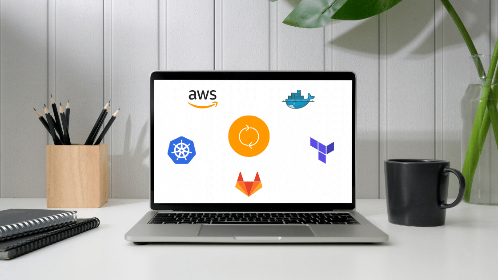

**Let’s explore the benefits of serverless computing and why it may be the best option for your business. Whether you represent a startup or a larger company, you’ll find benefits from serverless computing. Let’s dive in!**

## What is serverless computing?

Serverless computing is a cloud-based computing model that eliminates the need to manage its own server infrastructure. As a result, DevOps Engineers and developers from your company don’t have to maintain physical servers. Instead, the cloud provider manages the server infrastructure and ensures the application is available and scalable to meet demand.

We listed the benefits of serverless separately for startups and larger companies. Some advantages apply to all-size businesses. However, we still should have in mind different perspectives of startups and corporations.

## Benefits of serverless computing for startups

Here are some of the benefits of [serverless computing](/our-areas/cloud-services/) for startups:

### Reduced Costs

Startups typically have limited budgets, and serverless computing can help them reduce costs associated with infrastructure management. With serverless computing, **startups can pay for only the resources they use**, rather than having to invest in and manage their own servers and data centers. This can help startups **save money on hardware, maintenance, and personnel costs**.

### Better cost predictability

Since businesses only pay for the computing resources they use, they can more **easily predict and control their costs**. This can help them avoid unexpected expenses and optimize their resource usage.

### Scalability

Startups need to be able to quickly and easily scale their applications as they grow. With serverless computing, startups can **easily scale their applications up or down in response to changes in demand** without having to worry about managing infrastructure.

### Improving app security

Serverless computing providers like AWS, Azure, and Google Cloud offer a **range of security features, such as automatic software updates, encryption, and network isolation**. By offloading security responsibilities to the serverless computing provider, businesses can focus on other critical aspects of their operations while still following security best practices for their applications and data.

### Reduced Complexity

Serverless computing abstracts away the infrastructure layer, reducing the complexity of application development and deployment. This can help startups save time and resources and **focus on their core business**.

### Increased flexibility

Serverless computing allows businesses to **use a wide range of programming languages and frameworks**, making it easier to build and deploy applications using the tools and technologies that work best for their specific needs.

### Faster Time-to-Market

With serverless computing, startups can **focus on building their applications** instead of managing infrastructure. This can help them get their product or service to market faster, **giving them a competitive advantage**.

### Increased agility

Serverless computing allows startups to quickly **experiment with new ideas and applications** without worrying about the cost and complexity of setting up infrastructure. This can lead to greater innovation and agility.

## Benefits of serverless computing for larger businesses and corporations

Serverless computing offers several benefits for larger companies. Let’s go through them.

### Reduced infrastructure costs

With serverless computing, companies **only pay for the exact amount of computing resources they need**, rather than having to pay for and maintain their own servers. This can lead to significant cost savings, especially for larger companies with high computing needs.

### Improved security

Serverless computing platforms typically provide built-in security features such as encryption, access controls, and monitoring. This can help businesses **better protect their applications and data**. No matter if you represent a large or smaller company, your application has to be secure.

### Improved scalability

Serverless computing allows companies to **easily scale up or down as needed without worrying about capacity** planning or infrastructure management. This is especially useful for larger companies with unpredictable or rapidly changing workloads.

### Higher productivity

Serverless computing can increase the productivity of corporate development teams by reducing the time and resources required to manage infrastructure. This can enable developers to **focus on developing new features and therefore adding extra value to the product** rather than focusing on managing the infrastructure.

### Improved reliability and performance

Serverless computing providers typically offer high availability and fault tolerance, which can lead to improved reliability and uptime for applications. It also offers fast startup times and automatic scaling, which can lead to **improved application performance and reduced latency**.

### Seamless integration with other services

Many serverless computing providers offer integrations with other cloud services, such as databases, storage, and messaging. This can make it easier for businesses to **build and deploy complex, multi-tier applications**.
