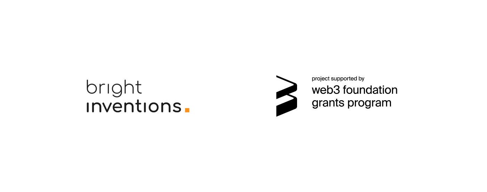

**We are very happy to finally share the news that our grant proposal for a ZK-Snarks for Substrate implementation, accompanied with a series of blog posts and a video tutorial, was accepted as a part of the [Web3 Foundation (W3F) grants program](https://web3.foundation/grants/). We are grateful to be able to work once again with the support of Web3 Foundation (to check our first W3F financed project, read our [blog post](/blog/bright-treasury-a-treasury-module-application-funded-by-a-w3f-foundation-grant) or visit [BrightTreasury](https://treasury.bright.dev/?utm_source=referral&utm_medium=bright-blog&utm_campaign=zk-snarks-grant)).**

By preparing a tutorial with basic implementation of the ZK-Snarks for Substrate ecosystem, **we hope to popularize this concept and make it more accessible to Substrate developers**. There have been similar initiatives available in other blockchain technologies, however currently there is no easily accessible up-to-date demonstrational implementation of ZK-Snarks in Substrate. 

As our implementation will be delivered along with **a series of blog posts and a Youtube tutorial video**, we aim to reach a wider audience and provide an accessible introduction to ZK-Snarks.

**Watch the released video:**

<YouTubeEmbed url='https://www.youtube.com/watch?v=groGv-JVvgg&t=12s' />

**Read blog posts:** 

[Zk-SNARKs in Substrate (Part 1)](/blog/zk-snarks-in-substrate-part-1)

[Zk-SNARKs in Substrate (Part 2). Using Groth16 and Running Circom Proof](/blog/zk-snarks-in-substrate-part-2-using-groth16-and-running-circom-proof)

[Zk-SNARKs with Substrate (Part 3). Pallet Implementation](/blog/zk-snarks-with-substrate-part-3-pallet-implementation)

## Milestones

The scope of the proposal was delivered in 2 milestones, the first one is available in our [repository](https://github.com/bright/zk-snarks-with-substrate/):

### Milestone 1

Creating a pallet which stores necessary data for a ZK-Snarks. 

**Key deliverables:**

1.  A Dockerfile that can be used to test all the functionality delivered with this milestone. 
2. The pallet that allows storing a verification key and the proof on the blockchain and the on-chain verification.
3. Blog post: ZK-Snarks concept

   * What are the ZK-Snarks
   * Describing the “Bob” problem and how they can solve it
   * Describing the process of creating proof 
   * Creating a “circom” example

### Milestone 2

Implementing the on-chain proof verification mechanism followed by a series of educational materials. 

**Key deliverables:**

1. Groth16 proof verification method which will be used by the pallet 
2. A demo where we will use a 3rd party tool to verify a solution & where Alice could be rewarded for finding a solution. 
3. Circuits in circom, which will describe our exemplary problem.
4. Blog post: Tutorial Groth16 (Part 1) - describing the groth16 and running "circom proof" from previous post with the Rust Unit test / CMD.
5. Blog post: Tutorial Pallet (Part 2) - creating a pallet with the unit tests & running an example from the previous tutorial with polkadot.js. 
6. Youtube video tutorial explaining the concepts described in the blog posts. 

Soon we will share more blog posts from our tutorial series, so stay tuned!
