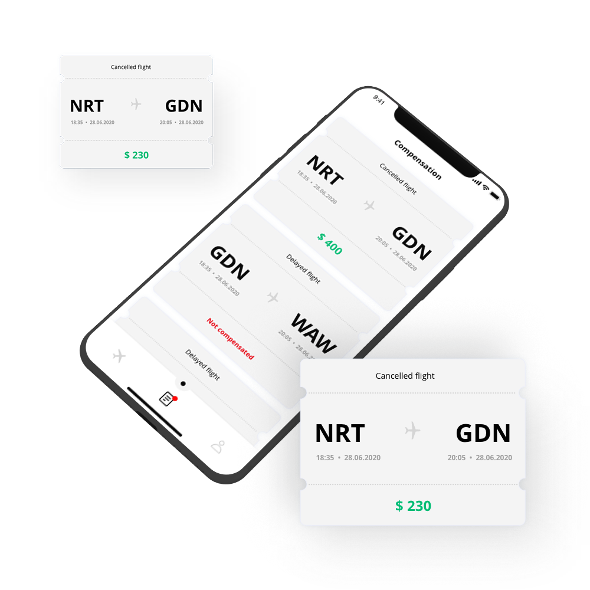
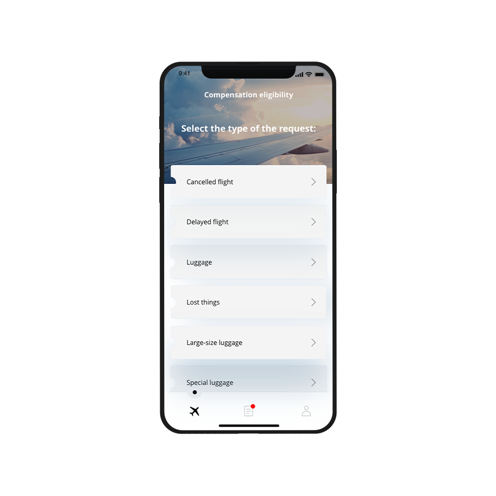

---
team_members:
  - mateusz
our_service:
  - mobile app development
  - MVP development
layout: project
project_id: airhelp
title: AirHelp
image: /images/flight_compensation_app_mockup5.png
description: AirHelp iOS mobile application lets you check if your flight is
  eligible for compensation and guides you through the whole process of
  complaints.
hero_image: /images/case_study_flight_compensation_app.png
Hero Image_alt: AirHelp case study
social_media_previev: /images/airhelp_fb_preview.png
social_media_previev_alt: AirHelp case study
bar_achievements:
  - number: "1"
    label: MVP
  - number: "1"
    label: iOS App
  - number: "4"
    label: Key MVP features
tags:
  - mobile app
  - MVP
  - customized software
title_team: team
title_case_study: more success stories
title_contact: let's talk about your product
description_contact: Book a free consultation in 48 hours!
order: 9
slug: airhelp
show_team: false
show_case_study: true
show on homepage: false
published: true
language: en
---

*It is not a real implemented design. It is a mockup example created for the purpose of case study.*

<TitleWithIcon sectionTitle='main features developed by Bright Inventions' titleIcon='/images/icons_features_svg.svg' titleIconAlt='features' />

* Dynamic and UX friendly survey
* Push notifications
* Facebook and Google integration
* File uploading

<TitleWithIcon sectionTitle='about AirHelp iOS app' titleIcon='/images/icon_title_about.svg' titleIconAlt='about AirHelp' />

In 2015 [AirHelp](https://www.airhelp.com/en-gb/) was a fast-growing startup with a mission to educate passengers about their rights. AirHelp came to us with a basic version of their iOS app and expected us to rewrite it. We developed an MVP version of the app taking care of the backend. We helped AirHelp to launch a new version of the app in the AppStore. In the meantime, the client had time to build an in-house development team that could pursue the project in the future.

*It is not a real implemented design. It is a mockup example created for the purpose of case study.*

<TitleWithIcon sectionTitle='goal' titleIcon='/images/icon_title_goal.svg' titleIconAlt='goal' />

The main goal was to create a mobile-friendly tool for users that want to file a complaint about a delayed or canceled flight. The app had to be really simple and minimalistic so that users are able to quickly go with the flow even if they have to provide much detailed information about the flight.

*It is not a real implemented design. It is a mockup example created for the purpose of case study.*

<TitleWithIcon sectionTitle='result' titleIcon='/images/icon_result_svg.svg' titleIconAlt='result' />

We developed an MVP version of an iOS app. After that AirHelp in-house development team could continue the project. Nowadays, AirHelps successfully completed the transformation from a startup to the top global air passengers’ rights advocate. We are happy that we could assist them at the beginning of their incredible journey.
