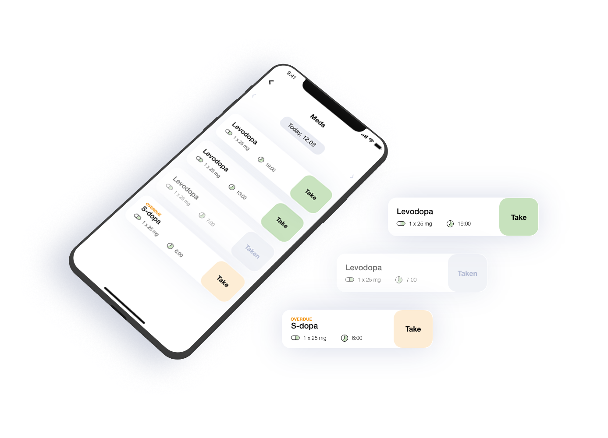
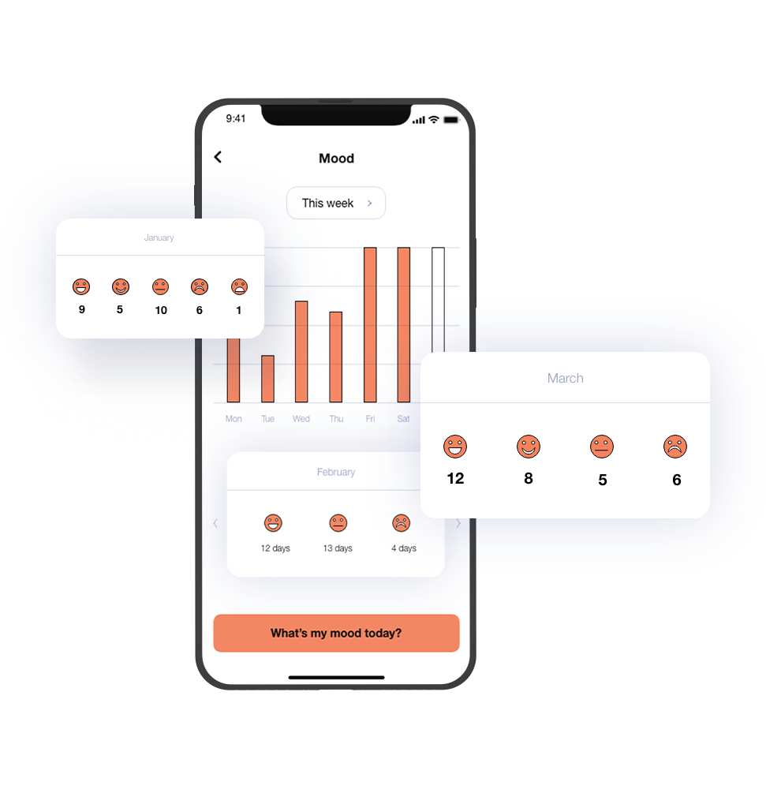
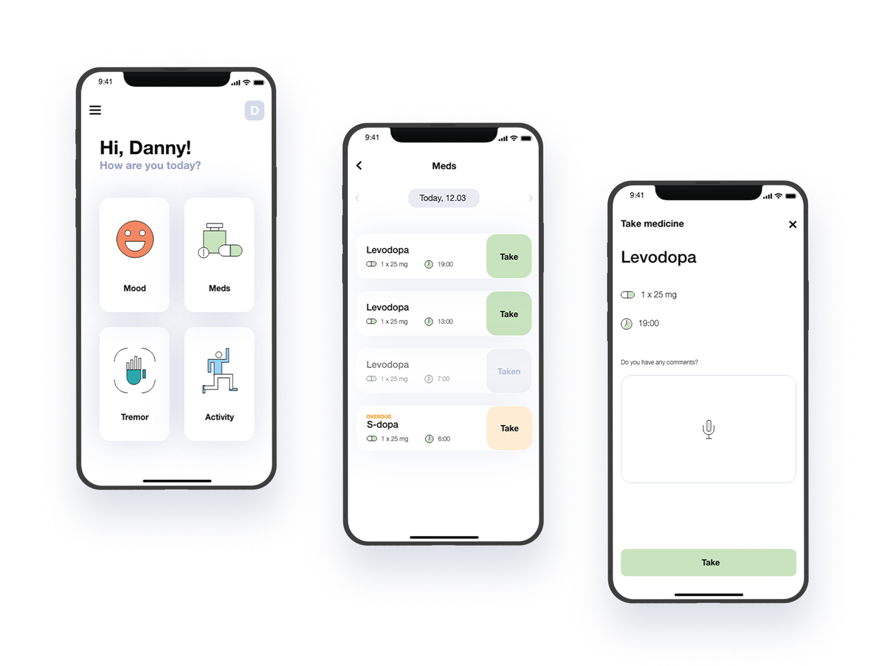
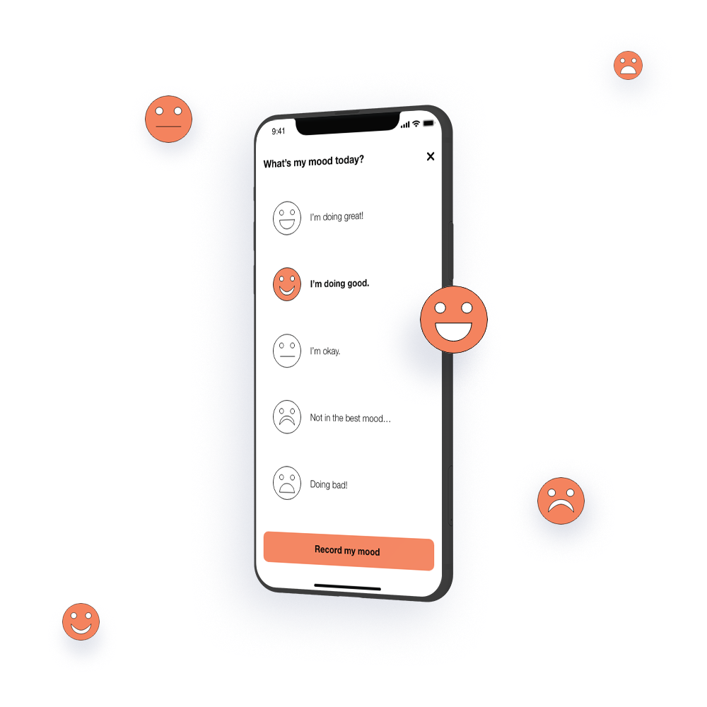

---
team_members:
  - michal
our_service:
  - MVP development
  - mobile app development
layout: project
project_id: solution-parkinson
title: "Supporting People with Parkinson's Disease – MVP story "
image: /images/app_for_parkinson_patients1.png
description: From the idea to the patient engagement solution in 3 months.
  Discover the journey of an eHealth MVP crafted to engage individuals living
  with Parkinson's disease in managing their condition, and assisting doctors in
  monitoring their symptoms.
hero_image: /images/case_study_app_parkinson_patients_app.png
Hero Image_alt: App for patients suffering from Parkinson’s disease
social_media_previev: /images/fb_preview_case_study_parkinson_app_en.png
social_media_previev_alt: App for people with Parkinson's patients case study
bar_achievements:
  - number: 90,000
    label: Annual U.S. Parkinson's diagnoses
  - number: "3"
    label: Months to MVP launch
  - number: "2"
    label: 2 iOS and Android apps
tags:
  - mobile app
  - MVP
  - customized software
  - eHealth
title_team: team
title_case_study: more success stories
title_contact: let's talk about your product
description_contact: Fill out the form below and we'll get back to you in 48 hours.
order: 99
slug: solution-for-parkinsons-patients
show_team: false
show_case_study: true
show on homepage: false
published: true
work_in_progress: false
language: en
---
<TitleWithIcon sectionTitle="technologies" titleIcon="/images/skills.svg" titleIconAlt="technologies" />

<Gallery images='[{"src":"/images/swift_icon_stack.svg","alt":"Swift"},{"src":"/images/kotlin_new_stack_logo.svg","alt":"Kotlin"},{"src":"/images/node_stack_logosvg.svg","alt":"Node.js"},{"src":"/images/case-study_typescript_stack-logo.svg","alt":"TypeScript"},{"src":"/images/aws_stack_logo.svg","alt":"AWS"}]' />

**technologies**: Swift, Kotlin, Node.js, Typescript, AWS

<TitleWithIcon sectionTitle="problem – lack of an easy way to daily manage the disease" titleIcon="/images/icon_title_about.svg" titleIconAlt="problem" />

Only in the U.S. **each year, about [90,000](https://www.parkinson.org/understanding-parkinsons/statistics) people are diagnosed with Parkinson's diseas**e. Living with a chronic illness like Parkinson’s imposes many lifestyle changes on the patient. For those battling the disease, it is crucial to **have a way to easily track their overall vitals, medicine intake, or note any symptoms** that need to be brought to doctors’ attention.

<TitleWithIcon sectionTitle="solution: a mobile app that simplifies the day-to-day lives of patients" titleIcon="/images/two_flags.svg" titleIconAlt="solution" />

Our long-time partner from Germany (a digital agency and early-stage project incubator), reached out to us with a ready-to-implement idea their customers had for an app. **The goal was to develop a mobile app that simplifies the day-to-day lives of patients suffering from Parkinson’s disease**.

Before reaching out to us, our client had already designed a high-fidelity wireframe of the user interface. Consequently, they needed a technological partner to take ownership of the software development process. And so, **Bright Inventions was entrusted with the implementation of the entire system** - the development of two apps (iOS and Android), as well as the entire backend.

The app functioned as a personal digital diary for individuals with Parkinson's disease, allowing users to log their symptoms and monitor their medication intake. I**ts primary aim was to observe the body's reaction to therapies, aiding patients and healthcare professionals in managing the condition**. The app provided advanced analytics for physicians to better understand patient conditions.

*It is not a real implemented design. It is a mockup example created for the purpose of case study.*

<TitleWithIcon sectionTitle="challenges: inclusive AI and securing medical data" titleIcon="/images/gearwheel.svg" titleIconAlt="challenges" />

From the beginning, we understood that **the key element of the solution must have been inclusive and empathic UX/UI design**. The app had to be **friendly in use for patients suffering from tremors** or other movement disorders. Also, as the elderly constitute the majority of patients suffering from Parkinson’s, **the challenge was to deliver a legible, highly intuitive interface that would minimize the chances of mistake**s. If an accidental input were to take place, though, the interface also needed to allow the option to undo the action.

Although our team wasn't directly responsible for creating designs, based on our experience in developing user-oriented solutions, **we provided numerous recommendations to simplify features** of the graphical user interface to better suit the needs of people with Parkinson’s. The client responded positively to our recommendations, subsequently giving us the green light to proceed.

The greatest challenge, however, was to **fulfill the highest security and privacy standards to protect users**. Given its healthcare nature, the app stored sensitive medical data on patients’ health, including information on pain and tremors, as well as data on very specific side effects, such as sexual drive levels and gambling propensity.

One of the security tactics we implemented was **breaking down the encrypted database into two – each stored in a different AWS services’ physical location**. The first database stored basic user data, such as name or email address. The second database kept sensitive medical information, including medication intake or physical symptoms and side effects. Through this decision, **we minimized the chance that, in the event of a data breach, the attacking party would be able to access all the information**. Therefore, even in the case of a data breach, **the risk of matching symptoms to specific patients' names is low**.

<TitleWithIcon sectionTitle="the result: MVP in three months" titleIcon="/images/results_icon_title_small.png" titleIconAlt="result" />

After three months, **we successfully delivered the MVP of the solution**, followed by overseeing several iterations of the system to enhance its functionality. **This project is an example of an inclusive patient engagement app designed to support chronically ill patients, regardless of their age or technical proficiency**. It’s great to be a part of this MVP’s story!

*Presented mockups are not real implemented design. Mockups were created for the purpose of case study.*