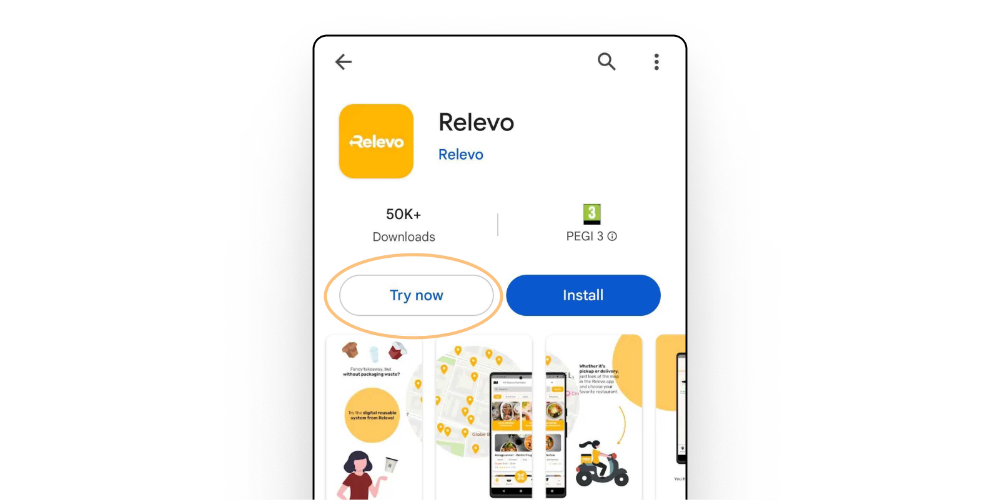

---
team_members:
  - mateusz
  - sebastian-r
  - krzysiek-s
  - pawel-o
our_service:
  - mobile app development
layout: project
project_id: relevo - instant app and app clip
title: Boosting User Acquisition with App Clip & Instant App for Relevo – a Food
  Take-Away and Delivery App
image: /images/case_study_cover_instant_clip.png
description: Overcoming user hesitancy towards installing new applications is a
  crucial challenge in today's competitive market. Discover the strategic
  approach our team employed to turn this obstacle into a marketing triumph.
  Delve into the success story where we skillfully implemented cutting-edge App
  Clip and Instant App solutions, revolutionizing the user experience and
  establishing a robust user acquisition channel for a thriving startup based in
  Germany – Relevo.
hero_image: /images/instant_app_app_clip.png
Hero Image_alt: mockup
social_media_previev: /images/instant_app_app_clip_preview.png
social_media_previev_alt: some preview
bar_achievements:
  - number: +200k
    label: app users
  - number: 3,000+
    label: Relevo partners
  - number: 700+
    label: cities where the app operates
tags:
  - mobile app
  - customized software
  - retail & restaurant
title_team: team behind the project
title_case_study: more success stories
title_contact: let’s talk about your solution
description_contact: Book a free consultation in 48 hours. Contact us!
order: 6
slug: app-clips-instant-apps-solution
show_team: true
show_case_study: true
show on homepage: false
published: true
work_in_progress: false
language: en
---
<TitleWithIcon sectionTitle="technologies" titleIcon="/images/skills.svg" titleIconAlt="bright" />

<Gallery images='[{"src":"/images/swift.png","alt":"swift"},{"src":"/images/kotlin.png","alt":"kotlin"},{"src":"/images/android_stack_logo.svg","alt":"Android"}]' />

**technologies:** Swift, SwiftUI, Kotlin, App Clip, Instant Apps

<TitleWithIcon sectionTitle="problem – a cultural barrier in Germany" titleIcon="/images/icon_title_about.svg" titleIconAlt="problem" />

Relevo changes the takeout experience by facilitating the borrowing of reusable packages in restaurants across Germany. Although their mobile app is appreciated by over 200,000 people, users in Germany still exhibit some hesitancy towards unfamiliar app downloads. This cultural obstacle was likely to stop Relevo from spreading its impactful plastic-fight mission. After recognizing the problem, our team introduced a game-changing solution.

<TitleWithIcon sectionTitle="solution – implementing Instant App and App Clip to introduce new users to Relevo" titleIcon="/images/two_flags.svg" titleIconAlt="solution" />

Our mobile development team engineered and launched an often underestimated marvel: **the Instant App and App Clip. These cutting-edge technologies grant users access to a basic version of the Relevo app without the need for a full installation**.

Displayed as an intuitive pop-up on mobile devices, the **Instant App/App Clip adeptly highlights specific features, spotlighting the app's pivotal benefits**. The sample versions of Relevo’s solution are conveniently accessible either through Google Play or by scanning a QR code.

If you love it, you install it. As simple as that!

Relevo Instant App on Google Play

The essential aspect of the implementation involved setting up analytics to measure the users' acquisition through the channels provided by App Clip and Instant App. **We devised and implemented tracking protocols, enabling the Relevo team to meticulously monitor the results of this implementation**.

<TitleWithIcon sectionTitle="challenges – finding the balance between user engagement and meeting tech limitations" titleIcon="/images/gearwheel.svg" titleIconAlt="challenges" />

The critical challenge involved **strategizing which features should be incorporated into the sample versions of the iOS and Android apps**. The challenge lay in crafting a flow that not only entices new users to Relevo but also adheres to the strict size limitations stipulated by Google and Apple. Furthermore, **the flow needed to closely resemble the final version of the application to ensure a seamless transition**. This way, switching from App Clip/Instant App would be a smooth experience.

Once the strategic decisions were made, our team embarked on **finding optimal methods to implement these selected features within the sample versions**. This was accomplished through a modular approach, segmenting various parts of the application into distinct modules. This strategy not only enhanced clarity but also streamlined the customization process for App Clip and Instant App.

<TitleWithIcon sectionTitle="result – enhancing marketing efforts with a new acquisition channel" titleIcon="/images/icon_result_svg.svg" titleIconAlt="result" />

By implementing App Clip and Instant App, **we have streamlined the process of introducing new users to Relevo, instantly showcasing the app's key features on their screens** without necessitating a full download. Over time, users opt to install the app as they recognize its value. 

We are proud to affirm that both **App Clip and Instant App have evolved into significant channels for user acquisition**, reaching audiences that might otherwise be inaccessible.

<TitleWithIcon sectionTitle="Relevo’s founder’s perspective" titleIcon="/images/clients_perspective_icon.svg" titleIconAlt="Relevo’s founder’s perspective" />

Bright inventions serves both as a development partner and a sparing partner in challenging and choosing the right approach & setup.

The excitement the whole development team is putting into our work is vivid and the communication goes beyond only work related topics. To find a development partner matching the skillset and the cultural / communicational level of bright inventions is tough to imaging.

**Matthias Potthast, Founder of Relevo**